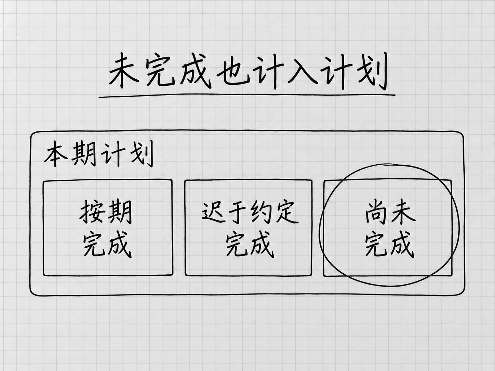
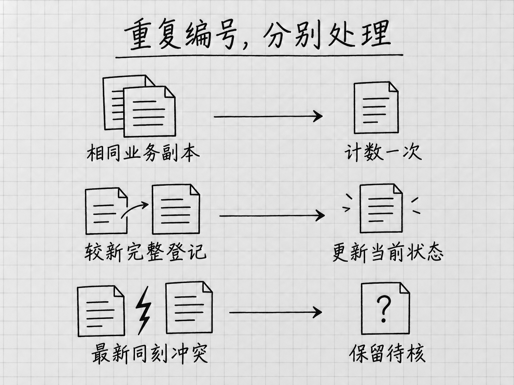

# 第15章 表格处理与数据分析：统一口径，得到可信结论

你收到三份表，需要把本月工作汇总起来。表头相似，里面有编号、日期和状态。最容易想到的要求是：“帮我分析一下，再做几张图。”

可是一张看起来专业的图，可能混用了几个不同问题：本月原本安排多少项？最后做完多少项？其中多少按时完成？只看已经完成的事项，还是把未完成的也算进来？这些问题都能得到数字，但数字的含义不同。

本章用三地区的交付台账练习。“交付单”代表一项有约定日期、需要登记完成情况的工作。要学会的习惯是：**先说清数字怎么算，再用少量有代表性的记录检查规则，随后处理整批。** 这里检查少量记录，后文简称“试小样”。

打开[P04练习材料](../examples/P04/README.md)，先用A包。先完成A合表和一次测试副本变化，再用C包正常换月，就能走通主线。希望练习更新、冲突和缺项时，再按本章B包部分逐条加入变化。起步不需要客户关联、图表和演示，一份有汇总、明细及必要说明的工作簿就够用。

## 先看懂一行，再谈汇总

A包有东区、中区、西区三份Excel文件，合计20条记录。每份表的工作表叫“交付台账”，第一行是表头。东区7条，中区7条，西区6条；这里说的条数不包括表头。

先打开东区表，看DL-0001这一行。它是一张交付单的登记，原约定8月3日交付，实际8月2日完成。A包中每张交付单只有一条登记，所以此时20行刚好对应20张交付单。稍后加入更新，行数就不再等于业务对象数。

表里有两个看起来都像编号的字段，作用不同。“交付单号”标识工作对象；“来源行编号”标识这条原始记录的位置。DL-0001以后可以出现新的登记，但每条来源行都能分别回查。不要拿来源行编号当成业务对象，也不要因为两行交付单号相同就直接删掉其中一行。

订单号和客户编号暂时只需原样保留。一份订单可以分成多张交付单，一个客户也可以有多个订单。东区的DL-0001和DL-0002属于同一订单，都是正常记录，不能按订单号或客户编号去重。“去重”就是决定哪些记录不应重复计算；决定前必须知道重复的究竟是什么。

本次先回答两个问题：8月应交付多少单，其中多少单按期完成。把计算约定写给WorkBuddy，比让它先推荐十种分析更有用：

- 统计期是2026年8月1日至31日。
- 状态截至2026年9月5日18:00，统一使用北京时间。
- 按**原约定交付日**归入月份，不按实际完成月份归入。
- 计划数是原约定日在8月、截至点未取消的交付单数。
- 按期数是上述计划中已有确认完成日期，且实际日期不晚于原约定日期的数量；同一天完成算按期。

“期间”说明在统计哪一批任务；“截至时点”说明采用到什么时候为止的信息。8月的任务完全可能在9月才完成，所以两者不必落在同一个月。表中9月2日完成的一单，原约定日如果是8月31日，仍然属于8月计划，只是没有按期完成。

这些是本练习的业务口径，也就是数字怎样定义。你的单位可能采用其他规则，尤其是取消事项是否从计划中排除。WorkBuddy可以帮你发现口径缺项、说明不同算法会回答什么问题；到底采用哪种口径，应由本次业务目的和已经确认的规则决定。规则改变后要重算，不能把两套结果混在一起比较。

## 先让五条记录说明算法

<!-- diagram: FIG-027 -->

*图：在本例 A 包口径下，未完成事项仍在计划内；按期数只取其中按约完成的部分。先固定统计范围，再计算比例。*
<!-- /diagram: FIG-027 -->

把三份A包副本放入新的“8月交付练习”文件夹。在WorkBuddy创建任务，选择该工作空间，并添加三份文件。确认本次没有带入B包和作者答案。第一次先不要求最终报告：

> **你：** 请读取这三份台账，统计2026年8月、截至9月5日18:00北京时间的计划数和按期数。按原约定日归期，未完成仍在计划内，截至点已取消的交付单不计入计划，同一天完成算按期。一张交付单算一个对象。先只用DL-0001、DL-0004、DL-0002、DL-0003、DL-0017解释判断，给出对应来源，不扩展其他指标。

这五条分别代表提前完成、当天完成、延后完成、尚未完成、跨月完成，能检查最容易混淆的条件。若只选五条正常按期记录，即使全部算对，也不知道工具会不会漏掉未完成项、错算跨月项。试小样的目的是检验规则，不是靠这五条推断全部交付表现。你可以对着原表逐条判断，无需先学Excel函数。

| 交付单 | 材料中的情况 | 计入计划 | 计入按期 |
| --- | --- | --- | --- |
| DL-0001 | 原约定8月3日，实际8月2日 | 1 | 1 |
| DL-0004 | 原约定和实际都是8月15日 | 1 | 1 |
| DL-0002 | 原约定8月8日，实际8月10日 | 1 | 0 |
| DL-0003 | 原约定8月20日，当前登记仍在处理中 | 1 | 0 |
| DL-0017 | 原约定8月31日，实际9月2日 | 1 | 0 |

这张表是作者参考判断，不是WorkBuddy的运行输出。五条共计5项计划、2项按期。检查工具的判断是否符合原表与口径，尤其是第三、第四行为什么不能从分母里删掉。它能给出解释，不等于解释正确；检查的依据仍是你已经确定的规则。

如果它只选择已完成的记录，得到的就成了“已完成中有多少按期”，换了问题。请指出遗漏的DL-0003，要求继续按原口径处理。此时修正的是判断规则，不是把最终答案告诉工具让它凑数。

## 合成一个能回查的工作簿

五条说清楚后，继续同一任务，要求按相同规则处理三份完整材料，生成Excel工作簿。把结果分成“汇总”“明细”“口径与异常”等工作表即可，不必同时生成几份报告。

说明原表保持不动，明细要保留来源文件和来源行编号。汇总列出各区与总计的计划数、按期数、按期率，另列需要跟进的未完成交付单。按期率就是按期数除以计划数，不是三地区百分比的简单平均。

找到生成的实际文件，在常用Excel或WPS中打开。先查看汇总，再返回明细。A包的作者参考结果如下：

| 范围 | 计划数 | 按期数 | 按期率 |
| --- | ---: | ---: | ---: |
| 东区 | 7 | 4 | 57.14% |
| 中区 | 7 | 3 | 42.86% |
| 西区 | 6 | 3 | 50.00% |
| 总计 | 20 | 10 | 50.00% |

显示百分比可以保留两位小数，计算时保留原来的分子与分母。不要先把地区百分比四舍五入，再相加求平均。三个地区的计划数不同，直接平均也未必代表整体情况。

你可以自己做两层检查。先把7、7、6相加，再把4、3、3相加，确认分组回到总计；然后从明细找回刚才五条，再核对最后一行DL-0020。第一种检查容易发现漏区，第二种能发现日期或范围判断错误。仅仅两个总数碰巧一样，不代表每行都处理对了。

请WorkBuddy“再检查一遍”可以帮助排错，但若它仍沿用同一套错误规则，两遍可能得到同样的结果。因此至少保留一种你能独立完成的核对：从原件算少量记录、检查分组加总，或像下一节那样改变一个输入，事先写下应有变化。你不必手算整张表，也不能把同一回答重复两次当成两份独立证据。

A包中另有4单已经完成但迟于约定，6单仍未完成。未完成单号是DL-0003、DL-0006、DL-0011、DL-0014、DL-0018、DL-0020。它们的原约定日都早于截至日期，应继续跟进。不要用“已完成事项的平均用时”把这部分积压藏起来。

## 文件里有数字，不等于会自动更新

生成的汇总可能保存的是固定数字，也可能使用了公式。固定数字是当时算好的结果；公式是根据指定单元格继续计算的规则。两种都可以交付，但复做方式不同。

请WorkBuddy明确说明：哪些地方是输入，哪些是固定结果，哪些使用了公式。然后在办公软件里点选一个汇总单元格，看它显示的是直接数值还是计算表达式。你不用背下表达式，但应能解释它统计了什么范围、排除了什么。

用A包的副本做一个变化实验：把DL-0009的实际日期从8月11日改为8月9日，其他内容不变。这只是测试副本，不是修改真实事实。先在心里写出预期：计划仍20，中区按期从3变4，总按期从10变11，总按期率从50%变55%。

如果成果采用可重算公式，应在它实际引用的输入区域修改，查看汇总是否跟着改变。若公式引用的是工作簿内部明细，仅改电脑上另一份源文件，不一定会触发它更新。一定要弄清谁在引用谁。

如果是固定结果，应把变更后的源材料重新交给WorkBuddy，沿用口径再运行，另存新输出；改了源表却继续使用旧汇总，结果当然不会自动变。还要查看已经生成的图和文字是否同步。一个公式算出55%，并不能保证旁边那句“按期率50%”自动重写。

当你需要持续填写、随改随算的工作表时，再要求公式路线；一次交付、下次重新运行的报告，可以使用标明时间的固定结果。不必为了显得专业，让所有单元格都装上复杂公式。

## 逐条加入变化，分清副本、更新和冲突

<!-- diagram: FIG-028 -->

*图：先限定截至时点，再分清副本、完整更新和同一最新时刻的冲突；原始来源与历史仍要保留。*
<!-- /diagram: FIG-028 -->

保留A成果，开始B包。先回到没有修改DL-0009的原始A包：刚才的日期变更只属于公式测试副本，不带进B练习。如果原任务同时看到了测试副本，另开任务重新提供干净A包与相同口径，确认基线为20项计划、10项按期，再逐条加入B。

八条变化逐次加入，期间与截至时点始终不变。每次在这个干净基线的任务里说明“这是新收到的登记”，要求保留历史和来源，解释哪些数字改变。工作中可以批量处理，教学时拆小步，是为了看清每一种规则。

同一交付单有多条登记时，先只采用不晚于截至时点的信息，再比较登记更新时间。较晚时刻的完整更新可以替代旧状态；相同最新时刻若有冲突，必须保留冲突。较新的登记如果缺字段，也不能悄悄跳过它、把旧状态当作最新，而应说明哪些判断仍能确定。

**先看B-01。** 它与DL-0001原记录的九个业务字段完全相同，只是来源行编号不同。这是同一业务记录的另一份副本。原始行由20变21，计划和按期仍为20、10。副本来源要能找到，统计不重复算。

**再看B-02。** 它是DL-0003较新的状态，实际8月20日完成，与原约定相同。现在计划仍20，按期从10变11。旧的“处理中”登记不是垃圾，保留作历史，只是不再作为当前状态。

**B-03更新DL-0018。** 它在9月2日完成，晚于原约定8月30日。计划仍归8月，按期仍11。未完成少了一项，迟完成多了一项；不能为了让8月结果好看，把它搬到9月计划里。

从这三步可以看出，“重复编号”至少有两种含义：完全副本，或者同一事项的新状态。按编号一键删除重复，很可能把更新也删掉。

**B-04才是真正需要停下来判断的冲突。** DL-0004两条登记拥有相同更新时间，却分别写实际8月15日和8月16日。原约定都是8月15日，所以其中一个算按期，另一个不算。不能因为文件在后面，便选择后面那条；也不能挑有利于指标的一条。

这张交付单属于8月计划是明确的。冲突只影响是否按期。因此确定计划仍为20，已确认按期变为10，另有1单按期待核。把这单删出分母，再写10/19，会悄悄换掉计划范围。写10/20并称为确定总体按期率，同样掩盖了未知。此时正确成果可以就是已知数量和缺口。

**B-05取消DL-0006。** 取消登记早于截至点，按本例已约定规则，确定计划从20变19。取消为什么排除，必须来自业务规则，而不是工具觉得取消数据不好分析。

**B-06新增DL-0021，但缺原约定日期。** 它属于哪个月还不能确定。不能拿确认日或更新日代替。已确定计划仍19，另列1单资格待核。

**B-07把DL-0011登记为已完成，却没给实际日期。** 它的原约定日期清楚，因此仍在8月计划中；是否按期未知。不能补今天，也不能悄悄退回较早的“处理中”版本来制造一个整齐状态。正常未完成行的空日期与已完成行的漏填，是两种不同情况。

**B-08提供后续明确更正。** 变更说明已核对DL-0004的原签收记录，确认实际8月15日；较新的登记解决了之前冲突。按期数回到11，但另外两种未知仍存在。工具能采用的是新证据，不能把猜测包装成更正。

全部加入后的阶段结果，可以与这张作者参考表对照：

| 加入到哪条 | 确定计划 | 确认按期 | 计划内按期待核 | 计划资格待核 |
| --- | ---: | ---: | ---: | ---: |
| B-01 | 20 | 10 | 0 | 0 |
| B-02 | 20 | 11 | 0 | 0 |
| B-03 | 20 | 11 | 0 | 0 |
| B-04 | 20 | 10 | 1 | 0 |
| B-05 | 19 | 10 | 1 | 0 |
| B-06 | 19 | 10 | 1 | 1 |
| B-07 | 19 | 10 | 2 | 1 |
| B-08 | 19 | 11 | 1 | 1 |

最终28条来源行，扣除统计中的1条完全副本、归并6条历史版本，对应21个当前交付对象。21个中有19项确定计划、1项取消、1项资格待核；19项计划中11项确认按期、7项确定未按期、1项按期待核。保留这些去向，你才知道“少掉的行”去了哪里。未知尚未解决时，11/19不能标成确定的总体按期率。

## 数字回答到哪里，结论就写到哪里

完成基础汇总后，可以请WorkBuddy围绕最初问题写两三句发现：本期计划与按期情况如何，哪些尚未完成，需要继续跟进什么。先把这段放在同一工作簿，不必另外生成长报告。

如果需要比较三地区的数量，可以增加一张简单图表，保留地区、数量单位、统计期和截至点。先确认要帮助读者看数量还是比例，再选图；两者回答不同问题，不宜只挑看起来差异更大的那一种。

一个可能出现的错误结论是“东区效率最高”。A包确实显示东区按期率约57.14%，高于其他两区；但记录没有解释各区任务难度、人员投入和任务类型。因此可以描述这份材料中的比例差异，不能直接评价人员效率。

同样，“下个月比例提高”是观察；“新流程带来了提高”是原因判断。只有两期台账，通常不足以说明原因。可以请工具指出还需要什么证据，例如任务构成是否相近、是否同时发生其他变化。不要用一段流畅解释替代实际调查。

## 换一个月，沿用方法而不沿用旧数字

另建9月练习目录，只放C正常包三份文件。它有12条新记录，东、中、西各4条。统计期改为9月1日至30日，截至10月3日18:00，北京时间。B包未解决的问题不带入这次独立复做。

把上次已经确认的规则交给WorkBuddy，并明确新月份、新截至点和新文件。先检查材料是否齐全，再生成相同用途的工作簿。不要只说“照上个月再做一份”，否则旧路径、月份和固定数字可能被继续使用。

本次参考结果是：东区4项计划、2项按期；中区4项计划、2项按期；西区4项计划、3项按期。总计12项计划、7项按期，显示58.33%，底层仍是7/12。核对的不只是新总数，还包括标题、日期、明细范围和已有说明中是否残留8月内容。

完成正常换期后，再分别选做两个变化，不要同时加入。

历史更正使用A的干净基线和“历史更正”材料。9月18日确认DL-0002原实际日期记错，应为8月8日。若仍查看9月5日的旧信息快照，这条后来登记的更正不能提前进入，8月仍为10/20；若按10月3日重新整理8月修订版，则为11/20。9月仍为7/12。保存原快照和修订版，并说明变化来自历史记录更正，不是9月新增完成了一单。

缺交练习只提供C东区、中区及“缺交说明”，不提供西区文件或上次完整输出。已收到范围是8项计划、4项按期，50%可以标为“东区、中区已收到范围按期率”。全体三地区的数和比例未知。西区缺材料不等于零，也不能复制8月西区数字来填满表格。

## 需要关联信息时，先查清关系

三份同类台账是上下追加。给交付单补充客户名称，则是按客户编号找另一张表，这叫关联或匹配。两者都像“合表”，实际动作不同。

P04选做材料提供客户对照。拿A东区前五条关联三名客户，正常仍是5条交付记录。随后追加同一客户的另一个名称候选，机械匹配会扩到8行，因为该客户对应的三张交付单各自匹配了两条名称。

此时不要删除三张正常交付单来凑回5。问题在客户对照的一号多名，应保留5个业务对象，将名称冲突标明，等待确定采用哪条名称。没有来源依据，不能让工具随意选第一条。

如果换成“需求与反馈”，一条需求本来就可能有多条反馈。可以用下面的小样独立迁移：需求R1、R2属于客户甲，R3属于客户乙；反馈F1和F2都对应R1，F3对应R2，F4写了不存在于需求表的R9。问的是“本材料中多少需求至少找到一条反馈”。

让WorkBuddy先解释两张表各一行代表什么，再处理。应保留R1的两条正常反馈，将F4列为未匹配；在三条需求中，有两条能找到反馈，即2/3。R3只能写“本材料未见对应反馈”，不能推成客户从来没有反馈。若按客户号去重，或照搬交付状态只取最新一条，都可能损坏这个问题需要的信息。

数据还散在回执、邮件或文件中时，也可以先做提取：选两份你有权使用的材料，说清一张单对应一行、要哪些字段、保留哪个文件的哪个位置。逐项回查两份后再扩大。文字无法辨认就留空待核，不用猜值补齐。提取成表是另一条入口，手头已经有表的人不必先做它。

## 动手与排查

本章至少做一次A包合表，再在副本中把DL-0009改成约定当天完成，检查预期变化。随后做C正常换期。这能同时检验你是否理解口径，以及结果到底怎样更新。B包按自己的进度逐条练，不要求一次吃下所有例外。

**结果和答案不同时，先查范围，再查算法。** 是否少了西区？是否把表头当记录？是否只统计完成项？这些问题比颜色和格式更先影响结论。

**编号消失或变形时，保留文本含义。** DL-0001中的零属于编号，不是可以省略的数值精度。不要让工具为了统一格式改掉业务标识。

**一改输入，数字没有变化时，查引用位置。** 固定结果要重跑；公式要修改它真正引用的输入。无计划时，比例应写“不适用”，有资格待核时则不能宣称没有计划。

**异常越来越多时，缩小到一张交付单。** 把它的全部登记、时间和规则放在一起解释，再将解决办法用于其余同类记录。不要用反复要求“仔细检查”替代具体问题。

本章把批量整理、合并、计算交给工具，你负责确定数字的含义，并检验容易出错的边界。稳定规则能在下期继续使用，省下反复复制表格、补公式和重画图表的劳动。核查和修复也是投入的一部分；得到准确、可用的结果，才算完成这项工作。

相关官方说明：[创建任务](https://www.codebuddy.cn/docs/workbuddy/Create-Task)介绍文件与工作空间入口；[数据分析并可视化](https://www.workbuddy.cn/docs/workbuddy/From-Beginner-to-Expert-Guide/Practice-Cases/Practice-Three)介绍数据分析任务的组织方式。练习中的指标、材料和参考数值以[P04说明](../examples/P04/README.md)为准。

<!-- studio:nav -->
← [第14章 文稿写作与文档制作：写清内容，交出可用文件](capability-write.md) · [目录](../README.md) · [第16章 工作总结与汇报展示：提炼成果，讲清重点](capability-present.md) →
<!-- /studio:nav -->
