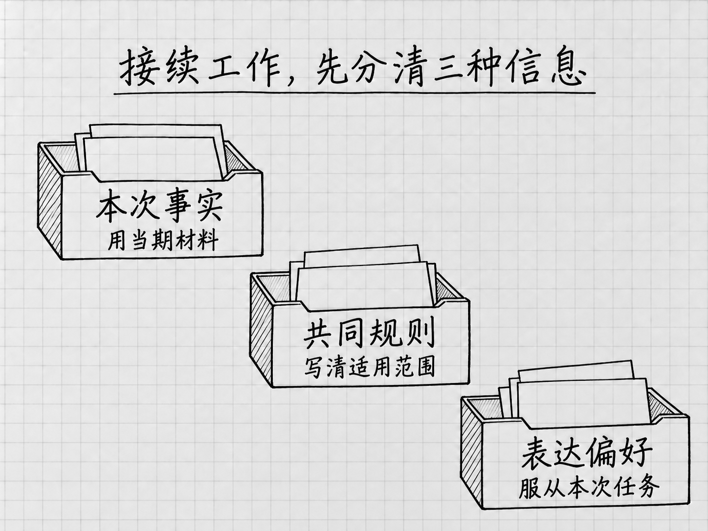

# 第12章 接续工作：按需认识资料库、项目与记忆

同一类工作做第二次时，重新寻找材料、解释背景、提醒格式，仍可能花掉不少时间。资料库、项目和记忆都与接续工作有关，但保存的对象不同，用错了反而容易沿用旧事实。

这章按需阅读。先学会用明确材料接续一次任务；当重复寻找与解释已经成为负担，再选用对应功能。

## 让新任务取得正确依据

回到[六文件练习](../examples/F03/README.md)。现行安排提供正式依据，历史安排用于比较，讨论副本保留未决定想法，变化说明则是根据原文形成的摘要。下次要查询当前安排，应该引用现行原文；摘要可以辅助阅读，但地位不能反过来。

新建一个任务，引用“正式文件”中的现行安排。已经有第10章的变化说明，可以一起提供；没有也不影响这个练习。然后问：

> 请根据我这次引用的正式安排，回答2026年9月28日之后的每周例会几点开始、在哪里，并指出原文依据。如已提供变化说明，它只作辅助；有冲突请以正式安排为依据，同时指出冲突。不要采用未确认讨论中的方案。

作者参考是周一14:00开始、305会议室。核对它采用的是9月25日确认的安排，而非历史材料中的上午时段。

这个小测试检验了两件事：新任务拿到了正确材料，并且知道哪些内容有权作为依据。问一句“你还记得吗”，得到肯定回答，却无法检验这两点。持续使用 AI 的基础，是让重要背景可以找回、可以核对，而不是寄希望于所有历史内容自动延续。

## 资料库：保存与引用常用材料

资料库是 WorkBuddy 中组织材料与成果的地方。官方说明区分“我的文档”和团队空间，并提供把指定资料添加到任务的方式。它适合解决“以后到哪里找这份材料”的问题。[官方资料库说明](https://www.codebuddy.cn/docs/workbuddy/From-Beginner-to-Expert-Guide/Function-Description/Library)

如果你的账号已经可以使用资料库，可以先上传一份已核对的虚构 Word 说明。在资料库找到它，再使用“添加到任务”，用于一个新任务。然后询问说明中的会议时间、地点与适用范围，核对回复实际采用的文件。[资料管理说明](https://www.codebuddy.cn/docs/workbuddy/From-Beginner-to-Expert-Guide/Function-Description/Library/Content-Management)

这里要区分两个动作：存入资料库，是以后能够查找；添加到当前任务，才明确本次要用哪份资料。不能因为库里存了几十份文件，就认为每项任务已经逐份读过。

版本也要在使用时确认。假如资料库同时保存旧说明和修订说明，新任务应明确引用当前有效的一份，旧版只有在需要比较时才加入。保存了新版本，不等于旧任务、旧摘要和所有引用都已同步更新；更新后的第一次使用，仍用一个已知答案的问题检查。

没有资料库条件，本地文件照样能完成这条路径。保存位置、文件名称和一行版本说明已经够用；不必为一份偶尔查看的资料增加管理层次。需要团队空间时，再确认谁能访问，个人保存和团队共享分别决定。

## 项目：保留一项持续工作的共同背景

WorkBuddy 中的“项目”用于组织持续工作的共同说明、材料与相关配置。它与一次任务的区别在于：任务处理眼前的一项请求，项目把多次相关工作需要的背景放在一起。[官方项目说明](https://www.codebuddy.cn/docs/workbuddy/From-Beginner-to-Expert-Guide/Function-Description/Project)

例如，你每周都给同一位主管写进展说明。报告对象、完成状态的定义和篇幅通常不变，本周做了什么、谁还没有回复却每次都变。前一类适合成为共同说明，后一类应随每次任务重新提供。

可以先写出这样一份简短说明，再用于组织持续工作：

> **这项工作**：每周向主管说明进展。  
> **共同要求**：先写已完成，再写进行中和待回应事项，最后写下周计划；已有草稿不能写成已定稿。  
> **表达方式**：一页内说清进展与需要支持的事项，保留关键条件。  
> **每次另给**：本周记录、统计周期、临时变化和已确认的新决定。

这份说明有用，是因为它保存的是判断方法。若把“本周完成三项”也写成长期要求，下周就可能把旧业绩带进新报告。

如果你已经在使用项目，第一次使用这些共同说明时，仍要指出当期输入，并检查输出是否正确区分共同要求与本周事实。例如：“沿用本项目的进展说明要求，只根据这次提供的记录整理；没有记录的成果不补写。”若新任务没有正确采用背景，就直接附上必要说明，先完成工作，再排查该任务与项目的关联和材料使用情况。

还没开始使用项目时，先把上面的共同说明保存为本地文件，每次与当期记录一起提供，就能练习同样的区分方法。以后需要使用项目功能，再依当前界面的官方说明配置；本例不依赖先建好项目。

产品中的项目也不是本地文件夹的别名。文件夹决定文件放在哪里；项目组织持续工作所需的背景。仅把文件移动到一个目录，不能证明相关任务已经使用它；把材料加入某个项目，也不应被理解为其他同事都能访问。多人共享取决于实际身份与配置。

只有一次的短通知，直接提供材料即可。经常重复解释同一套规则时，项目才有机会把准备投入分摊到后续任务。判断是否值得采用，可以看它是否减少了重复交代，以及规则变化时是否更容易找到并更正。

## 记忆：延续偏好，并检查它是否理解准确

记忆是产品从对话中提取并保留部分信息，供后续工作参考的机制。它不是完整聊天记录，也不保证某句话会立即、完整、永久地进入所有新任务。官方说明提供查看、更正、删除和关闭记忆的设置。[官方记忆说明](https://www.codebuddy.cn/docs/workbuddy/From-Beginner-to-Expert-Guide/Function-Description/Memory)

一个适合入门的例子是表达偏好：“给我写内部说明时，先说需要采取的行动，再补背景。”它只影响表达顺序，容易核对，也不会代替业务决定。

若当前环境启用了记忆，可以从账号头像菜单的“记忆与进化”查看已有内容。[账号菜单说明](https://www.codebuddy.cn/docs/workbuddy/From-Beginner-to-Expert-Guide/Function-Description/File-Browser)重点看它概括得对不对：原要求是“内部说明先写行动”，若被概括成“所有文章都必须只有三句话”，适用范围和要求都变了，应更正或删除。没有看到相应记忆时，本次请求直接写明偏好即可，不必等待自动更新才能继续工作。

接着用一份新材料检查效果。假设新任务要求一份详细操作说明，它仍应按需要展开步骤，不能为了“简洁”删掉必要条件。所谓偏好，是在合适范围内帮助表达；若影响了当前交付，就在任务中把要求说清楚，并回头处理不准确的记忆。

会议时间、客户状态和审批结果等事实，应以有日期和依据的正式材料为准。假设记忆保留了“例会周一上午开”，现行文件却写下午，处理分两步：当前任务依据正式文件回答；过时记忆另行更正或删除。只改这一次答案而留下错误背景，下一次仍可能需要纠正。

## 把事实、规则和偏好分别管理

<!-- diagram: FIG-023 -->

*图：先分清保存的内容，再按需选择本地文件、资料库、项目或记忆。复用方法时，仍要更新和核对本次事实。*
<!-- /diagram: FIG-023 -->

把这几种方式放回刚才的周报，你会更容易选择：

|需要保留的内容|适合怎样使用|
|---|---|
|本周工作记录、正式安排|作为本次任务的事实依据，明确引用有效版本|
|以后还会用的说明与成果文件|保存在易找的位置，按需使用资料库组织和引用|
|固定报告对象、状态定义、写作要求|作为持续工作的共同背景，按需用项目组织|
|个人表达顺序等偏好|可以利用记忆，并检查提取是否准确|

这些方式可以配合，但没有一种负责所有事情。资料库中的文件可能需要更新；项目规则可能不适用于另一项工作；记忆可能概括失真。发生冲突时，先分清是本次事实、工作规则还是表达偏好，再回到相应依据处理。

也不必把同一条规则复制到五处。重复保存看似更保险，修改时却容易漏掉旧副本。保留一个清楚的共同说明，其他地方明确引用它，比到处留下略有差异的版本更容易维护。

## 动手与回看

先完成本章开头的新任务引用：拿到正确材料，回答一个能核对的问题。经常复用的人，再选一条适合自己的路线：把一份说明加入资料库后重新引用；把稳定要求与当期资料分开；或者检查一条无关业务事实的记忆偏好。

这一章要形成的习惯，是把下一次工作需要的背景准备好。能减少重新寻找和解释，同时又不会把旧事实带进新任务，接续才真正省力。

<!-- studio:nav -->
← [第11章 按需扩展：认识技能、专家与连接器](capability-system.md) · [目录](../README.md) · [选读指南：从眼前最需要完成的工作开始](choose.md) →
<!-- /studio:nav -->
