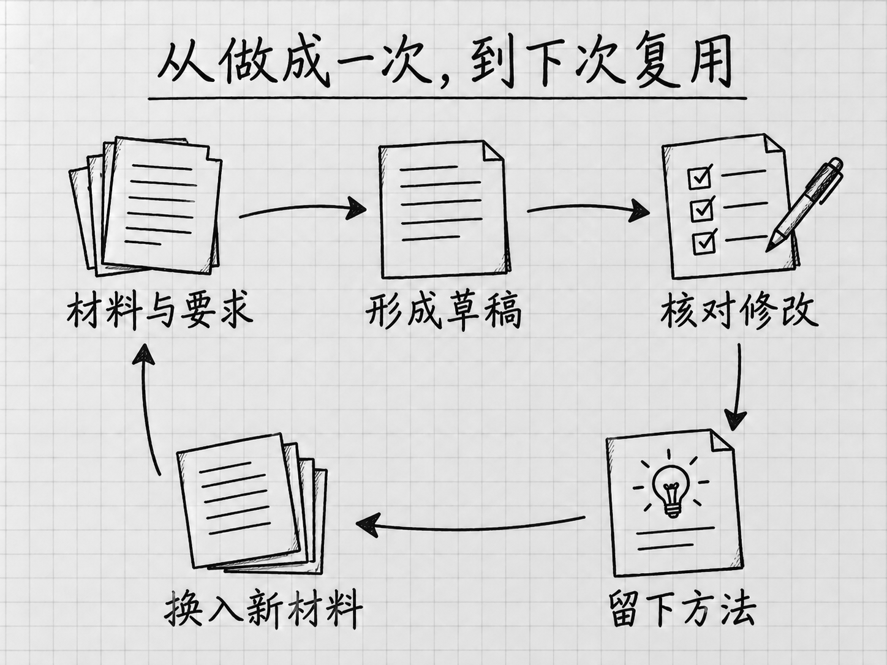

# 阅读指南：从第一次使用，到减少日常重复劳动

这本书面向会使用电脑、没有编程基础、尚未用过 WorkBuddy 的白领。你将学会把工作要求和材料交给它，检查、修改成果，再把做对的方法用于下一次工作。日常电脑操作直接带过；WorkBuddy 与AI有关的陌生概念，会在第一次需要时结合任务解释。

效率提升来自少做重复整理、搬运和解释，减少方向错误造成的返工。例如，把几份材料按同一口径汇总，形成能检查的草稿；材料变化后只更新受影响的部分；下个月沿用方法，重新读取事实。书中的练习围绕这些具体收益展开。

## 两个部分：先会操作，再通过工作学会方法

<!-- diagram: FIG-012 -->

*图：先用一项任务练会交代、检查和修改，再保留有效做法；下一次仍需换入新事实。各环节按实际任务需要使用。*
<!-- /diagram: FIG-012 -->

第一部分“从零上手”对应第01—12章。第01—04章帮助你完成第一次任务：先整理几条提醒，再用八条工作记录做一份周报。第05—10章深入讲材料、任务说明、模型与模式、权限、过程控制和成果检查，让你知道每一步影响什么，出错时该查哪里。

第11、12章按需阅读，讲技能、专家、连接器，以及资料库、项目和记忆。它们适合不同的工作需要；理解用途后，遇到实际需求再尝试，不必为了开始办公把所有扩展配齐。

第二部分“高效办公”对应第13—20章。第13—19章分别处理资料学习、文稿、表格、汇报、问题分析、沟通推进和重复流程。各章用独立材料完成一项工作，再用条件变化说明怎样判断和调整。已经能独立交材料、取回文件的读者，可以从[选读指南](choose.md)进入眼前需要的章节。

第20章是本部分的综合实践：从月度材料形成统计、小结和后续安排，处理一次更正，再换月份复用。它教你按交付需要组合方法，不要求凑齐七种能力。可以先用书中的材料，再换成自己的一项工作。

附录A排查常见问题，附录B查术语、版本与任务入口，遇到需要时回看。

## 在七类工作中，学会七种判断

|眼前的工作|本章重点练习的习惯|
|---|---|
|资料搜集与快速学习|带着问题读，分清依据和推断|
|文稿写作与文档制作|先确定谁要看、看完要做什么，再写文字|
|表格处理与数据分析|先定统计口径，再看计算和解释|
|工作总结与汇报展示|从对方要作的判断出发，组织证据|
|问题分析与方案制定|先弄清问题和限制，再比较办法|
|沟通协作与任务推进|把消息变成明确动作，跟到结果|
|重复工作与流程复用|留下稳定方法，每次换入新的事实|

这些习惯会在案例里用到：为什么同一份通知换了读者就要重写；为什么八条催补消息不代表八次失败；为什么上周的好周报可能把旧事实带进本周。你既会看到可以怎样请求 WorkBuddy，也会知道该检查什么、反馈什么，以及换一种材料后怎样继续使用。

七类工作是本书的教学选择，不是某项调查的频率排名。你可以从最常做、最容易核对结果的一类开始。

## 分轮使用材料，自己先做，再看参考

[练习材料目录](../examples/README.md)提供独立的原创虚构案例。第一轮只给本轮输入，完成后再加入说明中指定的变化；参考答案留到自己做完后核对，不交给AI当输入。这样才能看出它是否依据材料完成了工作。

书中的请求可以直接使用，但换成自己的任务时，要更换日期、对象、范围与交付要求。判断结果看事实和用途，不要求措辞与参考一字不差。提示词背后的选择会随案例说明，不需要另背一套固定口诀。

方向未确定时，先检查少量内容，可以少做无效排版；要求已经清楚的小任务则可以直接成稿。是否分步取决于哪里容易出错，无需每项工作都重复完整流程。

## 把检查与修改也算进投入

AI回复快，不等于整项工作已经省时。准备材料、补充要求、核对数字和修订文件，都算你的投入；后台等待与自己实际动手的时间分开看。只有交付质量达到同样要求，时间比较才有意义。

第一次重点学会做成，第二次看能否复用：哪些要求不用再解释，哪些材料可以一起处理，哪些变化只需局部更新。愿意计时就记下来，不必为了学习每章都填一张表。书中小样用于理解方法，实际省多少时间，需要放到自己的工作量中验证。

从第一项练习开始，保留输入与已确认结果。以后需要改进时，能回到具体材料和修改位置，比重新猜一遍问题出在哪里更省力。

<!-- studio:nav -->
[目录](../README.md) · [第01章 认识 WorkBuddy：它能帮你完成哪些工作](understand.md) →
<!-- /studio:nav -->
