<!-- Generated by studio; edit the units in book.yaml. -->

# WorkBuddy高效工作法：零基础掌握办公与学习的7个高效习惯

 <strong>马力</strong>

## 目录

### 开篇

- [阅读指南：从第一次使用，到减少日常重复劳动](#reading-guide)

### 第一部分 从零上手：学会 WorkBuddy 的基本操作

- [第01章 认识 WorkBuddy：它能帮你完成哪些工作](#understand)
- [第02章 安装与登录：准备好第一次使用](#setup)
- [第03章 认识界面：创建任务，发出第一条消息](#first-screen)
- [第04章 第一次完成任务：把工作记录整理成周报](#first-file)
- [第05章 提供材料：让 WorkBuddy 读对文件、用对版本](#materials)
- [第06章 交代任务：说清目的、要求和交付物](#task-brief)
- [第07章 选择模型与模式：直接做、先讨论，还是先计划](#models-modes)
- [第08章 权限与授权：设定本次任务的操作范围](#permissions)
- [第09章 跟进任务：查看进度、补充要求与继续处理](#running-control)
- [第10章 检查结果：找到、修改和保存文件](#results)
- [第11章 按需扩展：认识技能、专家与连接器](#capability-system)
- [第12章 接续工作：按需认识资料库、项目与记忆](#continuity)

### 第二部分 高效办公：七类常见工作与AI工作习惯

- [选读指南：从眼前最需要完成的工作开始](#choose)
- [第13章 资料搜集与快速学习：带着问题找到可靠答案](#capability-learn)
- [第14章 文稿写作与文档制作：写清内容，交出可用文件](#capability-write)
- [第15章 表格处理与数据分析：统一口径，得到可信结论](#capability-data)
- [第16章 工作总结与汇报展示：提炼成果，讲清重点](#capability-present)
- [第17章 问题分析与方案制定：找准问题，比较可行办法](#capability-think)
- [第18章 沟通协作与任务推进：理清消息，跟进到结果](#capability-coordinate)
- [第19章 重复工作与流程复用：留下方法，下次接着用](#capability-reuse)
- [第20章 综合实践：用 WorkBuddy 完成一项真实工作](#capstone)

### 附录

- [附录A 常见问题排查：任务卡住、结果不对、文件打不开](#troubleshooting)
- [附录B 日常使用速查：术语、版本与任务入口](#version-card)

## 开篇

### 阅读指南：从第一次使用，到减少日常重复劳动

这本书面向会使用电脑、没有编程基础、尚未用过 WorkBuddy 的白领。你将学会把工作要求和材料交给它，检查、修改成果，再把做对的方法用于下一次工作。日常电脑操作直接带过；WorkBuddy 与AI有关的陌生概念，会在第一次需要时结合任务解释。

效率提升来自少做重复整理、搬运和解释，减少方向错误造成的返工。例如，把几份材料按同一口径汇总，形成能检查的草稿；材料变化后只更新受影响的部分；下个月沿用方法，重新读取事实。书中的练习围绕这些具体收益展开。

#### 两个部分：先会操作，再通过工作学会方法

<!-- diagram: FIG-012 -->

*图：先用一项任务练会交代、检查和修改，再保留有效做法；下一次仍需换入新事实。各环节按实际任务需要使用。*
<!-- /diagram: FIG-012 -->

第一部分“从零上手”对应第01—12章。第01—04章帮助你完成第一次任务：先整理几条提醒，再用八条工作记录做一份周报。第05—10章深入讲材料、任务说明、模型与模式、权限、过程控制和成果检查，让你知道每一步影响什么，出错时该查哪里。

第11、12章按需阅读，讲技能、专家、连接器，以及资料库、项目和记忆。它们适合不同的工作需要；理解用途后，遇到实际需求再尝试，不必为了开始办公把所有扩展配齐。

第二部分“高效办公”对应第13—20章。第13—19章分别处理资料学习、文稿、表格、汇报、问题分析、沟通推进和重复流程。各章用独立材料完成一项工作，再用条件变化说明怎样判断和调整。已经能独立交材料、取回文件的读者，可以从[选读指南](#choose)进入眼前需要的章节。

第20章是本部分的综合实践：从月度材料形成统计、小结和后续安排，处理一次更正，再换月份复用。它教你按交付需要组合方法，不要求凑齐七种能力。可以先用书中的材料，再换成自己的一项工作。

附录A排查常见问题，附录B查术语、版本与任务入口，遇到需要时回看。

#### 在七类工作中，学会七种判断

|眼前的工作|本章重点练习的习惯|
|---|---|
|资料搜集与快速学习|带着问题读，分清依据和推断|
|文稿写作与文档制作|先确定谁要看、看完要做什么，再写文字|
|表格处理与数据分析|先定统计口径，再看计算和解释|
|工作总结与汇报展示|从对方要作的判断出发，组织证据|
|问题分析与方案制定|先弄清问题和限制，再比较办法|
|沟通协作与任务推进|把消息变成明确动作，跟到结果|
|重复工作与流程复用|留下稳定方法，每次换入新的事实|

这些习惯会在案例里用到：为什么同一份通知换了读者就要重写；为什么八条催补消息不代表八次失败；为什么上周的好周报可能把旧事实带进本周。你既会看到可以怎样请求 WorkBuddy，也会知道该检查什么、反馈什么，以及换一种材料后怎样继续使用。

七类工作是本书的教学选择，不是某项调查的频率排名。你可以从最常做、最容易核对结果的一类开始。

#### 分轮使用材料，自己先做，再看参考

[练习材料目录](examples/README.md)提供独立的原创虚构案例。第一轮只给本轮输入，完成后再加入说明中指定的变化；参考答案留到自己做完后核对，不交给AI当输入。这样才能看出它是否依据材料完成了工作。

书中的请求可以直接使用，但换成自己的任务时，要更换日期、对象、范围与交付要求。判断结果看事实和用途，不要求措辞与参考一字不差。提示词背后的选择会随案例说明，不需要另背一套固定口诀。

方向未确定时，先检查少量内容，可以少做无效排版；要求已经清楚的小任务则可以直接成稿。是否分步取决于哪里容易出错，无需每项工作都重复完整流程。

#### 把检查与修改也算进投入

AI回复快，不等于整项工作已经省时。准备材料、补充要求、核对数字和修订文件，都算你的投入；后台等待与自己实际动手的时间分开看。只有交付质量达到同样要求，时间比较才有意义。

第一次重点学会做成，第二次看能否复用：哪些要求不用再解释，哪些材料可以一起处理，哪些变化只需局部更新。愿意计时就记下来，不必为了学习每章都填一张表。书中小样用于理解方法，实际省多少时间，需要放到自己的工作量中验证。

从第一项练习开始，保留输入与已确认结果。以后需要改进时，能回到具体材料和修改位置，比重新猜一遍问题出在哪里更省力。

## 第一部分 从零上手：学会 WorkBuddy 的基本操作

### 第01章 认识 WorkBuddy：它能帮你完成哪些工作

周五下午，你准备写周报。事情其实都做了，记录也有：资料整理过，通知发出去了，一份说明写到一半，另有一件事还在等同事回复。麻烦在于，这些记录并不是一份可以直接交出去的周报。你要重新读一遍，判断完成状态，归类，改成主管能看懂的句子，再放进文档。

WorkBuddy 可以参与这段工作。你把材料交给它，说明要交什么，它可以帮助阅读、归纳和组织内容，并在当前环境允许的范围内处理文件。腾讯将它定位为人工智能（AI）工作台。你可以像平时交代工作一样，用普通中文说明任务，办公文件是其明确介绍的用途之一。[官方产品简介](https://cloud.tencent.com/document/product/1831/134384)

<!-- diagram: FIG-034 -->
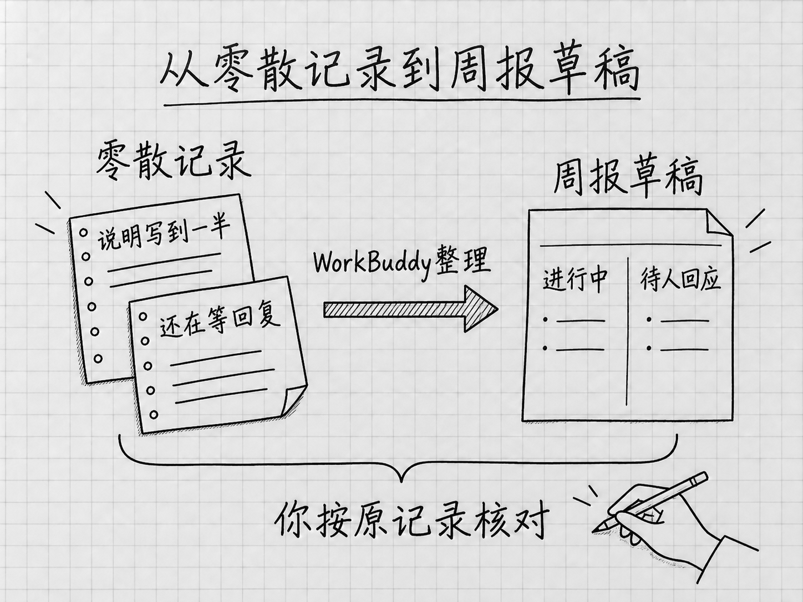

*图：WorkBuddy 帮你整理记录、区分状态；你按原记录核对，避免把进行中、待回复写成已经完成。*
<!-- /diagram: FIG-034 -->

本书从这种普通工作开始。你不需要会编程，也不必把自己变成软件工程师。首先要学会的是：把一件事交代清楚，给出能用的材料，发现结果中的问题，最后拿到真正能使用的成果。

#### 先看清楚，我们准备让它做什么

本书的第一个完整练习只有八条虚构记录。现在先看其中三条：

> 《资料提交说明》计划写3节，前2节已有草稿，第3节还没写完，尚未提交审阅。  
> 本周向会务同事问了培训设备清单，截至周五下班仍没收到回复。  
> 下周一补完《资料提交说明》第3节，连同前2节发给主管审阅。

这三条不能都放进“本周成果”。第一条是进行中，第二条是等待回应，第三条是下周计划。下面是作者编写的整理示例：

> **进行中**：《资料提交说明》已有前2节草稿，第3节待完成，尚未提交审阅。  
> **待人回应**：培训设备清单已询问，仍待会务同事回复。  
> **下周计划**：补完第3节后，将整份说明提交主管审阅。

你看到的变化不只是句子更顺了。原来散放的进展被放到合适位置，主管可以更快判断什么已经完成、什么还需要跟进。如果材料有几十条，这种阅读、分类和改写的重复劳动就更值得交给工具。

但这份示例也说明了人的作用。“写出草稿”与“已经定稿”有什么差别，哪些内容必须保留，最终仍要按原记录检查。AI 把未完成的事写得更漂亮，并不会让它变成真实业绩。

#### 为什么它既能整理文字，又能处理文件

<!-- diagram: FIG-013 -->
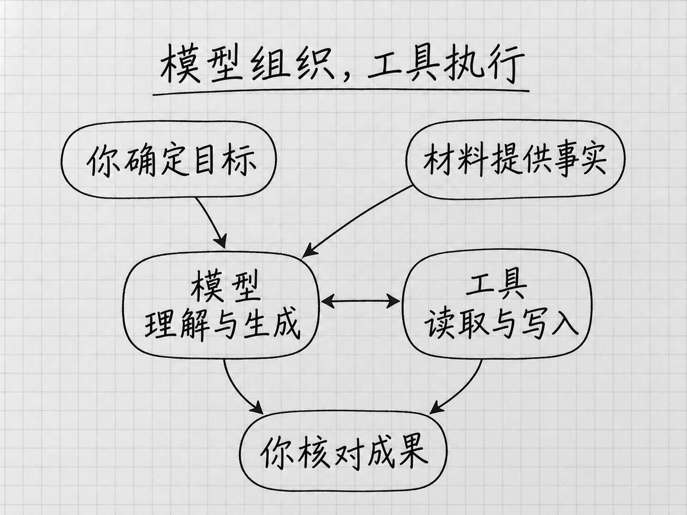

*图：你确定目标，材料提供事实；模型组织内容，工具落实读写。能推进任务，仍不等于自动做对，最后要核对成果。*
<!-- /diagram: FIG-013 -->

本书关心 AI 在办公中的两类用途：理解和生成内容，以及借助工具执行动作。两者结合，才有可能把“替我想一想怎么写”推进到“根据这些记录做出周报文件”。

负责理解和生成内容的核心，叫**模型**。你给出八条记录和周报要求，模型会尝试判断事项的状态、安排结构、组织句子。你不必先学习模型的技术原理，但要理解它与传统表格公式的差别：公式按照设定规则计算，模型则会根据你的表述和材料组织答案。同一份记录，要求“汇报进展”和要求“找出需要支持的事项”，得到的侧重点可以不同。

这种灵活性很有用，也带来需要检查的地方。记录只说“目录已发给主管”，它可能把这句话写成“资料整理工作已获认可”。句子通顺，却多出了没有依据的判断。遇到这种情况，应该回到记录，指出哪一个状态被扩大，而不是仅仅要求“写得严谨一点”。

生成一段周报文字，还没有生成 Word 文件。读取电脑文件、创建文档等具体动作，需要相应的**工具**，并且得到执行这些动作所需的允许。模型负责判断要怎样处理，工具把读取、写入等动作落实到实际材料上。因此，文件读不到时，换一种漂亮的问法不能补上缺失的内容；只收到文字时，也不能据此认为文件已经保存。

能够围绕目标调用工具，把多个步骤接起来执行的 AI 助手，常被称为**智能体**，英文是 Agent。以周报为例，它可以围绕你的目标，先读取记录，再整理内容，最后借助文件能力生成文档。这里“能推进任务”不代表“会自动判断一切”：统计哪一周、交给谁、未确认的事怎样写，仍需要你提供条件；它交回的内容和文件，也需要按这些条件检查。

现在可以看清各自的分工：你确定工作目标与重要条件，材料提供事实，模型帮助理解和组织，工具负责具体执行。使用 WorkBuddy 的关键，是把这些环节接好。它的回复可以帮你了解进度，实际文件和原始依据才让你判断工作是否完成。

#### 问问题、讨论办法和处理文件，完成标准不同

<!-- diagram: FIG-014 -->
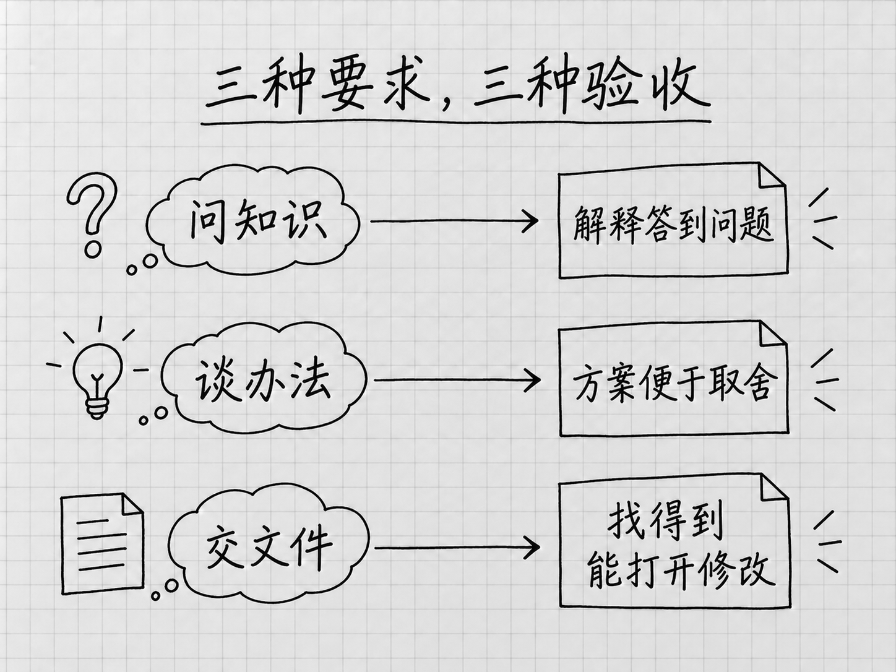

*图：咨询看是否答到问题，讨论看是否帮助选择；要求可编辑文件时，还要找得到、打开并能修改。三类任务不必依次完成。*
<!-- /diagram: FIG-014 -->

同样是关于周报，下面三句话要求的工作并不一样：

> “周报一般应该写哪些内容？”

你需要的是一个解释。回复能帮助你理解结构，这项咨询就可能已经完成，不必生成文件。

> “我有完成的事，也有等待别人回复的事，怎样安排更清楚？”

你在讨论表达方式。此时可以比较几种分法，再决定自己的周报用哪一种。它给出建议，不等于已经处理了你的真实记录。

> “请根据这八条记录生成一页可编辑周报，保留完成状态，并告诉我文件在哪里。”

这次你要求交付文件。合格结果不仅要有文字，还要存在一份能找到、打开和修改的文档。官方的首个任务说明也把查看产物列在执行之后；任务中的回复与生成文件有各自的查看位置。[开启第一个任务](https://www.workbuddy.cn/docs/workbuddy/FirstTask)

因此，不要只看最后一句“已完成”。你要看它完成的是解释、计划，还是你要求的文件。这个习惯会贯穿全书：按照实际工作来验收，而不是按照回复的语气来验收。

#### WorkBuddy 的几个特点，会在办公中怎样用到

最先用到的是本地材料和成果文件。你可以围绕一项任务提供资料，要求得到通知、表格或其他成果；已有结果不合适，还可以继续提出具体修改意见。官方文档提供了从要求生成 Word 文档、再继续修改的做法。[文档生成与编辑](https://www.workbuddy.cn/docs/workbuddy/From-Beginner-to-Expert-Guide/Practice-Cases/Practice-Two)

做得多了，你还可以把稳定的方法留给下一次使用，围绕同一项工作继续补充材料。后面会在具体任务中讲这些做法；眼下先学会一次完整交付，不需要为第一份周报配置所有扩展功能。

接下来七项工作会分别练习读资料、写文稿、整理表格、做汇报、分析问题、沟通推进和复用重复工作。它们的共同点是，先围绕一个你认识的工作目标，取得一件能用的成果，再逐渐学会更复杂的方法。无需一次读完所有功能，才开始做一件小事。

#### 怎样选择第一项值得交出去的工作

先挑输入已经存在、重复动作较多、结果又能检查的任务。把十几条零散记录整理成清单，通常比让 AI 替你决定一个没有材料的重大取舍更适合作为起点。你有原记录，也知道清单应该保留什么，容易判断它是否帮上了忙。

<!-- diagram: FIG-035 -->
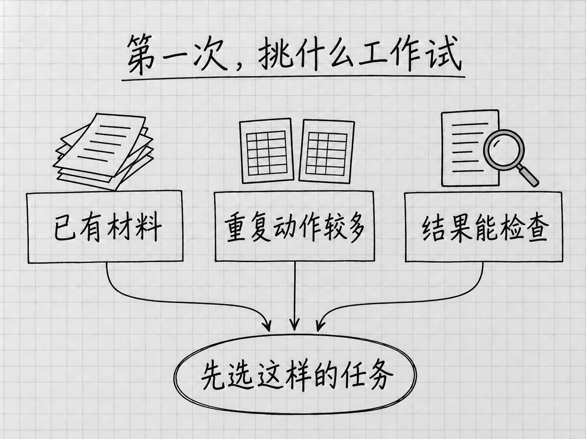

*图：已有材料、重复动作较多、结果能检查，适合作为第一次尝试的起点。是否省力，还要把准备、等待、检查和返工算进去。*
<!-- /diagram: FIG-035 -->

也不必把所有小事都交出去。回复一句“收到，谢谢”，自己打完可能更快；为了这一句话解释背景、选择语气、等待输出，反而增加动作。相反，一份需要反复换格式、按对象改写、每周都要重做的材料，才更可能带来持续的节省。

先不急着估计能省几倍时间。把自己最费力的环节指出来：是找材料、抄数据、分类，还是改了几遍仍不合适？以后比较时，把准备材料、等待、检查和返工都算进去。第一次花时间熟悉操作很正常；熟悉之后仍需要大量纠错，则要重新判断任务是否适合，或者材料和要求是否需要改进。

#### 选一件自己的工作

写下最近一周反复做的一件事，再补两句话：“我现在有哪些材料？”“完成后应该交出什么？”例如：“我每周要整理工作记录；材料是每天的笔记；最终交一页状态准确的周报。”再指出最费力的环节。以后你要比较的，是这一环节是否变省力、整件事是否仍然做对，而不是 AI 一次能写多少字。

如果暂时选不出自己的任务，就先使用本书的八条虚构工作记录。你可以用明确的材料练习交代与验收，再把方法换到自己的工作中。

### 第02章 安装与登录：准备好第一次使用

这一章完成安装、登录和练习材料准备。安装步骤只需阅读对应自己系统的段落；后面的登录回跳与工作位置说明，两种系统都需要看。

请先准备一台自己有权安装应用的电脑和可用网络。公司电脑如果由管理员统一管理，先按公司提供的安装方式操作。本章不用终端，也不需要自己配置编程环境。

#### 从官方入口选择适合电脑的安装包

从[WorkBuddy 官网](https://www.workbuddy.cn/)下载对应系统的安装包。需要核对的不只是 Windows 或 Mac，还包括系统版本与处理器类型：应用支持你的系统，不一定表示每个安装包都适合这台电脑。

Windows 可以在系统“设置”中进入“系统”，再进入“关于”，查看 Windows 规格和设备规格。这里既能看到系统版本，也能看到处理器和系统类型。WorkBuddy 的 Windows 安装页列出 Windows 10 及以上、x64 环境；如果设备显示 ARM 架构，应再看当前下载页的适配说明，不要只因为同样叫 Windows 就任选安装包。[Windows 设备信息](https://support.microsoft.com/zh-cn/windows/experience/find-information-about-your-windows-device)、[WorkBuddy Windows 安装指南](https://www.workbuddy.cn/docs/workbuddy/From-Beginner-to-Expert-Guide/Installation-Win-Guide)

Mac 可以打开苹果菜单中的“关于本机”。显示 M 系列芯片时，对应 WorkBuddy 的 Mac ARM64 包；显示 Intel 处理器时，对应 Mac X64 包。官方安装页要求 macOS 12 及以上。这里的 ARM64、X64 是区分安装包适用硬件的名称，你只需把页面上的选项与本机信息对应，不用学习芯片原理。[Apple 芯片识别说明](https://support.apple.com/zh-cn/116943)、[WorkBuddy Mac 安装指南](https://www.workbuddy.cn/docs/workbuddy/From-Beginner-to-Expert-Guide/Installation-Mac-Guide)

安装要求可能随版本调整。下载时若官网说明与这里不同，以当前官方要求为准；不符合要求时，先解决设备适配问题，再继续。

#### Windows：安装后从应用入口打开

打开下载好的安装包，按向导完成安装。没有单位要求时，沿用向导提供的位置即可。安装结束后，从开始菜单或桌面快捷方式打开 WorkBuddy。

若系统要求管理员凭据，而你没有安装权限，把应用名称、官方来源和提示交给管理员处理。这里需要解决的是安装权限，不是调整 WorkBuddy 里处理文件的权限；后者等开始任务时再设置。

#### Mac：复制到“应用程序”后再打开

打开下载的 `.dmg` 安装文件，按官方说明将 WorkBuddy 拖入 Applications（“应用程序”）。等待复制完成，再从“应用程序”打开 WorkBuddy；以后也从这里启动，不必重新打开安装包。

首次打开出现提示时，先区分是在确认应用来源，还是报告无法运行。若无法运行，优先核对 ARM64／X64 包与本机芯片是否匹配、系统是否满足要求。不要用反复下载同一个包来代替这一步判断。

#### 登录成功，要回到客户端再看一眼

官方文档常用“客户端”称呼安装在电脑上的 WorkBuddy 应用。登录从客户端发起，在浏览器中完成身份验证，再返回客户端。这个回跳过程，是首次使用时需要留意的一步。

点击应用中的登录入口，在打开的官方页面完成验证。个人练习使用自己可用的账号；组织统一登录则按组织安排。二维码、验证码等只在登录流程中使用，无需发给 AI。

网页显示登录完成后，切回 WorkBuddy。检查应用是否已经进入可开始任务的界面，账号信息是否符合预期。浏览器登录成功与客户端完成登录并不是同一件事；如果应用仍停在登录页，不要在多个窗口连续重复扫码。

先看看浏览器有没有等待你确认打开 WorkBuddy 的提示，再回到应用查看。仍无变化时，记录卡住的步骤与提示，重新从应用发起一次登录。公司网络或设备策略造成的拦截，应交给负责该环境的人处理，不必立即重装软件。

#### 记住版本，再建立练习文件夹

应用会更新，教材和你看到的细节可能略有差异。官方导航说明把当前版本号列在左侧导航栏顶部，可以先在那里查看并记下号码。需要检查更新时，打开账号头像菜单，找到“检查更新”。记录的是本机显示的版本，不要把官网某条更新日志的号码当成已经安装的版本。[左侧导航栏](https://www.codebuddy.cn/docs/workbuddy/From-Beginner-to-Expert-Guide/Function-Description/Sidebar)、[账号菜单说明](https://www.codebuddy.cn/docs/workbuddy/From-Beginner-to-Expert-Guide/Function-Description/File-Browser)

在自己习惯的位置建立“WorkBuddy练习”文件夹，再建一个“我的周报练习”子文件夹。先用随书材料，第四章会把工作记录和周报结果集中在这里。

这个位置以后会作为任务的**工作空间**：告诉 WorkBuddy 此次主要在哪个文件夹读取材料、保存成果。它不等于软件安装位置，也不等于“请处理这里所有文件”。选定位置后，仍要在任务里说清使用哪份材料、生成什么。下一章会结合界面说明。

如果应用已经登录、练习位置已经准备好，就可以继续。此时不需要添加外部服务，也不必更改高级设置。

#### 卡住了

下载没完成，就先处理浏览器中的下载问题；安装包打不开，先核对系统与安装包；网页登录成功但应用没变化，先检查登录是否回到客户端。遇到提示时，保留原文和发生步骤，比只说“不能用”更便于找到原因。若系统不符合官方要求，应换用符合要求的环境，避免反复安装同一个不适用的包。

### 第03章 认识界面：创建任务，发出第一条消息

第一次打开 WorkBuddy，页面上可能同时出现任务、场景、模板和许多功能入口。现在不用逐个认识。先做一件很小的事：把三条提醒整理成清单，再补充一句要求，最后找回这段记录。

这次练习只需要文字回复，不生成文件，也不设置真正的定时提醒。这样，你可以先熟悉“发送—查看—补充”的过程，再进入下一章的文件任务。

#### 先找三个地方

<!-- diagram: FIG-007 -->
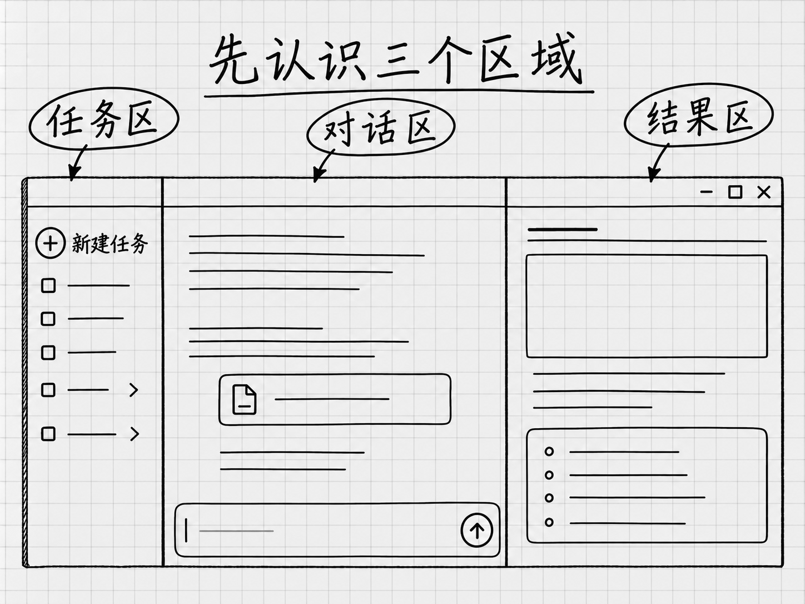

*图：左侧找任务，中间继续对话，右侧查看展开的结果。本章只整理文字，不要求生成文件。*
<!-- /diagram: FIG-007 -->

第一个地方是任务列表。它用来找回你做过的事。你可以把一个任务理解成围绕一件事持续工作的地方：这里会保留这件事的要求、补充信息和回复。官方任务管理说明提供了列表、搜索与继续处理已有任务的用法。[任务管理](https://www.workbuddy.cn/docs/workbuddy/Task-Management)

第二个地方是当前任务的对话区。你写出的要求和 WorkBuddy 的回答会在这里先后出现。输入区是等待你写下一句话的地方。刚打进去、还没有发送的内容，仍然是草稿；它不能当作已经交给 WorkBuddy 的指令。

第三个地方是查看结果的区域。官方对话说明中，“显示详情面板”可用于查看产物、文件和变更等内容。不是每个任务都会生成文件：这一章只整理文字，结果出现在对话里就足够。[任务对话](https://www.workbuddy.cn/docs/workbuddy/Conversation)

先在自己的窗口中找到任务入口与输入区。其他功能暂时留在原处，不需要为了开始练习把设置调整一遍。

#### 新建任务，把练习放到清楚的位置

使用“新建任务”入口。页面准备接收新要求，就可以开始了。若当前页面提供“选择工作空间”，选择上一章建立的“WorkBuddy练习”文件夹。

上一章准备的练习文件夹，现在被指定为任务主要读写文件的位置。**任务**保留围绕这件事的对话，**工作空间**容纳它要处理的文件，二者配合使用：一份清单可以只留在对话里，也可以按你的要求另存为文件。官方允许指定工作目录，也允许直接开始、使用默认目录。本章没有文件读写需求，暂用默认位置也可以，第四章生成周报时再明确选好练习位置。[创建任务](https://www.codebuddy.cn/docs/workbuddy/Create-Task)

你写给 AI 的任务说明，通常叫**提示词**。它可以是一句话，也可以连同材料与要求一起写成几段；不是代码，也没有必须使用的特殊句式。“提示词模板”只是预先写好的说明，使用时仍要把任务、材料和结果要求改成自己的。这次直接用下面这段话即可。

#### 发送三条提醒

在输入区粘贴下面这段话并发送：

> 请把下面三条虚构提醒整理成清楚的待办清单，只在对话里回复，不创建文件，也不设置定时提醒。  
> 1. 2026年9月25日下班前，核对完培训报名表。  
> 2. 整理资料目录，日期尚未确定。  
> 3. 2026年9月23日15:00，参加部门碰头会。

成功提交后，这段文字应作为你的一条消息出现在对话中，随后会出现 WorkBuddy 的处理过程或回复。若文字还留在输入框里、没有进入对话，先确认是否真的发出，再考虑重试，避免同一请求被提交多次。

这一轮的合格结果是三件事都保留，日期不被猜改。“日期尚未确定”不应自动变成明天或下周。清单的措辞可以与你写的不同，关键是事项和条件相同。

下面是作者编写的一种参考形式，并不是固定的 WorkBuddy 回复：

> - 核对培训报名表：9月25日下班前完成。  
> - 整理资料目录：日期待定。  
> - 参加部门碰头会：9月23日15:00。

先不用评价它“够不够专业”。看看是否漏了一条，是否把核对报名表误写成参加培训，是否擅自补了目录整理日期。对照原文做这种小检查，就是以后检查更复杂成果的起点。

#### 留在原任务，补充一次要求

等这一轮完成，在同一个输入区继续发送：

> 请按日期先后排列，有具体日期的放前面，缺日期的单列。保留三件事，不要补日期。

不用重新粘贴全部提醒。WorkBuddy 会结合这项任务前面的内容，理解“按日期排列”指的是哪份清单。这种在处理当前请求时可用的前文、材料和条件，叫**上下文**。第一条消息提供了三件事及日期，第二条只需补充排序要求，这就是利用上下文减少重复解释。

不过，你在电脑里打开过某份资料，不代表它已经成为这项任务的上下文；仍需提供相关内容。你看到旧对话保留在任务历史里，也不应据此假定每个细节都会被准确沿用。重要日期、版本或条件有变化时，要明确指出改变的项目。这一次只改顺序，合格结果应是9月23日排在9月25日前面，整理资料目录留在日期未定的部分。

作者参考结果可以写成：

> **有日期的事项**  
> 9月23日15:00：参加部门碰头会。  
> 9月25日下班前：核对完培训报名表。  
>   
> **日期待定**  
> 整理资料目录。

如果得到的结果没有按要求变化，不必把上一条请求原封不动反复发送。直接指出具体位置：“9月23日应排在9月25日前面，请只调整这两条的顺序。”这种反馈告诉工具需要改什么，也让你容易核对它是否真的改对了。

#### 知道什么时候等，什么时候回应

执行过程中，界面可能显示正在处理的状态，也可能出现一条需要你回答的问题。前者表示工具还在做事；后者表示下一步需要你的信息或选择。不要只根据时间长短判断“卡住了”，先读当前消息。

本练习已经说清日期未定的事项可以单列。如果它仍询问目录整理日期，你可以回复：“目前没有确定日期，保留待定即可。”这不是你提问失败，也不需要为继续对话编一个日期。

若出现权限提示，看看它准备做的动作是否与本练习有关。这里只整理文字，没有要求改文件或发送消息给别人；可以请它直接在对话里给出结果。遇到明显失败提示，先保留提示文字，确认刚才的请求是否已经提交；如果任务记录还在，回到同一任务补充情况，而不是连续新开多个相同任务。

#### 离开一次，再找到它

现在切到另一个页面，再从任务列表找到刚才的任务。标题可能由任务内容生成，不一定与你预想的一样。可以根据提醒、报名表等内容辨认；列表较长时使用搜索，找到后打开并查看自己的原始消息。

找到的是任务历史，它可以帮助你继续对话。这里保留了一份文字清单，但电脑上未必存在一份独立文档。你没有要求生成文件，因此此时不必在文件夹里到处找“提醒清单”。

下一章会专门要求一份 Word 文件。那时，是否能在对话中看到文字，只完成了一部分检查，还要去实际位置找到文件。这两种完成标准不同，早一点分清，后面会少走许多弯路。

#### 再做一次局部修改

回到刚才的任务，补充：“只把日期待定这一项改成‘整理资料目录，时间另行确认’，其他内容不变。”检查它是否只改了指定事项，随后离开并找回这段对话。

你已经练过最常用的工作方式：先交代一件事，利用已有上下文补充要求，再检查实际变化。下一章把这套方法用到一份真正的办公文件。

#### 卡住了

找不到记录时，先看当前账号是否与刚才一致，再查任务列表和搜索。若每次补充都开了新任务，就回到包含原始三条提醒的那一项；确实要换任务时，重新带上必要材料。若回复里出现你没有提供的日期，直接指出来源不足，让它恢复待定，不必顺着猜出的日期继续做。

### 第04章 第一次完成任务：把工作记录整理成周报

这一章要做出一份真正的文件：一页个人周报。你将给材料、检查内容、改一处表述，再找到文件并重新打开。所有材料都是虚构的，不需要提供自己的工作隐私，也不用先学后面的章节。

先准备好上一章能正常使用的 WorkBuddy，以及电脑上已有的 Word 或 WPS。这次需要可编辑的 `.docx` 文档：不仅能看见内容，还能继续修改文字。

#### 把原材料复制到练习位置

<!-- diagram: FIG-015 -->
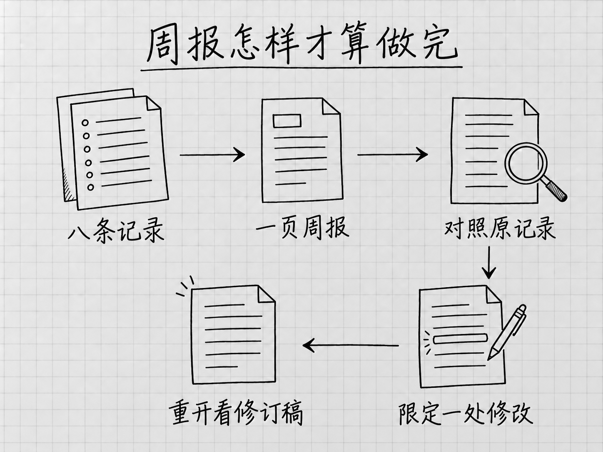

*图：按八条原记录核对事实，再比较限定修改，最后检查重新打开的修订文件。*
<!-- /diagram: FIG-015 -->

从随书的[F01练习材料](examples/F01/README.md)中，将“工作记录.txt”复制到“我的周报练习”文件夹。保留随书原件，方便事后核对。

打开复制后的文件，确认有 R01 至 R08 八条记录。编号用于把周报中的说法对应回原记录。材料统计的是2026年9月21日至25日，状态截至9月25日18:00：

> **R01，9月21日**：整理8份资料，目录已发给主管，尚未收到反馈。  
> **R02，9月22日**：已把下周培训的正式通知发给参加同事。  
> **R03，9月23日**：《资料提交说明》计划写3节，前2节已有草稿，第3节未写完，尚未提交审阅。  
> **R04，本周，具体日期未记**：询问过培训设备清单，截至周五下班仍未收到回复。  
> **R05，9月24日**：报名表共20条记录，已核对12条，剩余8条未核对。  
> **R06，9月25日**：修好目录中2个打不开的链接，并点开确认可以访问。  
> **R07，9月25日记下的计划**：9月28日补完说明的第3节，连同前2节交主管审阅。  
> **R08，9月25日记下的计划**：9月30日参加跨组会议，会前整理3个待确认问题，目前还没整理。

正文中的概括方便你先看懂材料，练习时仍以文件里的完整记录为准。特别留意 R07、R08：记录写在本周，计划却发生在下周，不能按记录日期算成本周完成。

#### 新建任务，明确材料和结果放在哪里

<!-- diagram: FIG-008 -->
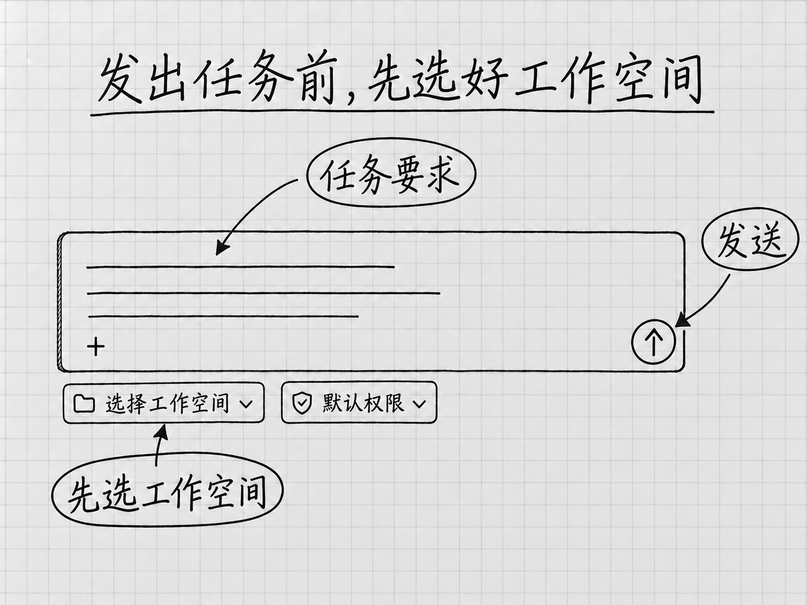

*图：“选择工作空间”位于输入框下方；添加材料与选择工作空间是不同动作。*
<!-- /diagram: FIG-008 -->

在 WorkBuddy 新建任务，使用“选择工作空间”选中“我的周报练习”。然后通过上传入口选择复制的“工作记录.txt”，或者把文件从文件管理器拖到输入区。官方创建任务说明支持这些提供材料的方式。[创建任务](https://www.codebuddy.cn/docs/workbuddy/Create-Task)

看见附件名称，说明你已把材料交到任务中，但还不能证明内容全部读到了。后面要通过实际结果核对。文件若选错，发送前先移除错误附件，再选正确的那一份；不需要让工具在许多无关文件中猜你的意图。

这次要生成文件，需要选择会实际执行的工作方式。输入区通常默认使用 **Agent**，也就是第一章介绍的智能体执行方式，可以沿用。若当前显示 **Ask（问答）**，使用输入区加号中的模式入口退出 Ask，回到默认的 Agent 执行方式，再开始文件任务。Ask 适合咨询和讨论；本次要把整理结果写成文件，因此要用执行方式。不同模式的选择会在第七章展开。[新建任务栏](https://www.workbuddy.cn/docs/workbuddy/From-Beginner-to-Expert-Guide/Function-Description/Task-Bar)

**权限**规定 WorkBuddy 可以访问哪些位置、执行哪些操作；它和“请做什么”的任务要求是两回事。这里保持“默认权限”。遇到确认提示时，先看它想做什么、影响哪个位置。本练习的合理目标是读取复制的记录，在练习文件夹写入周报；如果提出删除无关文件或操作其他目录，就先取消这一步，要求把处理范围收回练习位置。默认权限下普通操作也可能直接执行，没有弹窗不代表什么都没有发生。[权限说明](https://www.codebuddy.cn/docs/workbuddy/From-Beginner-to-Expert-Guide/Function-Description/Permission-Modes)

#### 照着交代一次，不必先背提示词

粘贴下面的请求并发送：

> 请根据附件中的8条记录，整理一份给直属主管看的本周周报（9月21日至25日，状态截至9月25日18:00）。控制在一页，分为已完成、进行中、待人回应、下周计划。保留R01—R08编号方便核对，不补造日期、成果或承诺。请生成可编辑的Word文件，保存到本次练习文件夹，并告诉我文件名和位置。

这段提示词交代了四件事：给谁看、依据什么、哪些事实不能改、最后交什么。写得具体，是为了让输出有明确的完成标准；并非越长越好。以后换成月报或通知，保留这四类条件，再替换本次的事实即可。

收到请求后，观察它是否正在读取材料和处理任务。如果它只回复了通用周报模板，没有使用八条记录，可以指出：“请先读取已添加的工作记录，再按这些真实条目整理。”如果报告附件无法读取，先确认本机能打开复制文件，再重新添加；不要急着把“整理得不对”归结成自己不懂提问。

R04 的具体询问日期没有记下。本次周报只需表明它是本周发生、仍在等回复，就可以省略具体日期，不必让整个任务停下来。若练习改为逐日汇报，或者工具确实需要这个日期，本例另提供一条可选补充事实：“询问是在9月24日发出的，截至9月25日18:00仍未收到回复。”实际工作中必须先找到对应依据，不能为继续任务随手编日期。没有问这个问题，不自动算失败；没有依据却自行写出某个日期，才是需要纠正的地方。

#### 先核对事实，再看文字顺不顺

下面是作者编写的内容参考，不是 WorkBuddy 的实际输出，也不要求逐字一致。

> **个人工作周报：2026年9月21日至25日**  
>   
> **已完成**  
> 整理8份工作资料，目录已发给主管，尚未收到反馈。（R01）  
> 已发送下周培训的正式通知。（R02）  
> 修复2个打不开的链接，并确认这2个链接可以访问。（R06）  
>   
> **进行中**  
> 《资料提交说明》共3节，前2节已有草稿，第3节未完成，尚未提交审阅。（R03）  
> 报名表20条记录中已核对12条，剩余8条待核。（R05）  
>   
> **待人回应**  
> 培训设备清单本周已询问，截至周五下班仍待回复。（R04）  
>   
> **下周计划**  
> 9月28日补完第3节草稿，将整份说明交主管审阅。（R07）  
> 9月30日参加跨组会议，会前整理3个待确认问题。（R08）

把自己的结果和原始记录对照。八个编号是否都能找到？完成、进行中、等待、计划是否分清？数字和范围有没有扩大？

例如，“通知已经发送”不能变成“培训顺利完成”；“已核对12条”不说明这12条全部无误；修复2个链接，也不等于检查过整个目录。这些判断比是否出现“积极推进”“圆满完成”等词更重要。文件看起来很正式，仍可能把状态写错。

#### 只改一处，保留其他内容

首稿不一定有错误，不要为了练习改错而假设它已经写错。我们可以做一次有目的的表达修改：

> 请只把“进行中”部分《资料提交说明》的进展压缩为一句，突出整份说明尚未提交审阅，保留共3节、前2节已有草稿、第3节未完成这些事实。其他事项、数字、日期和下周计划不动。另存修订文件，保留原文件，告诉我新文件的位置。

这条请求把修改范围限定在一处，并保留前一版供比较。相比“请再优化一下”，你更容易判断它有没有多改、漏改。官方文档说明支持在生成后继续提出调整意见；实际改动是否符合范围，仍要自己检查。[文档生成与编辑](https://www.workbuddy.cn/docs/workbuddy/From-Beginner-to-Expert-Guide/Practice-Cases/Practice-Two)

如果首稿这句话已经很简洁，就换一处你确实想改的表述，不必强行改坏再改好。如果发现它把该事项放进“已完成”，则直接引用 R03，要求恢复“进行中”，再检查其他项目的状态有没有跟着误变。

#### 找到文件，关闭后再打开

在任务的“产物”中查看生成文件；需要找其他文件时，可以查看“概览”里的工作空间文件。对话中的文字稿并不自动等于已经保存好的文档。[结果入口说明](https://www.workbuddy.cn/docs/workbuddy/FirstTask)

核对文件名和实际位置，再从电脑文件夹打开原稿与修订稿。用已有的 Word 或 WPS 查看标题、换行、内容是否完整，并尝试修改一处文字。仅能查看预览，不能证明可以编辑；若当前环境只能预览，先把“文件可修改”这一项留待可编辑环境完成，不把截图当作可编辑文档。

把修订稿关闭后重新打开一次，检查实际保存的是不是刚才核对的版本，再看内容是否仍完整地放在一页内。这样能分清对话中声称的修改与文件里实际保存的修改。若只是版式过长，可要求缩短冗余文字或调整排版，不能为了凑一页删除未完成事项。

找不到文件时，先请 WorkBuddy 说明实际保存位置和文件名，再查看任务文件夹。若根本没有生成文件，保留已经核对的内容，明确要求继续生成可编辑文档；若生成失败，应根据具体错误处理，不能把聊天里的“已保存”当作完成证明。

#### 把这次的做法留给下次

保留这次有效的请求，下次替换统计周期、记录数量和输入材料；R01—R08以及本周数字都不是通用要求。连续使用时，你要复用的是“按状态整理、逐条对应依据、限定修改范围”的方法。材料换了，检查也要跟着换，不能因为上一周做对过，就省略这一周的核对。

#### 卡住了

先定位停在哪里：材料打不开、仍在执行、正在等你回应、只有文字没有文件，还是文件打开后不对。每种问题需要不同处理。八条记录先用于练会；以后增加材料量时，再把准备、等待、核对与返工一起记下来，看看总投入是否真的减少。

### 第05章 提供材料：让 WorkBuddy 读对文件、用对版本

文件给得越多，不一定越容易做对。一份正式说明、一份旧通知和一份刚写下的讨论备忘，可能都在谈同一场会议，但它们的作用不同。如果混着使用，通知可能写得很通顺，时间却是旧的，或者把讨论中的建议写成已经确定的安排。

这一章用三份短文件练习给材料。先不急着写通知，只弄清楚：WorkBuddy 实际读到了什么，这次应该采用哪份依据，哪些地方仍然不能确定。下一章继续使用这些材料完成通知，不用再换一个背景。

#### 先认清文件、位置和版本

打开[F02例会改期材料](examples/F02/README.md)。在“WorkBuddy练习”文件夹中建立“例会改期”，把 input 中的三份输入复制进去：

- 01-现行说明.txt
- 02-旧通知.txt
- 03-未确认备忘.txt

不要仅凭文件名或保存时间决定采用哪一份。“最终版”也可能已经过期，“最新记录”也可能只写了尚未批准的建议。判断材料能否作为依据，要看其中的确认状态与适用范围。

提供前确认三份文件内容完整。空文件、未下载完整的附件或加密原件，需要先处理可读性。作者参考稿留到做完后核对，不要作为输入，避免工具照着参考答案改写，却没有真正处理原材料。

#### 三份材料，分别说明了什么

<!-- diagram: FIG-016 -->
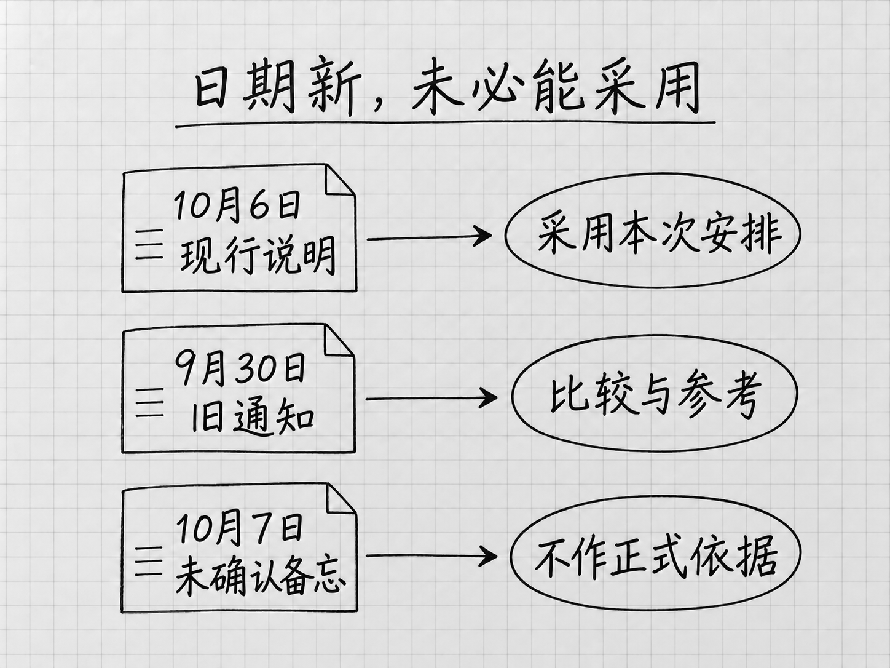

*图：10月6日现行说明提供本次正式安排；旧通知用于比较与参考；10月7日备忘虽更新，建议仍未确认。*
<!-- /diagram: FIG-016 -->

现行说明在10月6日发布，写明已由例会负责人确认。原定10月8日的这一次例会，有三项调整：

> 时间从10月8日10:00—10:30，改为10月9日14:00—14:30；  
> 地点从301会议室改为205会议室；  
> 材料提交期限从10月7日17:00，改为10月8日16:00。

它同时说明，参加范围和材料提交方式不变，仍发给联络人许宁，文件名使用“姓名-本周进展”。更容易被省略的一点是：只调整这一次例会，以后的例会仍按原安排，除非另有正式通知。

旧通知在9月30日发布，记录的正是调整前的安排。它可以帮助我们看清哪些地方变了，也可参考通知怎样称呼同事、怎样说明提交材料。但旧通知里的时间，不能因为句子完整就照搬。

未确认备忘记录于10月7日，比正式说明还晚。里面有人建议改到16:00开会，也有人询问能否线上参加。备忘明确写着，这些建议尚未确认，没有确定的线上安排或会议链接。

注意这里的关系：较新的文件不一定有权替代较旧的文件。10月7日只记录了讨论，10月6日却记录了已经确认的决定。工具需要知道你要整理的是可执行通知，而不是把所有说法拼成一篇文章。

#### 用一种清楚的方式给材料

在 WorkBuddy 新建“例会改期”任务，选择刚建立的练习文件夹，再用上传入口选择三份文件。也可以从电脑文件夹把它们拖到输入区。官方创建任务和对话说明支持添加文件、拖入文件以及补充文字。[创建任务](https://www.codebuddy.cn/docs/workbuddy/Create-Task)、[任务对话](https://www.workbuddy.cn/docs/workbuddy/Conversation)

如果只是几段短文字，也可以直接复制粘贴，但要为每段加上原文件名。例如先写“以下来自01-现行说明.txt”，再贴正文。没有标签地把三份内容接在一起，会使它更难辨认哪句话来自哪份资料。

这几种方式不必同时使用。附件适合保留文件身份；直接粘贴适合少量文字或附件读取不顺利的时候；指定工作文件夹适合让一项任务围绕同一处材料持续进行。无论采用哪种，任务都要说清哪些文件与本次工作有关，不需要把整个“文档”目录交进去。

文件名出现在输入区，只证明材料被选中或引用；是否读到所需内容，还要看它能否对应原文作出准确判断。网页链接也是如此：地址只是入口，可能受到登录或访问条件限制。需要哪一段内容，就检查它有没有实际取得那一段，而不是只看它有没有回复“已阅读”。

#### 先请它说明实际读取情况

发送下面的请求：

> 请读取这三份文件，为这一次例会改期通知整理依据。先说实际读到了哪些文件、每份在这次任务中有什么用途，再指出已确认的三项变化、不变事项和仍未确认的建议。关键结论注明文件名和对应段落。不要现在起草通知，也不要用文件日期的先后代替确认状态。

这里先整理依据，是因为任务里确实存在三种不同地位的内容。只有一份清楚的短材料时，不必每次都先做一轮这样的分析。

查看回复是否能具体对应三份文件。只说“已经全部阅读”还不够；应该能指出现行说明包含正式安排，旧通知反映旧安排，备忘保留未确认建议。进一步核对三个容易分辨的位置：新会议时间在哪里，新地点在哪里，16:00究竟指材料期限还是备忘中的开会建议。

下面是作者给出的简短参考：

> 采用01-现行说明.txt的已确认安排。会议改为10月9日14:00—14:30，地点205，材料于10月8日16:00前交许宁。  
> 02-旧通知.txt用于比较旧安排和参考表达。  
> 03-未确认备忘.txt中的16:00开会、线上接入均未确定，不能写成正式安排。调整只涉及这一次例会。

你的结果可以用自然段，也可以用一个小表，只要能看出结论与依据即可。不需要另外制作多张材料卡，更不需要先设计一套文件管理制度。

#### 发现读错，先修材料关系

如果回复把新会议时间写成16:00，不要只说“时间错了”。可以这样指出：

> 你采用了03-未确认备忘.txt里的建议。请回到01-现行说明.txt：正式确认的是10月9日14:00—14:30。请更正这一项，并检查有没有把线上接入也写成已确认安排。

这句话指出错误来源、正确依据和需要检查的相邻问题，比重新上传同一批文件更有针对性。如果首轮已经正确，就跳过纠错，直接保留这份已核对的依据。

材料缺失则要换另一种处理方式。假如它报告只读到文件开头，你可以先在本机打开原件，确认缺的是后半段还是只是显示没展开。确实未读到时，补一个能正常打开的副本，或者把相关段落粘贴进原任务，同时写明来源。

实际办公中还会遇到扫描 PDF 或照片。它们可能看起来像文字，实际却是图片，需要文字识别后才能处理。识别得到的时间、姓名和数字尤其需要回看原图；图片太模糊时，先换清楚原件，或者人工补录关键段落。不要要求工具“大胆猜一下”，因为那会把材料问题变成难以察觉的事实问题。

#### 让输入和输出各自找得到

本章形成的是一份可回查的材料判断，不一定需要独立文档。它可以留在当前任务中，下一章直接沿用。三份原件仍保留在练习文件夹里，工具的归纳不能替代原件。

如果同事也需要这份判断，可以要求把已核对的结论另存为“例会调整依据”，保留三份原始材料。后面补了新说明时，就能检查新信息改变了哪一项结论，而不必依靠记忆重新拼接前因后果。

#### 写通知前，最后确认两件事

检查 WorkBuddy 的结果有没有把较新的10月7日备忘，当成替代10月6日正式说明的新决定；再定位“只有这一次例会调整”的适用范围。前一项决定用哪个时间，后一项决定通知影响哪些会议。确认这两点，就可以沿着这份依据继续下一章。

#### 卡住了

工具说没有找到文件时，先检查当前任务使用的文件夹，再看是否真的添加了正确附件。工具说内容不完整时，先补可读内容；工具把未确认建议写成决定时，修正材料地位和采用规则。不要把这三种问题都用“再认真读一遍”处理。

### 第06章 交代任务：说清目的、要求和交付物

上一章已经整理好例会改期的依据，现在可以写通知了。材料虽然齐全，WorkBuddy 仍需要知道，你准备给谁看、希望对方做什么。这些信息会影响哪些内容该留下、哪些不必写，以及应该用多长的篇幅说明。

本章继续使用同一个“例会改期”任务。若你是从这里开始练习，可以先打开[F02材料](examples/F02/README.md)，提供三份输入，并按第五章的方法确认它们的作用。我们只起草通知，不实际向工作群发送消息，也不创建日历安排。

#### 一句“写个通知”，究竟少了什么

你当然可以说：

> 帮我写个例会改期通知，专业一点。

在材料足够明确时，它也可能写出可用的结果。问题不在于句子短，而是“专业”并没有说明通知面对谁、准备用在哪个地方。给主管的情况说明和发到同事群的通知，关注点不同；一页正式文件和手机上阅读的一小段消息，也不需要同样的结构。

这次的读者是原例会成员。他们最需要知道三件事：什么时候、在哪里开会，材料何时交。通知还要提醒大家更新自己的安排，并说清只调整这一次，避免有人把以后的每周例会也改到周五。

这些条件足够指导写作。无需先交代一个公司的历史，也不用要求工具扮演十个专家。你已经知道目标，就可以把它直接说出来。

#### 交代到足以动手，不必写成固定表格

在原任务发送下面的请求：

> 请依据《01-现行说明.txt》给原例会成员写一份部门工作群通知。旧通知只用来核对变化和参考表达，未确认备忘里的建议不要采用。正文约150—250字，写清这一次会议的新时间、地点、材料期限和提交方式，提醒大家更新安排；保留“仅这一次调整、之后按原安排”的范围。只起草，不发送，不创建真实日历事项。

这段请求没有神奇口令，只有几个必要条件。

“给原例会成员写工作群通知”说明读者和用途。“依据现行说明”告诉它事实从哪里来。“旧通知只参考表达、备忘建议不采用”解决输入中容易混淆的关系。“150—250字”和“只起草”说明成果大小与执行范围。最后，你可以直接用时间、地点、截止和适用范围来检查，而不用凭感觉判断“是不是专业”。

当你不知道漏了什么，可以用四个问题自查：要交什么，材料是什么，哪些条件不能改，怎样才算能用。回答可以写成一句，也可以分几句。要求已经清楚，就让它开始，不必为了凑齐固定格式额外往返。

官方文档生成说明也强调读者、结构和具体修改意见；本书在此把这些要求落实为一份普通通知，而不是让你收集一大篇万能提示词。[文档生成与编辑](https://www.workbuddy.cn/docs/workbuddy/From-Beginner-to-Expert-Guide/Practice-Cases/Practice-Two)

#### 看结果是否服务于读者

以下是作者编写的参考通知，措辞不是唯一答案：

> **本次部门例会调整通知**  
>   
> 各位同事，本次例会安排调整如下：  
>   
> 会议改为10月9日（周五）14:00—14:30，在205会议室召开，参加人员不变。请于10月8日16:00前，将本周进展材料发给许宁，文件名仍用“姓名-本周进展”，并相应更新自己的时间安排。  
>   
> 本次调整仅适用于原定10月8日的这一次例会；之后仍按原安排，另有正式通知时再调整。请按新时间参加。

检查时，先假装自己是收到通知的同事：能不能直接找出何时到哪里、何时交什么、交给谁？不需要重新打开三份原件，才知道下一步做什么。

再回到原材料核对事实。这里有两个“16:00”，性质不同：现行说明中的10月8日16:00，是已经确认的材料提交期限；备忘中的10月9日16:00，是尚未确认的开会建议。通知只应采用前者。把这两个时间混在一起，文字再顺也不能交出去。

至于“线上接入尚未确定”，本次通知可以不写，因为正式安排中没有这项内容。但它不能被改成“请通过线上会议参加”，也不能擅自写成“禁止线上参加”。省略未确认建议和替人作出否定决定，是两回事。

#### 具体反馈，让改稿有边界

<!-- diagram: FIG-017 -->
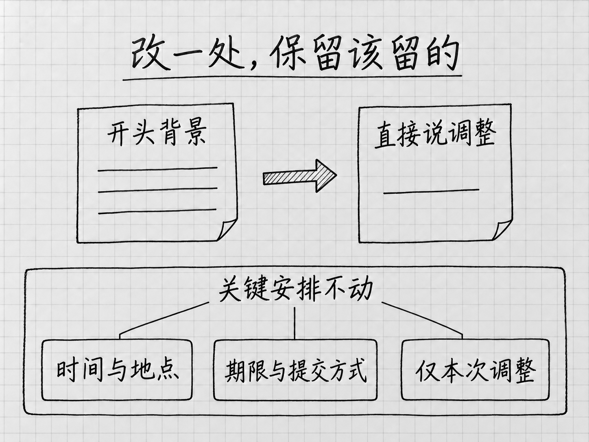

*图：把修改位置、预期变化和保留范围一起说清。改完先看指定位置，再核对不应变化的安排，比整篇重写更容易检查。*
<!-- /diagram: FIG-017 -->

看到不满意的稿子，很容易继续说“再自然一点”“再简洁一点”。这类要求可以表达方向，却没有告诉工具哪些信息必须留下。

假如开头写了一段“为进一步提升沟通效能、统筹推进相关工作”等背景，而你只想通知同事改了什么，可以这样补充：

> 请只压缩通知开头的背景说明，改成直接说明本次例会安排有调整。保留会议时间、地点、材料截止、提交方式，以及“仅这一次调整”的范围；其他内容不动。

这条反馈包含修改位置、问题、希望达到的效果和保留范围。结果出来后，你只需先看开头是否变直接，再核对关键安排没有变，比整篇重新生成后逐字重查更省力。

首稿如果已经清楚，就无需硬改开头。可以选择另一处确实要改善的地方，或者停在可用稿。练习的目的是学会给有用反馈，不是规定每份文稿都必须修改两轮。

“更有力度”也要说明具体意思。若你希望提醒明确，可以说“把材料截止放在前面，直接写明何时提交”。不要只增加语气强度，让原本未确认的安排变成“务必”“保证”一类承诺。表达可以调整，事实依据不随措辞改变。

#### 不顺利时，先判断问题属于哪一类

先查材料。文件是否真的添加到这个任务？回复是否实际采用现行说明？如果资料漏给了，就补资料并说明用途，不需要重新设计一套提示词。

再查要求。假如你同时要求“全文30字以内”和“完整写清时间、地点、期限、提交人、范围”，结果很可能顾此失彼。你需要决定哪些条件优先，或者适当放宽长度。限制之间冲突，不是工具多努力一会儿就一定能解决。

随后看任务是否太大。眼前一份短通知可以直接写；如果要同时处理十场不同会议、给不同人生成不同版本，就先选一份样例，核对替换规则，再处理其余。这是根据返工代价决定是否先试小样，不是每次写两句话都必须先规划。

最后再检查工具和环境。如果材料读到了，正文也正确，却无法生成指定格式的文件，问题可能出在文件能力或当前环境。继续把要求写得更长，未必有用。可以保留已核对内容，说明具体失败位置，再处理文件问题。不要把所有失败都归因于“自己不会提问”。

#### 同一件事继续说，换一件事带上必要背景

本章的通知延续上一章材料，所以留在原任务里即可。官方对话说明支持在已有任务中继续补充与修改。你发送的新要求会结合当前对话处理，不需要每次重新从头解释。[任务对话](https://www.workbuddy.cn/docs/workbuddy/Conversation)

第三章介绍过上下文。本次有效的上下文包括三份材料、已经核对的采用规则和通知用途；这些才是继续改稿时应当保留的条件。若来回讨论过几个方案，准备定稿时可以简短重申：“以10月6日正式说明为准，会议是10月9日14:00—14:30，只调整这一次。”这不是重复全部对话，而是把当前仍有效的条件从讨论过程里提出来。

界面中还可能出现“记忆”。它是产品把部分个人偏好等背景整理出来，供以后任务参考的功能，和本次对话里的具体材料不是同一回事。例如，“偏好简洁通知”可以长期使用，“这一次改到周五”却有明确时效，不能被当成所有会议的新规则。官方说明也提醒记忆可能出现概括偏差或过时内容；本次正式安排仍以所提供的依据为准。是否需要使用和管理这项功能，留到第十二章结合持续工作再讲。[记忆说明](https://www.workbuddy.cn/docs/workbuddy/From-Beginner-to-Expert-Guide/Function-Description/Memory)

换一个全新的通知时，带上新的材料、对象和确认信息。不要认为以前说过“每周四开会”，以后所有任务都会准确自动采用，更不要让旧安排覆盖这次的明确变更。

若这种通知以后经常写，可以保留本次有效要求，改成“依据本次已经确认的安排，给参加者写一份简洁通知……”。把9月或10月的具体事实换成当期材料，而不是固定在通用请求里。保存的是交代方法，不是让旧事实永远沿用。

#### 换一项任务，仍然这样交代

选一项你熟悉的工作，例如整理交接事项或把几条意见改成邮件。试着写一段任务说明，包含使用什么材料、给谁看、哪些条件不能改，以及怎样算完成。如果你已经能据此检查结果，就不需要再把提示词扩成长模板。

准备修改时，先指出一个具体问题。例如“收件人读完不知道何时回复”，比“写得更专业”更容易转成有用的改稿要求。你在练的是定义工作与判断结果，而不是记住某段固定话术。

#### 卡住了

不知道怎样反馈时，先选一句具体的话，说出“哪里不合适”与“希望读者更容易看见什么”。若说不出来，先判断自己是否已经明确用途。若用途明确但结果仍不对，按材料、要求、任务大小、工具环境的顺序定位，避免在同一个模糊要求上重复等待。

### 第07章 选择模型与模式：直接做、先讨论，还是先计划

你已经能把材料交给 WorkBuddy，也能让它生成文件。接下来，很容易遇到两个问题：界面里有不同模型，该选哪个？Ask、Plan、Agent 又有什么区别？

先从眼前的工作判断。你可能只是想弄懂一条通知，也可能希望先商量怎样同时修改几份材料，还可能已经把改动说得很清楚，只等它动手。这三种需求需要的工作方式不同，却不一定需要更换模型。

#### 模型负责怎样理解，模式决定这次怎样做

<!-- diagram: FIG-018 -->
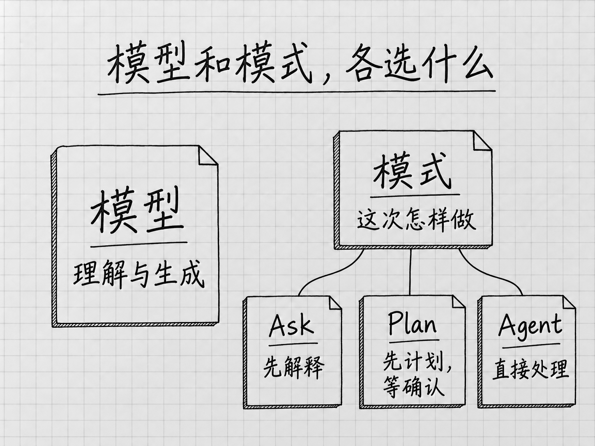

*图：按需要的成果选工作方式：解释可以用Ask，复杂改动可先Plan，范围明确时用默认Agent推进。三种方式不必依次使用。*
<!-- /diagram: FIG-018 -->

第一章已经介绍过，模型承担理解、分析和生成。不同模型的处理能力和响应速度可能不同；同一份材料交给不同模型，结果也可能有差别。WorkBuddy 提供模型选择，也有与模型相关的能力设置。先用当前可用的默认模型完成本书练习；遇到具体困难，再判断是否需要更换。[官方模型说明](https://www.codebuddy.cn/docs/workbuddy/From-Beginner-to-Expert-Guide/Function-Description/Model)

任务模式回答的是另一个问题：这次要讨论、先列计划，还是执行？按照官方说明，Ask 用于问答和讨论；Plan 先形成计划，等你确认后再执行；默认的 Agent 用于实际推进任务，包括需要时处理文件。官方描述的模式选择位于输入区“+”菜单中，选择“模式”后可使用 Ask 或 Plan；未选择这两种时按默认 Agent 方式开展任务。选择后，先看输入区显示的当前模式，再发送请求。[官方输入区与模式说明](https://www.workbuddy.cn/docs/workbuddy/From-Beginner-to-Expert-Guide/Function-Description/Task-Bar)

这里最容易混淆的是 Ask 和 Plan：Ask 的成果可以就是一个解释；Plan 的成果是准备执行的步骤，需要你先判断步骤是否合适。例如，“这几份材料哪里冲突”适合先讨论；“按确认后的安排同时更新三份材料”则值得先审步骤。Agent 适合目标、材料和范围已经清楚的执行工作。

模式也不代替权限。它决定怎样推进这次工作，权限决定哪些动作能够执行。选了 Agent 仍可能需要授权；确认了 Plan，也不表示其中所有目录都已允许访问。下一章再把这两者放进文件整理练习。

#### 同一批材料，可以从三个不同入口开始

继续使用[F02例会改期材料](examples/F02/README.md)：现行说明确定了这一次例会的新安排，旧通知用于对照，较新的备忘仍是未批准建议。三种模式使用同一批材料，改变的是这次要求它做到哪一步。

下面三个请求是相互独立的用法，不是必须依次完成的流程。

第一种情况，你只想弄懂安排。选择 Ask，再提出问题。

**你**：请根据这三份材料，说明这次例会正式改了什么、什么没变。较新的备忘中哪些只是建议？先在对话里解释，不修改文件。

作者参考：回答应指出日期、时间、地点和交材料截止时间的变化，保留参加范围、提交方式不变，并说明远程接入与 16:00 开会尚未确认。此时，清楚的解释就是成果，没有必要额外生成文档。

第二种情况，你准备把正式安排用于通知、自己的日程摘要和材料提醒，担心漏掉一项。可以选择 Plan，先看这三项成果各需要做什么。本练习仍只用已有的三份输入，不需要寻找额外的日程文件。

**你**：请依据01-现行说明.txt，拟定修订02-旧通知.txt并生成一段日程摘要、一段材料提醒的步骤。先说明各项要采用哪些事实、保留哪些条件、还有什么真缺口。03-未确认备忘.txt不作为已确认安排。暂不修改或生成文件。

检查计划时，抓住三件会影响后续文件的事：依据是否正确、三个成果分别需要哪些变化、哪些条件必须保持。假如计划准备把“这一次改到周五”写成“以后每周五开会”，现在改正，只需改一处处理规则；等三份成果全做完，可能三份都要返工。先计划的价值就在这里。

发现计划把参加范围也改了，就指出：“参加范围保持原样，请删去这一项。”计划符合要求后，再使用该任务提供的执行入口或明确继续执行。只改一份短通知时，先计划可能比直接修改多一次往返，可以省去。

第三种情况，目标和依据已经清楚。使用默认 Agent，直接让它处理文件。

**你**：请读取练习文件夹中的02-旧通知.txt，以01-现行说明.txt为依据另写一份通知。只更新日期、时间、地点和交材料截止时间，参加范围与提交方式保持原样；未批准建议不要写入，并保留仅调整这一次的范围。另存为“例会通知_确认稿.txt”，保留原文件，完成后告诉我文件位置。

这次要检查真实文件是否存在、内容是否符合要求。它在聊天里解释得再好，也不能替代文件交付。

#### 为什么换模型有时没有用

假设回答仍写着“周四开会”。先别急着换一个听起来更强的模型。回到任务检查：现行材料是否真的提供了？两份文件是不是同名，导致选错？请求是否只说了“整理通知”，没有说明需要以正式调整为准？

把原因查清后，可以这样续接：

**你**：你采用的是旧安排。请读取我刚补充的正式调整通知，以其中已确认内容修正日期、时间、地点和截止时间。备忘仍是建议，不作为正式安排。其他正确内容保留。

如果材料齐全、范围清楚，仍反复把“仅这一次”和“以后每次”混淆，再考虑调整当前可用的模型或相关能力设置。保留同一批输入和同一个要求，用这项已经知道答案的问题比较结果：能否准确区分适用范围，有没有新增错误，等待与检查是否值得。一次只改变一个重要条件，才容易判断改进来自哪里。

模型选择不是一次选出永远最强的型号。你需要的是这类任务中稳定可用的结果。某次写得更漂亮，也不能代替多份材料对照的准确性。

#### 把选择变成一个很短的判断

发送前问自己一句：“我现在需要的是回答、处理方案，还是实际成果？”

需要理解问题，就先问；涉及多个文件和动作，先看一份计划可能更省返工；范围明确的小任务，直接做即可。讨论过程中也可能发现材料齐了，可以开始执行；执行时遇到新问题，也可以停下来补条件。工作方式跟着任务变化，不必给每项工作套上固定三步。

#### 动手试一次

挑一个你已经做过的小任务，用一句话写清最终需要什么。若只是解释，不要求新建文件；若是交付文件，写清保存位置与原件处理。再给一个未选择的模式说明理由，例如“这次只改一处已确认时间，不需要单独做计划”。能这样判断，就已经够用。

#### 卡住了，先检查什么

找不到与书中相同的模式入口时，先确认当前客户端是否提供该选项，再查看界面帮助。你仍可在请求里写清“先解释”“先给计划，等我确认”或“按以下范围直接处理”，并检查它有没有照做；文字要求有助于限定任务，但不能当成系统权限的替代。

采用错材料，先补依据；知道怎么改却无法写入，转到[权限章](#permissions)；已经生成却找不到，转到[结果章](#results)。模式只是定位问题的一项，不能代替这些条件。

### 第08章 权限与授权：设定本次任务的操作范围

自己整理文件时，每一次移动由你动手；把整理工作交给 WorkBuddy 后，它可能连续执行多步。你需要在开始前确定处理范围，在必要的确认处判断动作是否符合要求。

“权限”是工具被允许访问和操作的范围，“授权”是你同意某项访问或动作。它们解决能不能做的问题；任务要求还要说明这次应该做什么。本章用六个虚构文件，把这两个层次分清。

#### 先把可以操作的地方准备好

打开[六文件练习材料](examples/F03/README.md)。这组材料是每周例会安排，包括现行文件、历史文件、附件和讨论副本。两份文件都叫“例会安排.txt”，放在不同子文件夹中；名字相同不意味着内容相同。

练习目录采用这个安排：在“文件整理练习”下放两个并列文件夹，“操作副本”保存整份原始材料的副本，“整理输出”接收结果。材料包中的原件留在原处。这次复制一份练习材料，是为了让你能对照整理前后，而不是让 AI 同时处理两份输入。

在 WorkBuddy 中把“文件整理练习”选作工作空间。这是本次任务使用的工作目录，里面同时包含输入和输出。请求中只让它读取“操作副本”，把结果写入“整理输出”。选中工作空间不等于其中所有文件都与本次任务有关，所以仍要说清这两个具体位置。

**你**：请读取“操作副本”中的六个文件，按现行、历史、待确认提出分类和命名方案。先列原路径、建议新路径和理由，不修改文件。不因名称相同或含“副本”就删除；发生重名时保留两份并说明区别。

第一轮的成果是一份整理预览。你应能从中找到六个原文件，判断两份同名安排有没有分开，9 月 26 日的讨论副本有没有被误当成正式现行安排。

这里先看预览，是因为分类规则一旦错了，错误会复制到整批文件。例如，“日期最近的就是现行版”会把未确认讨论放到现行目录。先修正规则，再统一执行，比整理后逐份找错更省事。

#### 默认权限，不代表每一步都会再问

<!-- diagram: FIG-010 -->
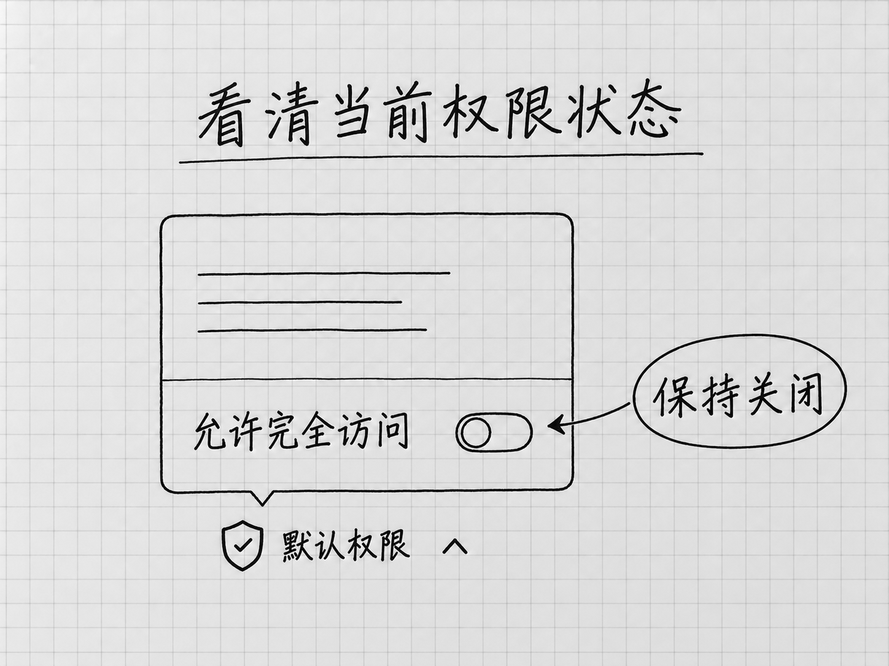

*图：本图的“允许完全访问”处于关闭状态。默认权限下的常规工作空间操作也可能直接执行，仍要说清本次处理范围。*
<!-- /diagram: FIG-010 -->

WorkBuddy 有默认权限与允许完全访问的设置。官方详细说明中，常规工作空间操作可能直接执行，涉及更大范围或较高影响的动作可能出现确认；不能把“我还没点允许”当成文件一定不会变化的保证。完全访问减少部分确认，也扩大了可执行范围，入门练习保留默认权限即可。[官方权限说明](https://www.codebuddy.cn/docs/workbuddy/From-Beginner-to-Expert-Guide/Function-Description/Permission-Modes)

按这份官方说明，允许完全访问会影响当前桌面客户端中的任务，不只是眼前这一次复制。练习保留默认设置，再通过明确的输入和输出范围限定任务即可。

“先列方案，不修改”是工作要求，不是另设了一道系统屏障。工具能否操作、这次要求它操作什么、实际做了什么，要分别看权限设置、任务说明和文件结果。

<!-- diagram: FIG-019 -->
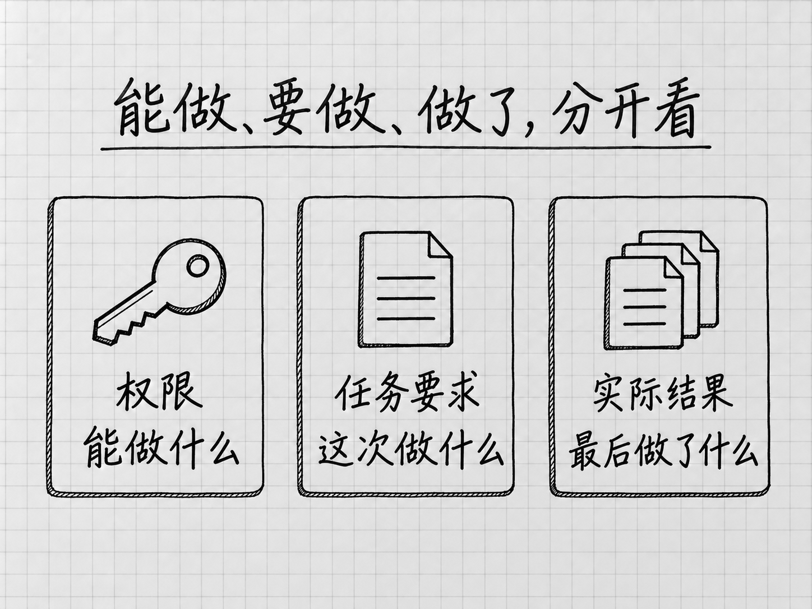

*图：设置说明可执行范围，请求说明本次目标，实际文件说明发生了什么；三者要分别核对。*
<!-- /diagram: FIG-019 -->

确认预览后，再发送执行要求：

**你**：按刚才确认的方案，把“操作副本”中的六份材料复制到“整理输出”下的现行、历史、待确认文件夹，并采用建议名称。原始材料和操作副本均保留，文件内容不改写。目标位置若已存在同名文件，先停下说明，不覆盖。

这里故意用复制完成整理。等你理解了前后对应关系，再尝试只在操作副本内移动文件。第一次练习没有必要顺便清理原件。

#### 出现确认时，看懂四件事再决定

确认窗口的具体文字会随动作和环境变化。无论提示怎样排版，都读清四件事：对象、动作、目标位置、影响范围。

例如，它要把操作副本中的一份文件复制到整理输出，这与刚才的要求相符；若它要删除整个原始材料文件夹，或者把目录中的所有同名文件覆盖成一份，就偏离了本次任务。不要因为弹窗来自工具就默认合理。取消这个动作，说明“保留原件，只复制到指定位置”，任务仍可能沿更小的范围继续。

还有一种情况：动作合理，但目标位置不能写。先检查是否选错目录，或目标文件正在被占用；按错误提示处理，必要时改到你有权使用的练习目录。写入失败有具体原因，不能靠扩大权限代替诊断。组织管理的位置按单位规则处理。

你也可能见到系统或在线服务的授权。操作系统权限管理的是应用对电脑资源的访问；WorkBuddy 内的权限模式管理任务能够执行的范围；连接器授权则涉及另一项服务的账号和数据。允许其中一项，不等于另外两项也自动获准。连接器到按需章节再展开。

#### 整理完，看文件，不只看完成提示

打开“整理输出”，逐一对应六份源材料。现行安排应是周一 14:00—14:30、305；历史安排应是周一 10:00—10:30、302；周二线上开会仍属于未确认讨论。两份议程各跟自己的版本放在一起，材料项目清单仍完整。

作者参考答案提供了一种可接受的命名，但你不必照抄。真正要核对的是来源是否都保留、状态是否分对、内容是否被改动、同名文件是否相互覆盖。工具额外生成了整理说明，输出目录的文件总数可能超过六个；不要仅凭总数判对错，要看六份源材料有没有一一对应。

扩大到更多材料时，沿用已验证的分类规则，把同名、缺内容、状态不明等例外单独列出，不让一个例外拖住所有正常文件，也不让工具替你猜。人负责规则和例外，工具承担重复操作，才是批量整理能够持续省力的原因。

#### 换成公司材料时，先遵循已有规则

本书练习使用虚构内容。回到公司工作，先确认哪些材料允许提供给这类工具、能用哪种服务、能放在哪里。不清楚时，问负责人或 IT，而不是靠改个文件名判断安全。

在组织允许制作练习副本时，只保留本次任务需要的字段和段落。例如，把同一个客户在所有文件中统一替换为“客户 A”，移除无关联系方式，并检查备注、附件和自由文本是否仍含识别信息。去掉姓名并不自动消除识别风险。

文件在电脑上，不代表后续所有处理都留在电脑上。模型处理、云端保存和外部服务可能涉及不同路径。判断材料能否使用，应以组织规则、所用服务和实际配置为依据。

#### 动手与回看

完成一次“预览—确认—复制整理—核对”，然后用自己的话说清：这次允许它处理哪六份材料，输出在哪里，原件在哪里。无需另做权限登记表。

如果整理错了，先保留当前结果并停止扩大范围，找出哪条分类规则错，再针对这几份修正。如果路径不清楚，先不继续，回文件管理器确认。把范围说准、把异常看清，既能保护材料，也能减少返工。

### 第09章 跟进任务：查看进度、补充要求与继续处理

任务交给 WorkBuddy 后，你不必一直盯着文字变化。但在离开之前，要知道它现在是否需要你回应。否则，工具可能已经在等材料，而你以为它还在工作；也可能已经生成了一半文件，你却又发起一次重复任务。

这一章沿用[六文件练习](examples/F03/README.md)，比较两版正式例会安排。没有完成上一章也可以开始：直接从原始材料中引用“正式文件”和“历史文件”里的两份安排，先不用整理其他文件。

#### 先给一个能看出进度的小任务

在任务中引用两份正式安排，确认路径分别指向现行与历史材料。

**你**：请比较这两版正式例会安排，先只比较正文，不比较议程附件，也不采用讨论副本。按适用范围、开会时间、地点、参加人员、材料项目、提交截止和提交方式列出变化与未变项，在当前任务中给我看。

你已经明确只比较正文，工具不需要再问“要不要比较附件”才能开工。如果它提出一个原要求已经回答的问题，可以简短重申：“本轮只比较正文，附件下一轮再补。”不要为了让流程显得严谨而反复回答无关问题。

开始后，观察当前步骤是在读取材料、处理内容，还是已经给出结果。官方说明中，任务会展示执行步骤和有关成果，运行时可以通过输入区停止；详情区域也可查看相关文件。你要把这些信息当成工作进度来读，而不是把每一行技术文字都学会。[官方对话说明](https://www.codebuddy.cn/docs/workbuddy/Conversation)

#### 判断下一步该由谁行动

<!-- diagram: FIG-020 -->
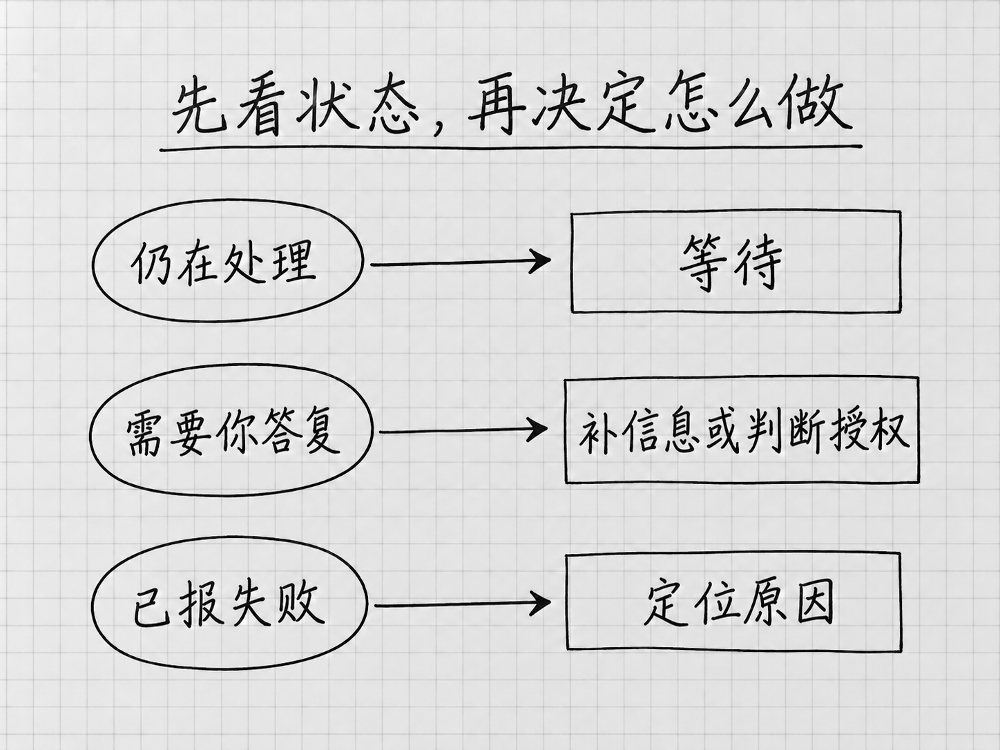

*图：没有要求回应时先等待；确有问题时补信息或判断授权；出现失败时找出具体对象与原因。看到完成，再检查所需成果。*
<!-- /diagram: FIG-020 -->

看到正在读取、分析或生成，并且没有要求你回应，通常先等待。此时反复发送“好了吗”不会补充任何有用信息。

看到一个问题，先判断答案是否真的影响结果。例如，工具发现你引用了三份都叫安排的材料，无法判断哪份是正式版，确认来源就有必要；若六份材料都已给出，版本状态也写得清楚，它应先据此判断。你可以要求它指出具体哪两处冲突，而不是自己重新概括全部资料。

看到权限请求，回到上一章的方法，检查动作与位置后再决定。看到明确错误，则先读失败对象：是某个文件没读到，还是输出位置不可写？把错误缩小到一个对象，才知道该补什么。

最后，看到“完成”，去看要求的成果。正文差异应包含：时段从 10:00—10:30 改到 14:00—14:30，会议室从 302 改为 305；参加人员、三项材料、周五 16:00 截止和提交方式不变。适用范围也必须交代。以上是作者根据练习材料写出的参考，不是一次实际运行记录。

#### 新要求来了，在已有成果上补

正文比较完后，你发现自己还需要议程时段的变化。给任务补上两份议程，再接着说：

**你**：现在增加两个议程附件。请保留已核对的正文差异，补充三个议程环节的旧时段与新时段，核对环节内容是否变化。不要重新改写其他正确内容。

作者参考：三个环节的内容与各自时长不变，分别从 10:00—10:05、10:05—10:20、10:20—10:30，移到 14:00—14:05、14:05—14:20、14:20—14:30。

如果你在它仍运行时发送这句话，要查看消息是否进入待处理队列。队列就是先把新要求排在后面，等待后续处理；消息已经发出，不代表当前动作已按新要求改变。WorkBuddy 官方文档说明，运行中的补充消息可能排队；“立即发送”也不能理解成撤销正在执行的动作。

因此，补充议程这类不影响当前比较的要求，可以接着发；“停止修改这份文件”则会改变当前动作，应先使用停止，再检查文件现状。先判断新信息影响正在做的哪一步，再决定是追加还是中止。[运行中消息处理说明](https://www.codebuddy.cn/docs/workbuddy/Conversation)

#### 停止之后，先找已经留下的东西

停止会中止继续推进，不会自动撤销此前的动作。已经创建的文件、完成的复制或写入，应以实际目录为准。再次继续前，需要先弄清留下了什么。

如果练习仍在运行，可以选做一次停止；短任务已经结束，就不必重新制造一次等待。停止后，先查看当前步骤。本轮只要求在对话里比较，没有生成文件也正常；涉及文件写入的任务，再查看输出目录。保留已经正确的部分，随后说明从哪里继续：

**你**：请先检查当前已有成果，告诉我哪些部分完成、哪些还没完成。已正确的正文对照保留，只继续补议程时段；如果已有同名结果，不要覆盖，先说明你准备更新哪一份。

这比重新发送最初的大请求更容易避免重复文件。工具说“可以继续”也不等于已经恢复完成，还要回到实际成果核对。

#### 失败时，修最小的一处

假设提示“找不到附件”，先到文件管理器确认文件是否被改名或移动，再重新引用当前路径。无需把两版正文全部重新上传并解释一遍。

假设输出只漏掉了适用范围，就指出漏项及依据，让它补这一处。若它采用了错误的正式版本，问题就不只是一句话：时间、地点和截止都可能受影响。先更正依据，再让它检查哪些结论由这份依据得出，逐项更新。

这两种情况决定了修订范围。局部漏项可以局部补；依据错误则要沿着依据查到结论。所谓少返工，是保留确定正确的部分，而不是无论错在哪里都只准改一句。

有时工具只说“读取失败”，原因并不清楚。可以要求它列出哪些文件实际读到了、哪份没有读到。文件损坏或格式不支持时，使用你能打开并核对的文字副本，说明替代范围。它没有读取的部分，不能被一句“已理解资料”带过。

#### 等待时间里，做一件独立的小事

比较期间，你可以查一下收件人需要 Word 还是普通文本，或者自己读一遍现行安排。它们不依赖尚未完成的结果，也不会同时改同一个文件。第一次练习仍应留意需要你回答或授权的状态。

以后同时处理多个任务，先判断有没有依赖：一份月报的文字结论需要等表格核算完成，就应先后进行；核对另一份无关通知，则可以同时做。两项任务若都要修改同一份文件，也先后进行，避免后写入的内容覆盖前一份修改。任务彼此独立，等待才更有可能转化为可利用的时间。

想判断是否提效，可以分别看自己实际投入了多少时间、从开始到交付经过多久。前者减少，意味着你腾出了注意力；后者还会受等待、核对和修正影响。两者不用混成一个夸张倍数。

#### 动手与回看

完成正文比较，再补一次议程变化。中途只回答真正影响结果的问题；结束后找出一项已完成成果和一项你做过的必要补充。若之后还要继续，在原任务留一句“正文已核对，议程已补，下一步做短说明”就够了，不必另建进度账本。

卡住时先问：它在等谁？已经完成什么？最小需要补什么？这三个问题能帮助你接着做，而不是一有变化就整项重跑。

### 第10章 检查结果：找到、修改和保存文件

WorkBuddy 在对话里写出了一段完整说明，工作是否已经做完，要看你原来需要什么。只为自己理解，聊天回答可能足够；要交给同事修改或归档，就要有一份能找到、能打开、能继续编辑的文件。

这一章把前面的例会差异整理成一份短说明。你也可以直接使用[练习包中的独立差异参考](examples/F03/README.md)，不必补做前两章。

#### 先选一份真的需要的成果

这次收件人只需要了解变动，没有筛选和计算要求，一份说明就够了。你常用 Word 或 WPS，可以要求生成可编辑的 Word 文档；只需本地阅读与修改，也可选择文字文件。文件格式服务于用途，不必同时做出文档、表格和演示文稿。

**你**：请根据已核对的正式安排差异，制作一份简短、可编辑的“每周例会安排变化说明”，保存到“整理输出”。先写生效范围，再写时间与地点变化，最后写未变要求。议程只概括三个环节内容不变、时段相应调整。未确认讨论不写成正式安排。保留现有文件，完成后告诉我文件名和实际位置。

如果你指定 Word，还要检查当前环境能否产出和打开该格式。遇到格式不可用，先让它交付可编辑文字内容，再用自己可用的办公软件整理；不要把改扩展名当成格式转换，也不要把一个截图当成可编辑文档。

#### 从预览走到实际位置

<!-- diagram: FIG-021 -->
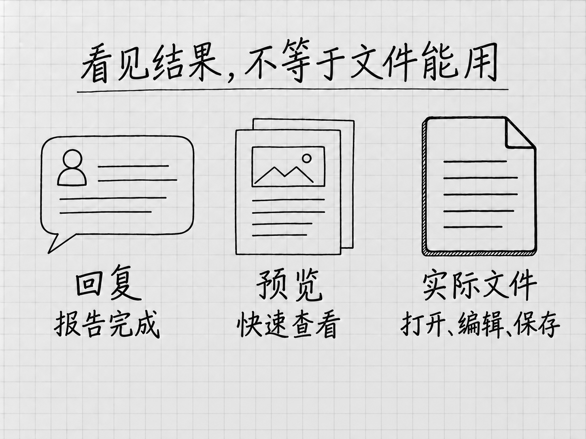

*图：当任务要求交付文件时，要找到实际文件，再按用途核对打开、编辑与保存；回复和预览各自只能提供一部分信息。*
<!-- /diagram: FIG-021 -->

任务里可能同时出现三样东西：介绍处理结果的回复、供快速查看的预览、保存下来的实际文件。AI 说“已经生成”，描述的是它报告的状态；你需要找到实际文件，才能确认交付确实存在。预览中的文字也可能看起来正确，但可编辑性、分页和保存状态仍要在文件中检查。

从任务的文件或成果区域找到这份说明，核对文件名。需要确认位置时，可在 WorkBuddy 文件页的相应菜单使用“打开文件位置”或复制路径；也可直接进入你指定的整理输出目录。官方文件浏览器支持查看文件、与当前文件对话，部分格式还支持编辑，具体能力取决于格式和当前环境。[官方文件浏览器说明](https://www.codebuddy.cn/docs/workbuddy/From-Beginner-to-Expert-Guide/Function-Description/File-Browser)

打开后，先判断是否为本次结果。若文件夹里有“草稿”“确认稿”“确认稿2”，不要凭名字猜最后版本，结合实际内容和修改时间检查。给下一份使用者留下一个明确的确认版，比留一串含糊的“最终版”更有用。

#### 把核对集中在会影响行动的地方

先核对四件事：是不是这项任务、依据是不是正确版本、必要内容有没有缺、文件是否真的能用。随后按用途增加检查。

这份说明要让人按安排行动，因此生效范围、时段、地点、截止时间都应回原文。作者参考的核心内容可以写成：

> 自 2026 年 9 月 28 日起，每周例会改为周一 14:00—14:30，在 305 会议室举行。参加人员、材料项目、周五 16:00 前提交下一周材料及提交方式不变。三个议程环节内容和时长不变，时段相应调整。

这段是作者参考，措辞可不同。你要特别找有没有“周二线上”的未批准建议，有没有把“会前一天中午”写成现行截止。语句流畅，并不能抵消依据错误。

检查不必平均用力。对这份说明，会议时段写错会让同事错过会议，日期和地点值得逐项回原文；标题用“变化说明”还是“调整说明”，只要含义清楚，就不必反复打磨。把会改变行动、判断或承诺的信息优先核实，才能兼顾质量与效率。涉及数字结论时，还要核对统计范围并复算关键数，数据分析章会展开。

#### 只改需要改的位置

<!-- diagram: FIG-011 -->
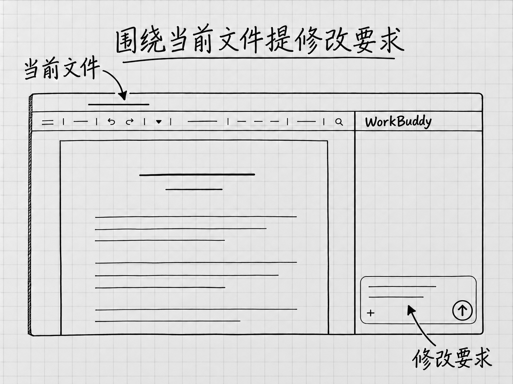

*图：展开文件内的对话栏后，先确认当前文件，再提出具体修改要求。图中输入框仍是待发送状态。*
<!-- /diagram: FIG-011 -->

假设内容已经正确，但标题写成了很长的“关于自某日起调整每周例会有关安排及材料提交事项的说明”。可以自己改，也可以继续让 WorkBuddy 改：

**你**：请只把标题改为“每周例会安排变化说明”，正文中的事实与顺序保持不变。另存为“每周例会安排变化说明_确认稿”，告诉我保存位置。

一两个错字，自己动手可能最快。需要统一措辞、调整一段层次时，让工具处理更合适。若在 WorkBuddy 的独立文件窗口中操作，可点右上角“和 WorkBuddy 对话”展开侧边栏。先确认当前打开的是要修改的文件，再提出修改要求；不能仅凭聊天里出现过文件名，就假定它会修改正确对象。

改完后，先看指定修改是否完成，再抽查一项应保持的关键内容，例如周五 16:00 的截止时间。还可以要求它列出实际改变了哪里。修改越明确，比较前后版本越容易；如果它连整段结构也重写了，就没有遵守这次范围，应回到上一份确认稿处理。

#### 保存以后，关闭再打开

在 WorkBuddy 内编辑 Word、Excel、PPT，需要登录账号；未登录时可以查看，但不能据此认为能编辑。修改后还要主动保存，可使用保存入口或常用快捷键。不要从某些文字格式自动保存的体验推断所有文件都一样。[文件编辑与保存说明](https://www.codebuddy.cn/docs/workbuddy/From-Beginner-to-Expert-Guide/Function-Description/File-Browser)

第一次使用某种输出格式时，在实际要交付的 Office、WPS 或编辑器中做一次小检查：能否修改文字、保存后重开是否保留修改、中文和版式是否正常。文档中的表格还要能编辑单元格，不能只有一张看起来像表格的图片。这是在检验 AI 生成文件与目标软件是否兼容；同一种已稳定使用的简单格式，不必每次专门制造一次改字练习。

若软件提示文件被占用，或另一个窗口的版本已经变化，先保留你眼前这份副本，再核对各自路径与内容，不要急着覆盖。把最后采用的改动明确合到一份文件中，再次保存重开。没有确认哪一份更新之前，不让工具替你自动判断“全部采用”。

#### 保存、分享和发送，是不同动作

保存到本地，只说明你有了这份文件。生成一个链接，还涉及访问范围；把文件发给别人，则是另一项行动。不要因为任务说“文件已完成”，就以为同事已经收到。

本练习做到本地确认版即可。真实交付前，检查收件对象、文件版本和需要的访问权限，再按单位流程发送。将来需要 WorkBuddy 协助外部发送，也要在任务中把发送对象和内容说清楚。

#### 动手与回看

做出一份说明，找到实际位置，改一处标题，保存后重新打开。能够指出当前确认版在哪里、哪几项事实已回查、文件能否继续编辑，就达到了本章目标。

排障时按你看到的现象回查：只有聊天文字，补格式与位置要求；文件不能编辑，查格式与目标软件；修改丢失，查保存与路径。详细处理见[常见问题排查](#troubleshooting)。

### 第11章 按需扩展：认识技能、专家与连接器

这章可以按需读。前面的任务已经能完成，就继续去做办公实战；遇到处理能力、工作方法或外部资料访问的问题，再回来看相应一节。

技能、专家和连接器分别解决不同缺口：技能提供某类任务的处理办法，专家组织某种角色与方法，连接器让任务访问获准使用的外部服务。先弄清自己缺什么，才知道有没有必要添加。

#### 技能：让一种处理方法可以反复使用

“技能”可以理解成供任务使用的一套特定做法。例如，处理一类文档时，应该怎样读入材料、按照什么要求整理、形成什么成果。它帮助 WorkBuddy 完成某类工作，而本次要处理哪份文件、采用什么事实，仍由你的任务说明和材料决定。官方技能区域提供发现、添加、启用和关闭入口，也介绍了根据描述寻找或创建技能的路线。[官方技能说明](https://www.codebuddy.cn/docs/workbuddy/From-Beginner-to-Expert-Guide/Function-Description/Skills-Market)

技能和普通请求的区别，可以用通知练习理解。“把这次开会时间改到14:00”是一次要求；“每次整理通知，都区分已确认安排与未批准建议，再检查收件人需要采取的行动”则是一种可复用方法。后者值得重复保留，但也不一定马上需要做成技能：一段清楚的工作说明已经能稳定完成，就先用说明。怎样把经常做的事变成可复用流程，第19章会进一步展开。

当你确实需要一个技能，先读它的能力说明，判断三个问题：它能处理你现有的输入吗？产出的结果正是你需要的吗？是否还需要额外账号或服务？一个描述为“文档处理”的技能，不代表支持任何文件、保留所有复杂版式，也不代表已经取得你的内部材料。

然后到技能管理入口检查它是否已安装、是否启用。安装是把这项能力加入；启用是允许任务使用；“调用”则是这一次任务实际用了它。三者不同。看到技能在列表里，不能据此判断刚才的任务已经用过。

第一次使用，只给一份能核对的小材料。例如用上一章的例会说明，要求：

> 请保持这份说明的事实与顺序，形成可编辑文档。请说明实际采用的处理方式、生成文件的位置；无法完成的部分直接指出，不要只给一张预览图。

结合执行记录看实际处理过程，再打开文件检查内容和编辑能力。技能装好了但任务没使用，查启用情况及任务是否适合；实际使用却输出失败，查输入格式与必要条件；文件生成但事实变了，修正处理要求并回查材料。三个问题各有原因，重新安装不能同时解决它们。

普通任务已能完成，就无需为了练习额外安装。新增技能的价值，应体现在一种原来做不到、做不稳，或需要反复交代的方法上。

#### 专家：把检查角度变成具体的工作方法

WorkBuddy 中的专家结合角色、方法和相关能力，专家团则组织多个角色协作。可以在“专家·技能·连接器”的专家区域查看用途和示例，选择合适的专家或专家团发起任务。[官方专家说明](https://www.codebuddy.cn/docs/workbuddy/From-Beginner-to-Expert-Guide/Function-Description/Expert-Center)

“专家”在这里是产品中的任务组织方式，不表示有一位真人专业人士为结论背书。判断它是否有帮助，要看采用了什么方法、发现了什么问题。

例如，例会说明已经写完，你担心收到的人仍不知道该做什么。只说“请专业地审核”太宽，可以先在普通对话里提出一个明确角度：

> 请从第一次收到通知的同事的角度，检查这份说明是否回答了什么时候开始、几点、哪里、需要准备什么。只指出会影响行动的缺口，并标出对应位置；不重写整份说明，不补造安排。

这条请求把“站在读者角度”变成了可执行的检查。假如发现“材料提前交”没有明确截止时间，就要回到正式安排补齐；若只建议把“请大家”改为“请各位”，却漏掉截止时间，它的检查就没有抓住工作重点。

如果选择了提供文稿检查方法的专家，也给它同样的材料与范围，观察它是否更容易抓到真实缺口。专家若建议增加线上参加入口，而正式材料并未批准，这仍是建议，不能直接写进确认稿。

专家团适合一份成果确实需要不同角度，而且这些角度会改变判断的情况。例如检查培训方案，一种角度看时间、场地和人手能否落实，另一种角度看参加者是否知道如何报名。两个角色各有明确问题，才可能带来补充价值。让多个角色轮流夸赞一份半页说明，只会增加你要阅读的内容。

无论使用哪个入口，都先说清检查角度与判断标准。把“找一个厉害的角色”改成“让它完成一种明确检查”，更容易得到有用结果。

#### 连接器：把外部材料接入当前任务

连接器用于访问另一项服务中的内容。例如，文件没有保存在电脑里，而在你有权使用的在线文档服务中。连接器让 WorkBuddy 在获得相应授权后取得材料，减少手动下载、上传和搬运。官方文档介绍了选择服务、登录授权、在任务中启用的流程；实际可用范围取决于服务、账号和授权。[官方连接器说明](https://www.codebuddy.cn/docs/workbuddy/From-Beginner-to-Expert-Guide/Function-Description/Connector)

连接器解决“从哪里取得材料”，技能解决“怎样处理材料”，专家解决“按什么角度和方法工作”。所以，选择一个写作专家，不能让它自动读到公司在线文档；给文件处理技能换一个名字，也不会产生外部账号权限。

首次连接时，先确定组织允许使用该服务，再在连接器区域选择服务，核对要登录的账号与请求访问的范围，完成授权，并在本次任务中启用。授权给的是特定账号允许访问的内容，不是该服务中的所有资料。

接通之后，仍要指明本次需要哪份文件。例如：

> 请只读取我指定的《每周例会现行安排》，先列出文档标题、发布日期和采用的开会时间，并标出依据位置。现在只核对材料，不修改文档或发送消息。

核对这些信息，能看出连接是否取得正确对象，以及任务是否真正读到了相关内容。连接显示成功，但找不到指定文件，可能是账号不对、该文件无权访问，或目标位置不明确；此时应处理访问问题，而不是继续要求“认真搜索”。找到文件后用错了版本，则按第五章的方法更正依据。

任务不再需要该服务，可以关闭本次任务中的连接器使用。关闭使用与撤销服务账号已授予的访问权不同；需要收回授权时，应按相应服务的账号管理说明处理。

如果没有相应账号，或组织不允许连接，使用获准导出的文件或必要文字副本即可。连接器是减少搬运的一条路线，办公方法本身仍可通过本地材料学会。

#### 遇到问题，先判断缺的是哪一层

<!-- diagram: FIG-022 -->
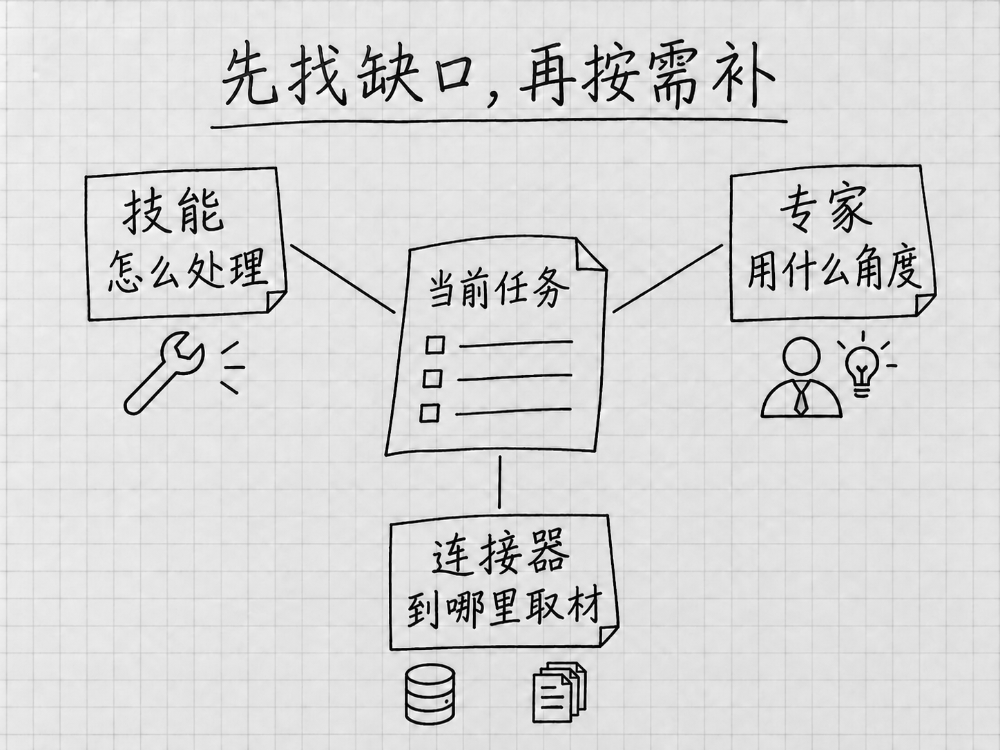

*图：技能补处理办法，专家补角色与方法，连接器补获准的材料访问。先判断当前缺什么，普通请求已够用时无需额外配置。*
<!-- /diagram: FIG-022 -->

回到例会说明，四种看似相近的困难，其实应该分别处理：

|遇到的困难|先做什么|原因|
|---|---|---|
|不知道正式截止时间|提供正式文件|缺的是事实依据|
|知道内容，但某种文件处理做不成|查当前能力与失败原因，必要时用技能|缺的是处理办法或条件|
|说明写完，不确定收件人是否看得懂|给出具体检查角度，必要时用专家|缺的是有针对性的审视|
|正式材料只在外部服务中|核对连接与授权，或提供获准副本|缺的是材料访问|

这张表不是要求四种功能都用一遍。一次任务往往只需要补其中一项。把缺口找准，比不断增添功能更能减少无效往返。

#### 动手与回看

用一份已有虚构成果，完成一次“收件人能否据此行动”的检查。先用普通对话就可以；如果发现真实缺口，补上它，再判断需不需要保留这套检查方法。

之后只选择你当前确实需要的一条扩展路线。能说清为什么要用、还缺什么条件、怎样判断结果合格，就达到了本章目的。

### 第12章 接续工作：按需认识资料库、项目与记忆

同一类工作做第二次时，重新寻找材料、解释背景、提醒格式，仍可能花掉不少时间。资料库、项目和记忆都与接续工作有关，但保存的对象不同，用错了反而容易沿用旧事实。

这章按需阅读。先学会用明确材料接续一次任务；当重复寻找与解释已经成为负担，再选用对应功能。

#### 让新任务取得正确依据

回到[六文件练习](examples/F03/README.md)。现行安排提供正式依据，历史安排用于比较，讨论副本保留未决定想法，变化说明则是根据原文形成的摘要。下次要查询当前安排，应该引用现行原文；摘要可以辅助阅读，但地位不能反过来。

新建一个任务，引用“正式文件”中的现行安排。已经有第10章的变化说明，可以一起提供；没有也不影响这个练习。然后问：

> 请根据我这次引用的正式安排，回答2026年9月28日之后的每周例会几点开始、在哪里，并指出原文依据。如已提供变化说明，它只作辅助；有冲突请以正式安排为依据，同时指出冲突。不要采用未确认讨论中的方案。

作者参考是周一14:00开始、305会议室。核对它采用的是9月25日确认的安排，而非历史材料中的上午时段。

这个小测试检验了两件事：新任务拿到了正确材料，并且知道哪些内容有权作为依据。问一句“你还记得吗”，得到肯定回答，却无法检验这两点。持续使用 AI 的基础，是让重要背景可以找回、可以核对，而不是寄希望于所有历史内容自动延续。

#### 资料库：保存与引用常用材料

资料库是 WorkBuddy 中组织材料与成果的地方。官方说明区分“我的文档”和团队空间，并提供把指定资料添加到任务的方式。它适合解决“以后到哪里找这份材料”的问题。[官方资料库说明](https://www.codebuddy.cn/docs/workbuddy/From-Beginner-to-Expert-Guide/Function-Description/Library)

如果你的账号已经可以使用资料库，可以先上传一份已核对的虚构 Word 说明。在资料库找到它，再使用“添加到任务”，用于一个新任务。然后询问说明中的会议时间、地点与适用范围，核对回复实际采用的文件。[资料管理说明](https://www.codebuddy.cn/docs/workbuddy/From-Beginner-to-Expert-Guide/Function-Description/Library/Content-Management)

这里要区分两个动作：存入资料库，是以后能够查找；添加到当前任务，才明确本次要用哪份资料。不能因为库里存了几十份文件，就认为每项任务已经逐份读过。

版本也要在使用时确认。假如资料库同时保存旧说明和修订说明，新任务应明确引用当前有效的一份，旧版只有在需要比较时才加入。保存了新版本，不等于旧任务、旧摘要和所有引用都已同步更新；更新后的第一次使用，仍用一个已知答案的问题检查。

没有资料库条件，本地文件照样能完成这条路径。保存位置、文件名称和一行版本说明已经够用；不必为一份偶尔查看的资料增加管理层次。需要团队空间时，再确认谁能访问，个人保存和团队共享分别决定。

#### 项目：保留一项持续工作的共同背景

WorkBuddy 中的“项目”用于组织持续工作的共同说明、材料与相关配置。它与一次任务的区别在于：任务处理眼前的一项请求，项目把多次相关工作需要的背景放在一起。[官方项目说明](https://www.codebuddy.cn/docs/workbuddy/From-Beginner-to-Expert-Guide/Function-Description/Project)

例如，你每周都给同一位主管写进展说明。报告对象、完成状态的定义和篇幅通常不变，本周做了什么、谁还没有回复却每次都变。前一类适合成为共同说明，后一类应随每次任务重新提供。

可以先写出这样一份简短说明，再用于组织持续工作：

> **这项工作**：每周向主管说明进展。  
> **共同要求**：先写已完成，再写进行中和待回应事项，最后写下周计划；已有草稿不能写成已定稿。  
> **表达方式**：一页内说清进展与需要支持的事项，保留关键条件。  
> **每次另给**：本周记录、统计周期、临时变化和已确认的新决定。

这份说明有用，是因为它保存的是判断方法。若把“本周完成三项”也写成长期要求，下周就可能把旧业绩带进新报告。

如果你已经在使用项目，第一次使用这些共同说明时，仍要指出当期输入，并检查输出是否正确区分共同要求与本周事实。例如：“沿用本项目的进展说明要求，只根据这次提供的记录整理；没有记录的成果不补写。”若新任务没有正确采用背景，就直接附上必要说明，先完成工作，再排查该任务与项目的关联和材料使用情况。

还没开始使用项目时，先把上面的共同说明保存为本地文件，每次与当期记录一起提供，就能练习同样的区分方法。以后需要使用项目功能，再依当前界面的官方说明配置；本例不依赖先建好项目。

产品中的项目也不是本地文件夹的别名。文件夹决定文件放在哪里；项目组织持续工作所需的背景。仅把文件移动到一个目录，不能证明相关任务已经使用它；把材料加入某个项目，也不应被理解为其他同事都能访问。多人共享取决于实际身份与配置。

只有一次的短通知，直接提供材料即可。经常重复解释同一套规则时，项目才有机会把准备投入分摊到后续任务。判断是否值得采用，可以看它是否减少了重复交代，以及规则变化时是否更容易找到并更正。

#### 记忆：延续偏好，并检查它是否理解准确

记忆是产品从对话中提取并保留部分信息，供后续工作参考的机制。它不是完整聊天记录，也不保证某句话会立即、完整、永久地进入所有新任务。官方说明提供查看、更正、删除和关闭记忆的设置。[官方记忆说明](https://www.codebuddy.cn/docs/workbuddy/From-Beginner-to-Expert-Guide/Function-Description/Memory)

一个适合入门的例子是表达偏好：“给我写内部说明时，先说需要采取的行动，再补背景。”它只影响表达顺序，容易核对，也不会代替业务决定。

若当前环境启用了记忆，可以从账号头像菜单的“记忆与进化”查看已有内容。[账号菜单说明](https://www.codebuddy.cn/docs/workbuddy/From-Beginner-to-Expert-Guide/Function-Description/File-Browser)重点看它概括得对不对：原要求是“内部说明先写行动”，若被概括成“所有文章都必须只有三句话”，适用范围和要求都变了，应更正或删除。没有看到相应记忆时，本次请求直接写明偏好即可，不必等待自动更新才能继续工作。

接着用一份新材料检查效果。假设新任务要求一份详细操作说明，它仍应按需要展开步骤，不能为了“简洁”删掉必要条件。所谓偏好，是在合适范围内帮助表达；若影响了当前交付，就在任务中把要求说清楚，并回头处理不准确的记忆。

会议时间、客户状态和审批结果等事实，应以有日期和依据的正式材料为准。假设记忆保留了“例会周一上午开”，现行文件却写下午，处理分两步：当前任务依据正式文件回答；过时记忆另行更正或删除。只改这一次答案而留下错误背景，下一次仍可能需要纠正。

#### 把事实、规则和偏好分别管理

<!-- diagram: FIG-023 -->

*图：先分清保存的内容，再按需选择本地文件、资料库、项目或记忆。复用方法时，仍要更新和核对本次事实。*
<!-- /diagram: FIG-023 -->

把这几种方式放回刚才的周报，你会更容易选择：

|需要保留的内容|适合怎样使用|
|---|---|
|本周工作记录、正式安排|作为本次任务的事实依据，明确引用有效版本|
|以后还会用的说明与成果文件|保存在易找的位置，按需使用资料库组织和引用|
|固定报告对象、状态定义、写作要求|作为持续工作的共同背景，按需用项目组织|
|个人表达顺序等偏好|可以利用记忆，并检查提取是否准确|

这些方式可以配合，但没有一种负责所有事情。资料库中的文件可能需要更新；项目规则可能不适用于另一项工作；记忆可能概括失真。发生冲突时，先分清是本次事实、工作规则还是表达偏好，再回到相应依据处理。

也不必把同一条规则复制到五处。重复保存看似更保险，修改时却容易漏掉旧副本。保留一个清楚的共同说明，其他地方明确引用它，比到处留下略有差异的版本更容易维护。

#### 动手与回看

先完成本章开头的新任务引用：拿到正确材料，回答一个能核对的问题。经常复用的人，再选一条适合自己的路线：把一份说明加入资料库后重新引用；把稳定要求与当期资料分开；或者检查一条无关业务事实的记忆偏好。

这一章要形成的习惯，是把下一次工作需要的背景准备好。能减少重新寻找和解释，同时又不会把旧事实带进新任务，接续才真正省力。

## 第二部分 高效办公：七类常见工作与AI工作习惯

### 选读指南：从眼前最需要完成的工作开始

第二部分的第13—19章，把前面学过的基本操作用到七类日常工作中。你已经知道怎样交代任务、提供材料、查看过程，以及把一份结果取回来修改，接下来不用把七章依次学完。先选一件本周真的要做、结果是否合格也由你判断的工作。

|你现在遇到的事情|先读哪章|第一次只做什么|
|---|---|---|
|几份说明看不完，不清楚该怎么执行|[第13章 资料搜集与快速学习](#capability-learn)|回答眼前的几个问题，注明依据|
|要写通知、说明或邮件，材料已经有了|[第14章 文稿写作与文档制作](#capability-write)|写好一份给特定读者看的正文|
|几张表要合并，数字总对不上|[第15章 表格处理与数据分析](#capability-data)|先统一范围，再核对一张汇总|
|做了不少事，不知道汇报该说什么|[第16章 工作总结与汇报展示](#capability-present)|做一页有依据的汇报|
|一个问题反复出现，需要选改进办法|[第17章 问题分析与方案制定](#capability-think)|比较几个符合条件的可行办法|
|消息太碎，常常漏跟进|[第18章 沟通协作与任务推进](#capability-coordinate)|整理自己的几件事，确认下一步|
|同一件工作每周都要重新交代|[第19章 重复工作与流程复用](#capability-reuse)|保存一份方法，用新材料再做一次|

每章都配有独立练习资料。如果暂时不方便使用自己的工作材料，就先用书中的副本。不要为了进入下一章，先把真实电脑里的所有文件整理一遍。

开始前，确认自己能完成三个动作：给 WorkBuddy 一份材料；指出它哪一句或哪一处需要改；找到最后保存的结果。如果文件交不进去，回看[第05章“提供材料”](#materials)；如果一直只能看到聊天里的文字，回看[第10章“检查结果”](#results)。这比先去安装新技能更直接。

这些案例的起步路线都不要求连接真实企业系统。接入外部服务、生成演示文稿或建立定时任务，会在确实能减少重复工作时作为进一步选择。先完成眼前可检查的成果，再决定是否需要增加设置。

选定一章后，也可以只做到第一份够用结果就开始工作。下次出现材料变更，再读该章的后半部分。学习和实际使用交替进行，更容易看出哪些方法真正适合自己。

完成一类实战后，可以进入本部分末的[第20章“综合实践”](#capstone)，按一项交付需要组合几种方法，处理变更并验证复用。换到另一类工作时，再回到这张表选择对应章节。

### 第13章 资料搜集与快速学习：带着问题找到可靠答案

刚接手一项工作，最花时间的常常不是写成果，而是搞清楚到底怎么做。你手上有说明、旧版本、常见问题解答和会议纪要，每份都像有用；读完一遍，仍不确定哪条要求适用于眼前事项。等你终于写出说明，又收到一份补充材料，只好重新检查。

WorkBuddy 可以帮你围绕问题共同阅读、比较和整理这些材料。你要保留的判断是：问题是什么，依据适用于谁，哪些决定还没有作出，以及自己是否真的理解了。一次好用的摘要能省阅读时间，但不能替你拥有所有业务判断。

本章从五份短资料开始，最后只交一份有依据的接手说明。需要自己持续负责的人，再深入练习三个新情境；只需要查清这次要求的人，完成主案就可以停下。公开搜索与长期留存也都按需要选择。

#### 从五个问题进入资料，不从“全部总结”开始

打开[接手资料汇总练习](examples/L01/README.md)。背景是你在 2026 年 9 月 29 日接手几项内部资料整理工作的周进展收集。这是普通业务工作，不需要先使用 WorkBuddy 的项目功能。

首次接手目录里有五份文件：交接背景、旧提交说明、现行提交说明、常见问题和协调会纪要。先只使用这五份，不把作者答案一起交给工具。

你眼前真正需要的答案是：收什么，交给谁，何时交，按哪个版本，哪些还没决定。直接要求“把所有材料详细总结”，可能得到逐份摘要，却仍需要你自己把要求拼起来。围绕这五个问题阅读，才能把不同文件中属于同一项要求的信息接在一起。

问题可以从下一步动作倒推：我要收材料，就必须知道收哪些、向谁收、何时收；我要判断某份材料是否合格，就必须知道适用标准。这样得到的问题，比“全面了解这个业务”更容易回答，也更容易检查是否答够。你只需为本次工作补齐必要认识，不必把每份文件都学成专家水平。

在任务中添加这五份材料，确认文件名与路径。输入区显示了附件，只能说明它们已被提供，不能单独证明正文完整读到。首轮请求可以这样写：

**你**：我刚接手周进展材料汇总。请阅读这五份文件，回答：不同事项要收什么、交给谁和放在哪里、何时交、按哪个版本、哪些安排还没决定。先说明实际读取了哪些文件；读不到或缺页的请指出。每项关键答案附文件名和对应小节，保留适用条件，不把建议写成决定。先在任务里回答即可。

这里没有要求它先交一张阅读清单、再交一张问题表、最后再写摘要。你只需要在回答里看清材料范围与依据。任务真的缺少一份文件时，补那一份；材料齐全、问题也清楚，就直接推进。

作者参考的读取范围应包含五份文件。“现行提交说明”的适用范围、提交内容、接收与时间尤其关键。如果工具只读到标题，可以要求它指出实际可见的正文范围；不要接受“已了解 V2”这样无法核对的概括。

#### 比较版本，要同时看日期、对象和决定状态

<!-- diagram: FIG-025 -->
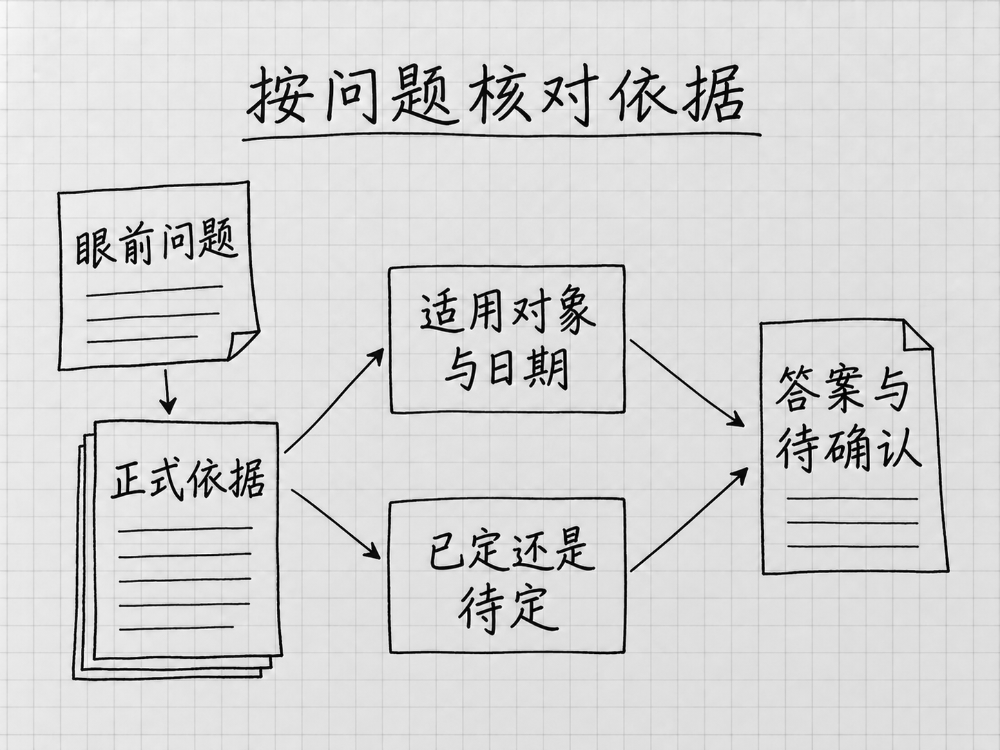

*图：带着问题找正式依据，再核对适用对象、日期与决定状态；更新更晚，不等于有权改变要求。*
<!-- /diagram: FIG-025 -->

这组材料故意设置了一个常见陷阱：常见问题解答，英文简称 FAQ，整理日期比正式现行说明晚，却仍写着全部事项周五中午交给林澄。协调会纪要更晚，又提出外部人员只交 PDF 的建议。按“文件越新越优先”排序，就会选错。

先回到正式说明。V2 在 9 月 26 日确认，9 月 28 日生效，但只适用于 9 月 28 日及以后实际启动的事项。此前已经启动的事项继续使用 V1。这不是简单的新文件覆盖旧文件，而是两个版本分别服务不同对象。

接着区分确认程度。纪要记录了讨论，也明确写了还没有批准。因此，“有人建议允许合并 PDF”和“已经允许合并 PDF”是两件不同的事。AI 很容易把一段讨论整理成肯定句，你需要检查它有没有删掉“拟议”“尚未确认”等条件。

可以针对疑点继续问：

**你**：请核对 FAQ 第一问与现行提交说明是否一致；说明哪类事项仍可按 FAQ 的时间与接收人处理，哪类不可以。协调会提出的 PDF 方式有没有批准依据？请指出原文，不按文件日期直接排序。

作者参考：旧事项仍按 V1，FAQ 的周五 12:00、林澄对这一类成立；新事项应按 V2 的周四 17:00、陈安处理。FAQ 不能一概用于全部事项。PDF 简化方式仍待确认，纪要不足以批准它。

核对依据时，先看它是否有权规定这件事，再看适用于谁、何时生效。日期是其中一个条件，不能单独决定采用哪个版本。影响行动的答案应能回到一个文件、一段文字；不必为每一句背景介绍建立来源档案。重复转载或多个摘要表达相同，也不会增加正式批准的证据。

#### 形成一份能直接用于接手的说明

确认关键规则后，不用重新开一项工作，把同一任务里的已核对信息整理成成果即可。

**你**：请把已经核对的内容整理成一份简明接手说明。按我的五个问题组织，区分已启动旧事项与新事项，附关键出处。对当前三项工作的适用版本分别说明，计划日期不能写成已经发生。尚未确认的事情放在末尾，并说明下一步找谁确认。

下面是作者参考内容，供你对照。它不是 WorkBuddy 的实际输出，也不要求逐字一致。

|接手问题|应当说清的答案与依据|
|---|---|
|收什么|旧事项交进展说明、进度表；新事项增加依据清单。见旧、现行说明的“提交内容”。|
|交给谁、放哪里|旧事项由林澄汇总，放旧批次位置；新事项由陈安汇总，放新批次位置。见各自“接收与时间”。|
|何时交|旧事项每周五 12:00 前；新事项每周四 17:00 前。不能统一写为周五。|
|按哪个版本|按实际启动日期。9 月 24 日启动的资料索引用 V1；9 月 28 日启动的常见问题用 V2；计划 9 月 30 日启动的流程说明，在按计划实际启动的条件下用 V2。|
|什么还没决定|外部协作人员能否只交合并 PDF，尚未批准；由陈安了解情况并提出后续意见。见现行说明“异常”和协调会纪要。|

你可以把这份说明保存为本地文字文件，也可以要求生成自己能编辑的文档。主案不需要同时交导图、演示稿和知识库。先得到接手者能使用的一份说明，再按实际用途扩展。

核对时，把注意力放在收集内容、接收人、截止时间、适用范围和待定事项。文件是否好看不是这一轮重点。若说明里写“流程说明已于 9 月 30 日启动”，就要改回计划状态，因为交接材料并没有提供已经启动的事实。

最后合上工具回答，用自己的话解释一次：“为什么同一周交材料的人可能有不同截止时间？”阅读时觉得顺畅，可能只是跟得上对方的解释；不看答案仍能说出判断条件，才更接近自己会用。能说出按实际启动日期分流，而不是按提交日期统一套新规则，就说明你抓到了本案的关键。

#### 真正缺少的信息，应当去哪里补

这套材料已经告诉你 PDF 例外未批准。此时最有用的下一步，是向负责确认的人提出一个明确问题，而不是继续搜索网上有没有别人这样做。

可以让 WorkBuddy 帮你把询问写短：

**你**：请根据现有材料，起草一句给陈安的询问，说明我要确认外部协作人员能否只交合并 PDF；若仍未决定，请问当前应如何收集。只起草，不代为发送。

作者参考：“目前材料仍显示 PDF 简化提交未获批准。外部协作人员这周应按哪种方式提供材料？若已形成新决定，请给我正式说明或确认记录。”这里向人确认的是内部安排；工具可以帮助表达，但不能代替负责人作决定。

材料缺失则是另一种情况。选做练习提供了一份缺页的现行说明。另开任务，用它替换完整 V2，不引用前一个任务的接手说明。此时旧事项要求仍有完整依据，新事项的提交内容、接收人和时间却无法从正式材料确认。

合格的回答应保留能确定的部分，并索取缺失页。把所有问题都说成“不知道”太粗糙，拿 FAQ 填上新事项要求又过于武断。会区分已知与未知，才能一次问到真正缺的东西。

#### 新材料来了，只改受影响的回答

主案完成后，再添加 10 月 2 日的正式补充。它规定：10 月 5 日及以后实际启动的事项，除 V2 的三份材料外，加一份负责人核对记录；此前已启动者保持原安排。接收人、时间和位置不变，外部简化方式也仍未决定。

**你**：请依据这份正式补充更新接手说明。先说明它改变了哪项回答、影响哪些事项，再只修改有关内容。原有接收人、截止时间和仍未决定的问题保持原样。对尚未实际启动的事项，说明还需确认什么。

作者参考：新增的是较晚启动事项的第四份材料。9 月 24 日旧事项仍交两份，9 月 28 日已启动事项仍交三份。计划 9 月 30 日启动的流程说明，要核对实际启动是否发生；若延期到 10 月 5 日或更晚才实际启动，就要提交四份材料。

这个例子说明，更新不只是替换一句话。你还要找出新规则依赖哪个事实。工具可以定位受影响的回答，但实际启动日期仍要有材料支持。

更新后对照前后版本，确认没有顺手把旧事项也改为陈安接收，没有丢掉原本的例外，没有把未决定事项写成已解决。变化不多时，正文末尾写一句这次改了什么就够了，不必额外制作变更台账。

#### 需要自己负责时，把看懂变成会用

如果你只是代查一次要求，前面的短解释已经够用。若你以后要独立接收、检查和回答别人，就继续做三个新情境，减少下次遇事重新翻资料的时间。

先说明你哪里不懂。比如：“我理解新版本按启动日期划分，但不理解旧事项后来增加内容算不算重新启动。”让 WorkBuddy 依据材料解释，同时指出材料没有定义的边界。通俗类比能帮助理解，但不能替代正式条件。

再让它听你解释：

**你**：我先说自己的理解，你先听完，再依据原文指出遗漏或错误，并给出处。不要因为措辞不同就判错。之后每次只给我一个新情境，等我作答再反馈，不提前代答。

打开练习包里的三个情境：10 月 6 日实际启动的新事项；9 月 24 日启动、后来增加子任务但明确没有另起事项的旧工作；启动日期缺失、又希望只交 PDF 的外部工作。先自己判断材料、接收方式与不能确定的地方，再看工具反馈和独立作者答案。

核对理由比核对结论更重要。第一题应该用新增核对记录；第二题不能仅因日历进入 10 月就切换版本；第三题不能猜启动日期，也不能把未批准的简化当成默认允许。答错时先判断是漏看了一个事实，还是没有理解规则：前者补读相关材料，后者请它换一个只改变关键条件的情境，再由你判断。这样能找到薄弱处，不必从头重读全部五份。

经常做的人可以把自己已经理解的判断写成一小段操作提醒：“先看实际启动日期，再选对应材料与接收安排；缺启动日期或遇未批准例外，先确认。”这是为了下次执行方便，不是每次学习都必须增加的交付。是否记错题、隔天再练，由你真正需要掌握的程度决定。

#### 换一批材料，重新判断适用条件

主案做熟后，用包内独立的入职材料练习迁移。这里决定版本的是入职日期，另有研发部门设备培训例外，还有一条较新的免签建议未获批准。

不用复制主案中的“事项启动日期”措辞。先读两位同事真正问什么，再请 WorkBuddy 根据这批材料答复。你应当看到：10 月 6 日入职的研发人员按现行指引参加入职说明，只有设备培训使用部门例外；9 月 29 日入职者后来补交表格，仍按旧指引，未批准的免签建议也不能使用。

选其中一题，用自己的话说明为什么。迁移成功不在于复用了一段长提示词，而在于你会重新找版本划分、事项范围与决定状态。材料里没有时区时，追问时区也是正确处理，不能用自己电脑的时间代替。

#### 按需搜索公开背景，别拿它改内部规则

另一个常见需求是补通用知识。例如，你想知道“流程图和任务清单各适合什么工作”。这可以独立开展公开检索，与内部提交规则分开。

当前环境具备搜索能力时，可以请求：

**你**：请比较流程图与任务清单分别适合解决什么问题，优先读取原始发布者的说明，给出支持结论的网页及有关内容。只回答通用方法，不推断本项目采用哪种要求；打不开或只看到搜索摘要时明确说明。

作者在准备本章时查阅的 ASQ 说明，把流程图用于表达步骤、顺序与决策关系；Microsoft 的任务清单说明展示了将工作分成可检查的动作并记录完成的用法。由此可以判断：要看流程走向和分支，流程图有帮助；要逐项执行和检查是否完成，清单更直接。[ASQ 流程图说明](https://asq.org/quality-resources/flowchart)；[Microsoft 任务清单说明](https://support.microsoft.com/en-us/planner/add-a-checklist-to-a-task)

这只是方法比较。它没有证明你的部门必须用哪种图，也不表示 WorkBuddy 已连接这些服务。采用外部答案前，打开关键原页，核对它讨论的对象与条件能否支持这句话。网页日期新却对象不同，不能直接替换已有依据；若原页无法读取，应保留限制，不能把搜索摘要说成已完成原文查证。

WorkBuddy暂不能搜索时，可以自行打开这两条原始来源，核对它们讨论的用途与适用条件，再把需要的内容交给任务。

何时结束搜索，也由问题决定。本例只需比较两种工具适合解决什么问题：各自的用途已有原始说明，关键差别已能解释，就可以停下。若要决定部门采用哪一种，还缺本部门的任务与协作要求，继续搜相似文章也补不上这个缺口。先辨认缺的是外部知识还是内部事实，才不会把“继续找资料”变成拖延决定的方式。

#### 留下能再次使用的部分

如果下周还要做这项工作，保留正式原件、当前接手说明和仍需确认的事项。给说明写明采用的版本与补充日期，在新任务中明确引用它们，抽查一个关键答案。资料库可按需使用，本地文件同样可以完成。

这次提效来自几处具体改变：带着问题筛选资料，集中比较适用规则，只追问真正缺的信息，有变化时只修正有关回答。你可以留意自己花在查找、核对和返工上的时间是否减少，也看新情境是否判断正确。摘要生成得快，若后面需要大量纠错，就还没达到想要的效果。

动手时先完成一份接手说明和一次自己的短解释。卡住了，就回到具体问题：文件有没有读到，依据是否适用，决定有没有批准，缺的事实应找谁确认。把这些判断练熟，下一次接手制度、产品说明或业务流程时，你就有了一套可以重复使用的办法。

### 第14章 文稿写作与文档制作：写清内容，交出可用文件

一场分享活动改期了。你已经在群里看过新安排，也记得有人问过报名要不要重填。真正开始写通知时，却还要重新翻消息：新日期是哪天？截止时间改没改？谁来换海报？有人建议提供录播，这件事定了吗？

这类工作费时，往往不是因为不会写中文，而是事实散、读者不同、改动频繁。WorkBuddy可以帮助你从材料起稿，在同一任务里继续改写，再生成文件。要让它替你省下反复翻找和重写的劳动，需要先做好一件事：**说清给谁看，提供必须写对的事实，用具体反馈修改。**

本章从一份协作同事通知开始。写完、改到能执行、保存成可修改的文件，就完成了主线。如果你还要给参加者另发通知，或写较长的情况说明，再进入相应练习。

#### 先把本次任务交代清楚

打开[W01练习材料](examples/W01/README.md)。这是独立的虚构活动，不需要你熟悉某家公司的业务。起步使用三份短资料：事实材料、读者与分工、写作要求。作者参考通知先留着，等自己完成后再看。

事实材料中，旧通知写的是10月14日。10月7日的确认安排已经把活动改为10月16日，仍是14:00—15:00，地点仍是综合楼302。报名截止仍为10月12日18:00，原报名有效。六条留言里有人问是否要重填，也有人建议录播；问句和建议都不能直接当作决定。

这次通知给三位协作同事看。刘文更新群置顶，赵宁替换海报，孙悦更新报名表说明。三人都应在10月10日17:00前完成，并向林然回复。这和参加者的报名截止是两个不同时间。把两者写成一个“截止时间”，同事即使认真阅读，也可能做错事。

把三份起步材料的副本放入“活动改期练习”文件夹，原件保留。读完短材料，知道其中有哪些决定、哪些旧信息，便可以开始，不必先手工抄成一张完整事实表。

在WorkBuddy创建任务页选择这个工作空间，也就是本次读取和保存文件的位置。把三份文件拖入输入框区域，或者通过上传入口添加。发送前看一眼文件名，确认没有把作者答案和后续变化一起放入。然后说明用途。例如：

> **你：** 请根据这三份材料，写一份给协作同事的活动改期通知。让刘文、赵宁、孙悦知道哪些信息改了、各自要做什么、何时完成和向谁反馈。使用已确认安排，旧通知只供核对；录播未定，不承诺回放。先在当前任务给出短通知，不需要长提纲，也不要代为发送。

这段请求交代了材料、读者、行动和边界。你也可以用自己的话说，关键是让WorkBuddy知道：这份通知怎样才算写好。这里的标准是三位同事看完便能知道自己的动作和期限；“正式、专业、有感染力”不能替代这个标准。

发送后，关注WorkBuddy是否确实依据三份材料工作。如果它说找不到文件，先检查附件或工作空间，再补充准确文件名。不要把文件打不开误判为自己的提问方式不够高级。短材料也可以直接粘贴，并在各段前注明“已确认安排”“旧通知”“讨论留言”，让不同作用看得出来。

#### 第一稿先做到同事看完能行动

收到初稿后，先不急着评价文采。你要找四类信息：变化是什么，什么没变，谁做什么，什么时候完成。只要其中一类不清楚，一份语气正式的通知也可能无法使用。

下面是教材作者根据材料写出的参考段落，不是一次WorkBuddy运行的截图或逐字输出：

> 因主讲人行程调整，办公经验分享会由2026年10月14日改为10月16日，时段仍为14:00—15:00，地点仍为综合楼302会议室。
>
> 请在10月10日17:00前完成信息同步：刘文更新协作群置顶通知；赵宁修改并替换活动海报；孙悦更新内部报名表中的活动日期说明。完成后请向林然回复“已更新”；如有阻碍，请一并说明。

这两段没有把全部材料搬进来。第一段回答“发生了什么变化”，第二段回答“我接下来做什么”。报名截止、原报名保留和不能参加的处理办法，可以接在下一段。参加者对录播的期望无需写成内部讨论史，但协作同事需要知道目前不能承诺回放。

比较自己的初稿时，不要要求词句与参考稿一致。有人先列三人的分工，有人合成一个短段，都可能好用。真正需要一致的是活动日、两个截止时间、地点、报名条件和录播状态。

如果初稿写了“请相关人员做好协调工作，确保活动顺利开展”，读起来没有语病，却把最有价值的信息省掉了。可以直接反馈：

> **你：** “请相关人员做好协调工作”太笼统。请把这一句改为三人的具体分工，并说明完成后回复林然。保留已经写对的活动时间、地点和报名条件，其他段落暂时不改。

这条反馈指出了具体句子、缺少的信息，以及允许修改的范围。改完后，你就能检查三人的分工有没有补上，其他事实有没有被连带改动。

如果一时说不清哪里不好，先从读者的困难出发：“他看完还会问什么？”答案如果是“不知道自己该做哪一步”，就补行动；如果是“分不清哪个时间适用于自己”，就拆开两类期限；如果是“前三段都没说到改期”，就把变化前置。把感受变成能检查的修改要求，才能减少“再好一点”的反复重写。

#### 把事实缺口和表达问题分开处理

<!-- diagram: FIG-026 -->
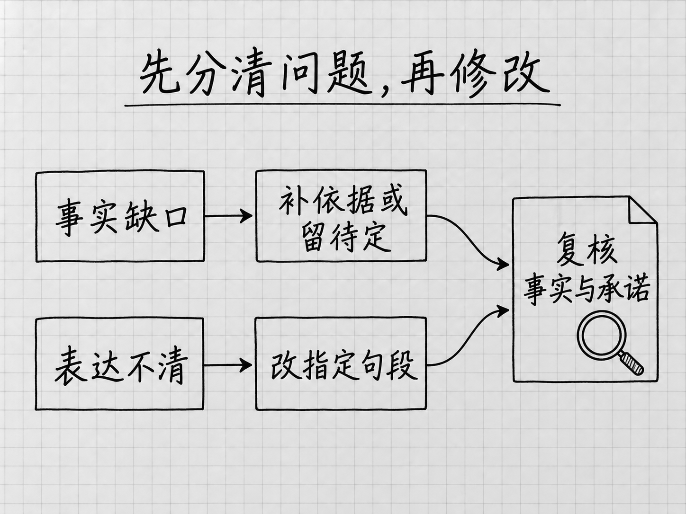

*图：改写可以改善表达，不能补造事实。先找准问题，再检查修改有没有改变已有事实或新增承诺。*
<!-- /diagram: FIG-026 -->

有些问题可以靠改写解决，例如“同步更新”不够具体。有些问题必须有人提供答案，例如联系人是谁、哪一个活动日期才是正式决定。两者混在一起，工具就容易用顺畅的语言填补事实空白。

本例已经提供了联系人林然，不能另编电话或邮箱。录播没确定，合适的表述是“录播尚未确认”，或者在不影响当前行动时暂不写。不能为了让通知更周全，加上一句“无法到场者可观看回放”。那不是润色，而是新增了承诺。

遇到缺口也不意味着整项工作都要停下。如果仅缺一条不影响通知主体的补充信息，可以先完成其余部分，再在任务里指出缺口。只有缺失内容会让读者无法行动时，才需要先补齐。例如活动地点完全未知，而通知必须让人按时到场，这就不能直接交成正式稿。

可以请WorkBuddy在输出末尾简短说明“还缺哪一项会影响发送”。拿到草稿后，先补影响行动的事实，再调整表达；缺少地点的到场通知，换几轮语气也不能变得可用。

接着使用材料中的“两条相冲突的意见”。赵宁建议所有参加者重新报名，孙悦认为应保留原报名。哪条更晚出现，不决定哪条更有权威。已确认安排仍是原报名有效，协作人的建议没有自动改变决定。

继续告诉WorkBuddy：现有决定未变，请先保留原报名规则，把是否重新报名列为需要林然决定的问题。这样既能处理建议，也不会让工具替活动协调人更改条件。在自己的工作中，你也可以说明哪份是正式确认，哪份只是同事批注，不必让AI从语气强弱猜权威。

#### 真正收到新日期时，只修改受影响内容

现在加入“正式改期”变化：10月9日，林然确认活动改为10月20日。时段、地点、报名截止、原报名有效以及协作更新期限都不变，录播仍未确认。

这个练习故意只改变一项事实。继续在原任务里提供变化，并指出需要保留的条件：

> **你：** 这是正式更新：活动日期改为2026年10月20日，仍为14:00—15:00。请修改当前通知中受影响的日期与说明；报名截止仍是10月12日18:00，协作更新期限仍是10月10日17:00，其他条件不变。给出修改后的通知，并用一句话说明改了什么。

你此时要查看实际文本，而不只看“已完成修改”的回复。标题有没有残留“16日”？正文的新日期是否一致？工具是否顺手把报名截止也顺延了？后者看起来合理，却违反材料。

如果只写过一份通知，就核对这一份。不必为了练习“同步”临时生成一套不需要的邮件、海报和PPT。若你原本已经制作了参加者通知，则把那份也交入，并说明两份都要更新相同活动日期。同步范围由已经存在的成果决定。

小错可以直接在文档中修改。比如一个字写错，你自己改通常就够了。需要重新组织段落、统一多份材料的变化，才值得继续交给WorkBuddy。提效不要求每次键盘操作都经过AI。

#### 需要第二类读者，再改写第二个版本

协作同事需要知道内部工作分工，参加者不需要。假如你确实还要发一份参加者通知，可以从已核对的稿件继续做，而不重新粘贴所有背景。

先说明新增用途：这份给已经报名的人看，重点是新时间、地点、原报名有效，以及无法参加的处理方式。内部三人分工不写，录播仍不保证。活动日期采用当前正式版本10月20日。

观察改写时的信息取舍。只把“各位协作同事”换成“各位参加者”，下面仍然要求对方更新海报，就是没有真正改变读者。反过来，为了照顾参加者而新增“所有报名者会收到录像”，则是改动了事实。

检查多版本时，先对共同事实，再对各自行动。日期、地点、报名条件应一致；工作分工和参加办法本来就不同，不需要强求两稿内容相同。

多个版本应共同依靠已确认材料。正式日期改变后，先把新事实交代清楚，再更新受影响的稿件。不要只改参加者通知，随后又把未更新的协作通知作为下一轮依据。你需要统一的是事实，按读者变化的是信息取舍、顺序和语气。

如果是给负责人写情况说明，重点又变为哪些安排已确认、信息更新进行到哪里、什么需要决定。当前材料没有报名人数和退报名人数，不能写“本次改期对参与率影响很小”。可以写“参加影响尚未完成统计”，并说明需要从哪里补数据。语气变得正式，不会自动增加证据。

#### 较长说明先安排问题顺序

短通知信息不多，可以直接成稿。情况说明、工作指引等较长内容，则值得先看看结构，否则可能写了很多才发现顺序不对。

打开独立的[访谈情况说明材料](examples/W01/reader/%E8%BF%81%E7%A7%BB-%E8%AE%BF%E8%B0%88%E6%83%85%E5%86%B5%E8%AF%B4%E6%98%8E.md)。它讨论大家查找公共资料时遇到的困难，与活动改期没有业务联系。三位受访者各说了一段话：一位找到了旧样表，一位没遇到问题但不知道谁维护目录，另一位靠快捷链接正常使用。补充材料确认存在两份同名样表，尚无全体员工的统计。

这次先向WorkBuddy交代读者和目的，让它按三个问题安排一页说明：现在确切知道什么，仍不清楚什么，下一步先核实什么。看到结构后，选择最容易混淆事实与猜测的一段，让它先写出来。

例如，“可能没人维护”是受访者的猜测。可以写“有受访者不了解目录维护人”，不能直接写成“目录长期无人管理”。“大概找了十来分钟”也不能变成全体员工的平均耗时。一份说明即使逻辑流畅，丢掉这些限定，也会把材料意思写大。

代表段没有问题后，再展开全文。这里多看一步，是因为长内容的结构和证据边界更容易影响后续。它不是所有短通知都必须履行的程序。

如果有固定模板，告诉WorkBuddy哪里放事由、情况、后续建议和联系人。模板决定内容放哪儿，不能提供本次事实。参考旧范文时也一样：只借它的语气或段落组织，不把旧日期、旧人员和旧结果带过来。

想让文字像自己，可以给一小段你认可的样文，再指出可观察的特点，比如“句子短，直接交代行动，不使用‘扎实推进’一类词”。同时说明样文只供参考表达，不作为本次事实依据。先看一段能否保留事实、又符合你的习惯，再用于全文。

#### 从正确的文字到可用的文件

回到活动通知。内容确认后，提出明确文件要求：保存一份可编辑Word文档，文件名写清用途，例如“活动改期_协作同事通知_10月20日.docx”；正文沿用当前确认版本，不增加内部讨论和修改过程，并说明保存位置。

查看任务提供的文件结果，找到实际文件，再用你平时使用的Word或WPS打开。聊天里出现一个标题或文件名，不等于文件已经落到可用位置。找不到时，继续询问准确文件名和保存目录，或使用任务结果中的文件入口。

打开以后，检查标题是否截断、正文是否残留空白占位、三人的分工是否清楚，以及联系人有没有单独落到第二页。需要后续修改的内容，应实际试改并保存，确认交付的文件可以继续使用。

用了模板，要检查旧日期、旧人员等固定文字是否残留；用了链接，要确认实际目标正确。这些检查跟着文稿的实际内容走，不必给一份短通知套上复杂报告的检查项目。

可以用“长标题”变化练一次版式修改。标题变长后发生换行并不一定是错误；重要的是清楚、完整、层级合适。不要为了挤进一页，把正文缩到难读。让WorkBuddy只调整标题排版，或者在办公软件中手动处理，再检查相关位置。

如果当前输出只能得到正文，没有形成可打开的Word文件，就先保存已确认内容，在Word或WPS中粘贴整理，再继续完成文稿交付。不要把未出现的文件当作已经生成，也不必把事实和表达全部推倒重来。文字是否准确与文件是否可用，是两个可以分别处理的问题。

保存正式版时，把文件名、活动日期和内容对齐。文件已保存，也不代表已通知相关同事。是否发送、发到哪里，是接下来的具体工作。本练习做到你手里有一份可以使用的稿件即可。

#### 动手：用一处变化检验你是否掌握

先只用三份起步材料完成协作通知，再加入正式改期信息。检查两件事：需要改的活动日是否全部改了，不该改的报名和协作期限是否保留。能解释这两点，比一次生成很多篇文稿更有价值。

接着选一个与你工作更接近的迁移：为参加者增加一个版本，或完成访谈情况说明。前者检验你能否按读者取舍，后者检验你能否在长内容中保留事实与不确定性。不必两项都做，也不需要每项再交一套附表。

完成后，把自己的文稿与原材料对照，再看作者参考。记录最费时间的是找事实、起草、修改，还是文件整理。若返工总发生在事实不清，下一次先改善材料；若事实一直正确，却反复调整语气，就保留一段认可的样文。不同问题需要不同改法，增加提示词长度并不一定有用。

#### 卡住了，先定位是哪一类问题

**写得顺，却总是写错日期。** 回到输入，标明哪份是已确认安排，哪份是旧通知。不要同时放入多份近似命名的文件却不说明作用。

**每次修改都把全文重写了。** 缩小反馈范围，引用具体句子，说明要改什么、保留什么；拿不准的修改先看一小段。简单错字可以自己改。

**内容正确，交出去仍有人追问。** 看追问是否来自缺少行动信息。例如“谁来做”“做完告诉谁”，往往比增加一段背景介绍更有帮助。

**文件看起来和预览不同。** 以对方实际使用的软件打开检查，修正具体位置。只修标题或版式，避免重新生成全文时，把已经核对的日期和安排一起改错。

本章的习惯是先确定读者，再提供事实，随后围绕具体问题修改。WorkBuddy承担起草、重组和重复改写，你保留对事实、承诺和交付标准的判断。省下来的主要是反复查找、复制和整篇重写的劳动，而不是省去最后一次认真阅读。

相关官方说明：[创建任务](https://www.codebuddy.cn/docs/workbuddy/Create-Task)介绍工作空间与材料入口；[任务对话](https://www.codebuddy.cn/docs/workbuddy/Conversation)介绍在原任务中继续修改；[文档生成与编辑](https://www.workbuddy.cn/docs/workbuddy/From-Beginner-to-Expert-Guide/Practice-Cases/Practice-Two)提供Word与演示文件的能力说明。

### 第15章 表格处理与数据分析：统一口径，得到可信结论

你收到三份表，需要把本月工作汇总起来。表头相似，里面有编号、日期和状态。最容易想到的要求是：“帮我分析一下，再做几张图。”

可是一张看起来专业的图，可能混用了几个不同问题：本月原本安排多少项？最后做完多少项？其中多少按时完成？只看已经完成的事项，还是把未完成的也算进来？这些问题都能得到数字，但数字的含义不同。

本章用三地区的交付台账练习。“交付单”代表一项有约定日期、需要登记完成情况的工作。要学会的习惯是：**先说清数字怎么算，再用少量有代表性的记录检查规则，随后处理整批。** 这里检查少量记录，后文简称“试小样”。

打开[P04练习材料](examples/P04/README.md)，先用A包。先完成A合表和一次测试副本变化，再用C包正常换月，就能走通主线。希望练习更新、冲突和缺项时，再按本章B包部分逐条加入变化。起步不需要客户关联、图表和演示，一份有汇总、明细及必要说明的工作簿就够用。

#### 先看懂一行，再谈汇总

A包有东区、中区、西区三份Excel文件，合计20条记录。每份表的工作表叫“交付台账”，第一行是表头。东区7条，中区7条，西区6条；这里说的条数不包括表头。

先打开东区表，看DL-0001这一行。它是一张交付单的登记，原约定8月3日交付，实际8月2日完成。A包中每张交付单只有一条登记，所以此时20行刚好对应20张交付单。稍后加入更新，行数就不再等于业务对象数。

表里有两个看起来都像编号的字段，作用不同。“交付单号”标识工作对象；“来源行编号”标识这条原始记录的位置。DL-0001以后可以出现新的登记，但每条来源行都能分别回查。不要拿来源行编号当成业务对象，也不要因为两行交付单号相同就直接删掉其中一行。

订单号和客户编号暂时只需原样保留。一份订单可以分成多张交付单，一个客户也可以有多个订单。东区的DL-0001和DL-0002属于同一订单，都是正常记录，不能按订单号或客户编号去重。“去重”就是决定哪些记录不应重复计算；决定前必须知道重复的究竟是什么。

本次先回答两个问题：8月应交付多少单，其中多少单按期完成。把计算约定写给WorkBuddy，比让它先推荐十种分析更有用：

- 统计期是2026年8月1日至31日。
- 状态截至2026年9月5日18:00，统一使用北京时间。
- 按**原约定交付日**归入月份，不按实际完成月份归入。
- 计划数是原约定日在8月、截至点未取消的交付单数。
- 按期数是上述计划中已有确认完成日期，且实际日期不晚于原约定日期的数量；同一天完成算按期。

“期间”说明在统计哪一批任务；“截至时点”说明采用到什么时候为止的信息。8月的任务完全可能在9月才完成，所以两者不必落在同一个月。表中9月2日完成的一单，原约定日如果是8月31日，仍然属于8月计划，只是没有按期完成。

这些是本练习的业务口径，也就是数字怎样定义。你的单位可能采用其他规则，尤其是取消事项是否从计划中排除。WorkBuddy可以帮你发现口径缺项、说明不同算法会回答什么问题；到底采用哪种口径，应由本次业务目的和已经确认的规则决定。规则改变后要重算，不能把两套结果混在一起比较。

#### 先让五条记录说明算法

<!-- diagram: FIG-027 -->

*图：在本例 A 包口径下，未完成事项仍在计划内；按期数只取其中按约完成的部分。先固定统计范围，再计算比例。*
<!-- /diagram: FIG-027 -->

把三份A包副本放入新的“8月交付练习”文件夹。在WorkBuddy创建任务，选择该工作空间，并添加三份文件。确认本次没有带入B包和作者答案。第一次先不要求最终报告：

> **你：** 请读取这三份台账，统计2026年8月、截至9月5日18:00北京时间的计划数和按期数。按原约定日归期，未完成仍在计划内，截至点已取消的交付单不计入计划，同一天完成算按期。一张交付单算一个对象。先只用DL-0001、DL-0004、DL-0002、DL-0003、DL-0017解释判断，给出对应来源，不扩展其他指标。

这五条分别代表提前完成、当天完成、延后完成、尚未完成、跨月完成，能检查最容易混淆的条件。若只选五条正常按期记录，即使全部算对，也不知道工具会不会漏掉未完成项、错算跨月项。试小样的目的是检验规则，不是靠这五条推断全部交付表现。你可以对着原表逐条判断，无需先学Excel函数。

| 交付单 | 材料中的情况 | 计入计划 | 计入按期 |
| --- | --- | --- | --- |
| DL-0001 | 原约定8月3日，实际8月2日 | 1 | 1 |
| DL-0004 | 原约定和实际都是8月15日 | 1 | 1 |
| DL-0002 | 原约定8月8日，实际8月10日 | 1 | 0 |
| DL-0003 | 原约定8月20日，当前登记仍在处理中 | 1 | 0 |
| DL-0017 | 原约定8月31日，实际9月2日 | 1 | 0 |

这张表是作者参考判断，不是WorkBuddy的运行输出。五条共计5项计划、2项按期。检查工具的判断是否符合原表与口径，尤其是第三、第四行为什么不能从分母里删掉。它能给出解释，不等于解释正确；检查的依据仍是你已经确定的规则。

如果它只选择已完成的记录，得到的就成了“已完成中有多少按期”，换了问题。请指出遗漏的DL-0003，要求继续按原口径处理。此时修正的是判断规则，不是把最终答案告诉工具让它凑数。

#### 合成一个能回查的工作簿

五条说清楚后，继续同一任务，要求按相同规则处理三份完整材料，生成Excel工作簿。把结果分成“汇总”“明细”“口径与异常”等工作表即可，不必同时生成几份报告。

说明原表保持不动，明细要保留来源文件和来源行编号。汇总列出各区与总计的计划数、按期数、按期率，另列需要跟进的未完成交付单。按期率就是按期数除以计划数，不是三地区百分比的简单平均。

找到生成的实际文件，在常用Excel或WPS中打开。先查看汇总，再返回明细。A包的作者参考结果如下：

| 范围 | 计划数 | 按期数 | 按期率 |
| --- | ---: | ---: | ---: |
| 东区 | 7 | 4 | 57.14% |
| 中区 | 7 | 3 | 42.86% |
| 西区 | 6 | 3 | 50.00% |
| 总计 | 20 | 10 | 50.00% |

显示百分比可以保留两位小数，计算时保留原来的分子与分母。不要先把地区百分比四舍五入，再相加求平均。三个地区的计划数不同，直接平均也未必代表整体情况。

你可以自己做两层检查。先把7、7、6相加，再把4、3、3相加，确认分组回到总计；然后从明细找回刚才五条，再核对最后一行DL-0020。第一种检查容易发现漏区，第二种能发现日期或范围判断错误。仅仅两个总数碰巧一样，不代表每行都处理对了。

请WorkBuddy“再检查一遍”可以帮助排错，但若它仍沿用同一套错误规则，两遍可能得到同样的结果。因此至少保留一种你能独立完成的核对：从原件算少量记录、检查分组加总，或像下一节那样改变一个输入，事先写下应有变化。你不必手算整张表，也不能把同一回答重复两次当成两份独立证据。

A包中另有4单已经完成但迟于约定，6单仍未完成。未完成单号是DL-0003、DL-0006、DL-0011、DL-0014、DL-0018、DL-0020。它们的原约定日都早于截至日期，应继续跟进。不要用“已完成事项的平均用时”把这部分积压藏起来。

#### 文件里有数字，不等于会自动更新

生成的汇总可能保存的是固定数字，也可能使用了公式。固定数字是当时算好的结果；公式是根据指定单元格继续计算的规则。两种都可以交付，但复做方式不同。

请WorkBuddy明确说明：哪些地方是输入，哪些是固定结果，哪些使用了公式。然后在办公软件里点选一个汇总单元格，看它显示的是直接数值还是计算表达式。你不用背下表达式，但应能解释它统计了什么范围、排除了什么。

用A包的副本做一个变化实验：把DL-0009的实际日期从8月11日改为8月9日，其他内容不变。这只是测试副本，不是修改真实事实。先在心里写出预期：计划仍20，中区按期从3变4，总按期从10变11，总按期率从50%变55%。

如果成果采用可重算公式，应在它实际引用的输入区域修改，查看汇总是否跟着改变。若公式引用的是工作簿内部明细，仅改电脑上另一份源文件，不一定会触发它更新。一定要弄清谁在引用谁。

如果是固定结果，应把变更后的源材料重新交给WorkBuddy，沿用口径再运行，另存新输出；改了源表却继续使用旧汇总，结果当然不会自动变。还要查看已经生成的图和文字是否同步。一个公式算出55%，并不能保证旁边那句“按期率50%”自动重写。

当你需要持续填写、随改随算的工作表时，再要求公式路线；一次交付、下次重新运行的报告，可以使用标明时间的固定结果。不必为了显得专业，让所有单元格都装上复杂公式。

#### 逐条加入变化，分清副本、更新和冲突

<!-- diagram: FIG-028 -->

*图：先限定截至时点，再分清副本、完整更新和同一最新时刻的冲突；原始来源与历史仍要保留。*
<!-- /diagram: FIG-028 -->

保留A成果，开始B包。先回到没有修改DL-0009的原始A包：刚才的日期变更只属于公式测试副本，不带进B练习。如果原任务同时看到了测试副本，另开任务重新提供干净A包与相同口径，确认基线为20项计划、10项按期，再逐条加入B。

八条变化逐次加入，期间与截至时点始终不变。每次在这个干净基线的任务里说明“这是新收到的登记”，要求保留历史和来源，解释哪些数字改变。工作中可以批量处理，教学时拆小步，是为了看清每一种规则。

同一交付单有多条登记时，先只采用不晚于截至时点的信息，再比较登记更新时间。较晚时刻的完整更新可以替代旧状态；相同最新时刻若有冲突，必须保留冲突。较新的登记如果缺字段，也不能悄悄跳过它、把旧状态当作最新，而应说明哪些判断仍能确定。

**先看B-01。** 它与DL-0001原记录的九个业务字段完全相同，只是来源行编号不同。这是同一业务记录的另一份副本。原始行由20变21，计划和按期仍为20、10。副本来源要能找到，统计不重复算。

**再看B-02。** 它是DL-0003较新的状态，实际8月20日完成，与原约定相同。现在计划仍20，按期从10变11。旧的“处理中”登记不是垃圾，保留作历史，只是不再作为当前状态。

**B-03更新DL-0018。** 它在9月2日完成，晚于原约定8月30日。计划仍归8月，按期仍11。未完成少了一项，迟完成多了一项；不能为了让8月结果好看，把它搬到9月计划里。

从这三步可以看出，“重复编号”至少有两种含义：完全副本，或者同一事项的新状态。按编号一键删除重复，很可能把更新也删掉。

**B-04才是真正需要停下来判断的冲突。** DL-0004两条登记拥有相同更新时间，却分别写实际8月15日和8月16日。原约定都是8月15日，所以其中一个算按期，另一个不算。不能因为文件在后面，便选择后面那条；也不能挑有利于指标的一条。

这张交付单属于8月计划是明确的。冲突只影响是否按期。因此确定计划仍为20，已确认按期变为10，另有1单按期待核。把这单删出分母，再写10/19，会悄悄换掉计划范围。写10/20并称为确定总体按期率，同样掩盖了未知。此时正确成果可以就是已知数量和缺口。

**B-05取消DL-0006。** 取消登记早于截至点，按本例已约定规则，确定计划从20变19。取消为什么排除，必须来自业务规则，而不是工具觉得取消数据不好分析。

**B-06新增DL-0021，但缺原约定日期。** 它属于哪个月还不能确定。不能拿确认日或更新日代替。已确定计划仍19，另列1单资格待核。

**B-07把DL-0011登记为已完成，却没给实际日期。** 它的原约定日期清楚，因此仍在8月计划中；是否按期未知。不能补今天，也不能悄悄退回较早的“处理中”版本来制造一个整齐状态。正常未完成行的空日期与已完成行的漏填，是两种不同情况。

**B-08提供后续明确更正。** 变更说明已核对DL-0004的原签收记录，确认实际8月15日；较新的登记解决了之前冲突。按期数回到11，但另外两种未知仍存在。工具能采用的是新证据，不能把猜测包装成更正。

全部加入后的阶段结果，可以与这张作者参考表对照：

| 加入到哪条 | 确定计划 | 确认按期 | 计划内按期待核 | 计划资格待核 |
| --- | ---: | ---: | ---: | ---: |
| B-01 | 20 | 10 | 0 | 0 |
| B-02 | 20 | 11 | 0 | 0 |
| B-03 | 20 | 11 | 0 | 0 |
| B-04 | 20 | 10 | 1 | 0 |
| B-05 | 19 | 10 | 1 | 0 |
| B-06 | 19 | 10 | 1 | 1 |
| B-07 | 19 | 10 | 2 | 1 |
| B-08 | 19 | 11 | 1 | 1 |

最终28条来源行，扣除统计中的1条完全副本、归并6条历史版本，对应21个当前交付对象。21个中有19项确定计划、1项取消、1项资格待核；19项计划中11项确认按期、7项确定未按期、1项按期待核。保留这些去向，你才知道“少掉的行”去了哪里。未知尚未解决时，11/19不能标成确定的总体按期率。

#### 数字回答到哪里，结论就写到哪里

完成基础汇总后，可以请WorkBuddy围绕最初问题写两三句发现：本期计划与按期情况如何，哪些尚未完成，需要继续跟进什么。先把这段放在同一工作簿，不必另外生成长报告。

如果需要比较三地区的数量，可以增加一张简单图表，保留地区、数量单位、统计期和截至点。先确认要帮助读者看数量还是比例，再选图；两者回答不同问题，不宜只挑看起来差异更大的那一种。

一个可能出现的错误结论是“东区效率最高”。A包确实显示东区按期率约57.14%，高于其他两区；但记录没有解释各区任务难度、人员投入和任务类型。因此可以描述这份材料中的比例差异，不能直接评价人员效率。

同样，“下个月比例提高”是观察；“新流程带来了提高”是原因判断。只有两期台账，通常不足以说明原因。可以请工具指出还需要什么证据，例如任务构成是否相近、是否同时发生其他变化。不要用一段流畅解释替代实际调查。

#### 换一个月，沿用方法而不沿用旧数字

另建9月练习目录，只放C正常包三份文件。它有12条新记录，东、中、西各4条。统计期改为9月1日至30日，截至10月3日18:00，北京时间。B包未解决的问题不带入这次独立复做。

把上次已经确认的规则交给WorkBuddy，并明确新月份、新截至点和新文件。先检查材料是否齐全，再生成相同用途的工作簿。不要只说“照上个月再做一份”，否则旧路径、月份和固定数字可能被继续使用。

本次参考结果是：东区4项计划、2项按期；中区4项计划、2项按期；西区4项计划、3项按期。总计12项计划、7项按期，显示58.33%，底层仍是7/12。核对的不只是新总数，还包括标题、日期、明细范围和已有说明中是否残留8月内容。

完成正常换期后，再分别选做两个变化，不要同时加入。

历史更正使用A的干净基线和“历史更正”材料。9月18日确认DL-0002原实际日期记错，应为8月8日。若仍查看9月5日的旧信息快照，这条后来登记的更正不能提前进入，8月仍为10/20；若按10月3日重新整理8月修订版，则为11/20。9月仍为7/12。保存原快照和修订版，并说明变化来自历史记录更正，不是9月新增完成了一单。

缺交练习只提供C东区、中区及“缺交说明”，不提供西区文件或上次完整输出。已收到范围是8项计划、4项按期，50%可以标为“东区、中区已收到范围按期率”。全体三地区的数和比例未知。西区缺材料不等于零，也不能复制8月西区数字来填满表格。

#### 需要关联信息时，先查清关系

三份同类台账是上下追加。给交付单补充客户名称，则是按客户编号找另一张表，这叫关联或匹配。两者都像“合表”，实际动作不同。

P04选做材料提供客户对照。拿A东区前五条关联三名客户，正常仍是5条交付记录。随后追加同一客户的另一个名称候选，机械匹配会扩到8行，因为该客户对应的三张交付单各自匹配了两条名称。

此时不要删除三张正常交付单来凑回5。问题在客户对照的一号多名，应保留5个业务对象，将名称冲突标明，等待确定采用哪条名称。没有来源依据，不能让工具随意选第一条。

如果换成“需求与反馈”，一条需求本来就可能有多条反馈。可以用下面的小样独立迁移：需求R1、R2属于客户甲，R3属于客户乙；反馈F1和F2都对应R1，F3对应R2，F4写了不存在于需求表的R9。问的是“本材料中多少需求至少找到一条反馈”。

让WorkBuddy先解释两张表各一行代表什么，再处理。应保留R1的两条正常反馈，将F4列为未匹配；在三条需求中，有两条能找到反馈，即2/3。R3只能写“本材料未见对应反馈”，不能推成客户从来没有反馈。若按客户号去重，或照搬交付状态只取最新一条，都可能损坏这个问题需要的信息。

数据还散在回执、邮件或文件中时，也可以先做提取：选两份你有权使用的材料，说清一张单对应一行、要哪些字段、保留哪个文件的哪个位置。逐项回查两份后再扩大。文字无法辨认就留空待核，不用猜值补齐。提取成表是另一条入口，手头已经有表的人不必先做它。

#### 动手与排查

本章至少做一次A包合表，再在副本中把DL-0009改成约定当天完成，检查预期变化。随后做C正常换期。这能同时检验你是否理解口径，以及结果到底怎样更新。B包按自己的进度逐条练，不要求一次吃下所有例外。

**结果和答案不同时，先查范围，再查算法。** 是否少了西区？是否把表头当记录？是否只统计完成项？这些问题比颜色和格式更先影响结论。

**编号消失或变形时，保留文本含义。** DL-0001中的零属于编号，不是可以省略的数值精度。不要让工具为了统一格式改掉业务标识。

**一改输入，数字没有变化时，查引用位置。** 固定结果要重跑；公式要修改它真正引用的输入。无计划时，比例应写“不适用”，有资格待核时则不能宣称没有计划。

**异常越来越多时，缩小到一张交付单。** 把它的全部登记、时间和规则放在一起解释，再将解决办法用于其余同类记录。不要用反复要求“仔细检查”替代具体问题。

本章把批量整理、合并、计算交给工具，你负责确定数字的含义，并检验容易出错的边界。稳定规则能在下期继续使用，省下反复复制表格、补公式和重画图表的劳动。核查和修复也是投入的一部分；得到准确、可用的结果，才算完成这项工作。

相关官方说明：[创建任务](https://www.codebuddy.cn/docs/workbuddy/Create-Task)介绍文件与工作空间入口；[数据分析并可视化](https://www.workbuddy.cn/docs/workbuddy/From-Beginner-to-Expert-Guide/Practice-Cases/Practice-Three)介绍数据分析任务的组织方式。练习中的指标、材料和参考数值以[P04说明](examples/P04/README.md)为准。

### 第16章 工作总结与汇报展示：提炼成果，讲清重点

月底写总结，你打开四周记录，发现自己并不缺材料。核对过资料、追过确认、改过表、发过通知，几乎每天都很忙。可把这些内容依次贴进文档，读起来仍像流水账。

问题常常出在从“我做了什么”跳到“对方需要知道什么”的那一步。主管可能想了解实际交付、为什么有事情没完成、接下来需要协调什么；你却把每周发生的活动都写了一遍。换成精美页面，重点也不会自动出现。

本章用一位普通员工的月度记录练习。先做一页文字总结，再按需要练口头说明或制作演示。你要养成的习惯是：**先想清楚对方要知道什么，再用证据讲重点。** AI可以替你整理、归并、比较表达，但不能替你夸大成果和个人贡献。

#### 先确定这次汇报要帮助谁了解什么

打开[P07材料包](examples/P07/README.md)。你将代入周宁，一位负责日常资料整理和内部协调的员工，向主管说明2026年9月的工作情况，事实状态截至9月30日18:00。

材料包括四份周记录、一张六项交付进度表、三段同事反馈，以及未完成事项和分工说明。它与前两章的活动、交付台账没有业务关系，可以独立开始。

先读任务说明，不急着让WorkBuddy“做一份专业汇报”。这次主管知道你的岗位，主要想看实际交付、未完成事项和需要协调的地方。因此，无需介绍部门使命，也无需先构思一个“全面提升工作效率”的漂亮主题。

在新的WorkBuddy任务中使用“9月个人总结练习”文件夹，加入起步材料的副本。作者参考和后续变化先不加入。

可以这样提出第一步请求：

> **你：** 我是材料中的周宁，要向主管提交9月工作总结，事实状态截至9月30日18:00。主管关心实际交付、未完成原因和需要协调的事项。请先按同一事项归并四周记录，从材料里建议三个左右值得讲的重点，注明依据来自哪条记录。区分我的工作与他人的贡献，不把参加讨论或整理草稿直接写成最终成效。暂时不做PPT。

看到回应后，关注它是否把四周的同一事项接起来，而不是各写一条。比如资料索引第一周发现问题、第二周修复发布、第四周复查，属于同一项工作的推进。不能因为出现三次，就算三项独立成果。

如果WorkBuddy漏读了一份周记录，或只根据进度表起草，先补充文件范围。进度表适合看状态，周记录和反馈才能解释过程、贡献与限制。没有必要要求它逐字摘录所有材料，但被选中的重点应能找到依据。

#### 分清活动、产出和结果，才不会越写越大

<!-- diagram: FIG-029 -->
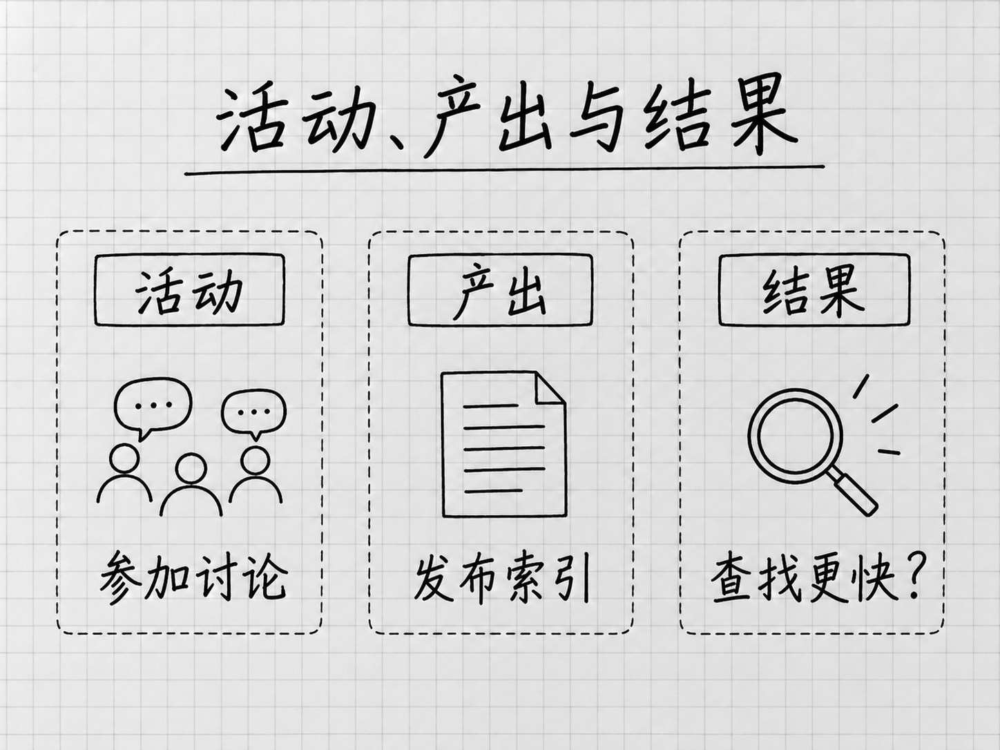

*图：参加讨论不能代替交付；发布索引也不能直接证明查找更快。汇报写到材料能够支持的位置。*
<!-- /diagram: FIG-029 -->

在P07中，“参加两次协调讨论”是一项活动；“发布一份修订索引”是一项产出；同事是否因此更快找到资料，才是需要进一步观察的工作结果。

三者都可以有价值，但不能互相代替。活动说明投入了什么，产出说明交出了什么，结果说明发生了什么变化。没有第三层证据时，把第二层说清楚，仍然是一份有用的总结。

以索引为例，材料支持：核查24项入口，修复其中6个问题链接，9月12日发布修订版。它没有测量修订前后查找用时。因此，稳妥的表述是“完成24项入口核查和6处链接修复”，而不是“显著提升全员资料查找效率”。

再看会议室说明。10名同事参与试用，8名无需额外口头解释完成指定预约操作，2名询问取消步骤，周宁据此补充内容。这可以说明小样中发现了一个具体问题，并完成相应改进。它不等于“效率提升80%”，因为8/10描述的是一次试用表现，没有与旧说明做同条件比较，也没有覆盖全体同事。

还有一个容易被放大的事实：周宁向12名新同事发送了资料包。发送是已经完成的动作，12人是否全部阅读、是否能独立办事，材料没有回答。不要把“已发出”自动升级为“已掌握”。

让WorkBuddy修改这类句子时，要指出超出的那一层。例如：

> **你：** “显著提升全员效率”没有依据。请回到材料，写清核查24项、修复6处以及发布修订版；没有测量查找时间，不补提升幅度。保留这项工作的价值，但让表述与证据相称。

这样修改不会把总结写得平淡。恰恰是具体数字、完成动作和真实限制，让读者更容易判断价值。形容词越大，能供人判断的信息反而可能越少。

#### 找到个人贡献，也承认协作的部分

个人总结不是把团队成果全部改成“我完成”。P07中的值班安排由周宁收齐5组名单并初核，发现2处冲突；具体调整由组长确认，之后周宁合并发出定稿。

因此可以写：“收齐5组名单，初核发现2处冲突，经组长确认调整后完成合并与发出。”这句话既让人知道周宁做了什么，也保留了他人的决定作用。写成“独立解决各组排班问题”，就超出了职责和材料。

新同事资料包也一样。模板原本由许钧制作，周宁本月更新链接、核对并发送。可以把维护与发送做好说清楚，不必包装成“从零搭建入职体系”。对普通员工来说，稳定完成这些基础工作本来就有价值。

你可以要求WorkBuddy在同一底稿里为主要成果注明“本人负责什么、依赖谁确认”。把这些信息留在同一底稿，起草时就容易看清成果归属；正式总结只保留必要的一两句。

如果你发现自己也说不清某项成果的分工，就回到实际记录补充。工具扮演资深顾问，或把文字改得更像述职，都不能增加它不知道的事实。

#### 从六项交付中选重点，写成一页

P07的进度表有六项约定交付。基线中，索引修订、会议室说明、新同事资料包发送、值班安排四项已完成；报销材料常见问题说明和旧文件归档两项未完成。

可以用“四项已完成、两项继续推进”交代全貌，但不要把4/6做成很大的个人绩效百分比。六项工作大小不同，四项完成并不能说明工作价值完成了三分之二。数量帮助核对，判断仍要结合内容。

这次一页总结可以按三块组织：主要交付，尚未完成及影响，下月动作与需要协调的事项。不是所有内容都写同样长。负责人已经知道日常职责，就少写背景，把篇幅留给本月真正变化。

从六项交付中怎么选重点？先看哪项需要主管采取行动：报销说明缺两项确认，值得留下篇幅。再看哪项最能说明本月实际变化：索引修订有清楚的完成动作与数量，可以作为代表。其他正常完成、也不需要对方回应的事项，简要带过即可。不能只按数字大小、记录长短或措辞是否亮眼来选。

WorkBuddy可以提出候选重点并说明理由，你据此取舍。若它选了三项已完成的漂亮成果，却漏掉需要主管协调的未完成事项，便没有服务本次汇报目的。重点不是从材料里自动冒出来的，它取决于听众看完以后需要了解什么、决定什么。

先看一段作者参考写法，注意它如何把几份记录合到一起：

> 已发布常用办事资料索引修订版：核查24项入口，修复6处问题链接，现行资料由薛影确认。完成一页会议室使用说明；10人试用中有2人询问取消步骤，据此补充了说明。该小样未与旧说明比较，不能据此认定整体效率提升。

这是教材作者依据虚构材料编写的参考，不是WorkBuddy实际输出。你的总结可以采用不同顺序，也可以只挑其中最值得主管关注的一项展开。

未完成部分同样需要具体。报销材料常见问题说明有8项内容，6项已确认，2项适用条件仍待财务确认，原定9月26日交付没有完成。与其写“持续沟通、积极推进”，不如说明卡在什么信息、已经做过什么、接下来需要谁配合。

旧文件归档的目标是30份，已清点22份，剩余8份待清点，保留规则也未全部确认。“清点”只是确认有哪些文件，不等于已经归档。第三周14份、第四周22份是累计数，不能相加成36份。

选好重点以后，再请WorkBuddy形成一页正文：

> **你：** 请按我们确认的重点写一页月度总结：先交代主要交付，再说明两项未完成，最后写下一步和需要协调的事项。关键依据暂时用记录编号放在同一底稿中，方便我回查；不要加入没有证据的提升比例，不把建议时间写成别人已经承诺的期限。

查看下一步时尤其注意承诺归属。材料说周宁建议10月8日前协调一次确认，不是财务已经保证那天完成。可以写“建议协调一次短确认”，不能改成“财务将于10月8日完成确认”。AI常会为了让计划更完整，把建议变成确定安排，你需要把这条界限保留下来。

回查主要判断后，再让WorkBuddy保存为可编辑Word文档，例如“周宁_2026年9月工作总结.docx”，并说明保存位置。在Word或WPS中打开，看看是否真的能一页读清楚。篇幅超出时先删重复背景和弱信息，不要先缩小字体。依据编号可以保留在工作底稿，正式稿中按读者需要处理。

做到这里，主线已经完整：你有一份讲清交付、问题和下一步的个人总结。是否制作演示，取决于汇报场合，不取决于工具能否一次生成很多格式。

#### 目的变了，就重新选择重点

先保留那份完整的月度初稿。后续变化是可分别选择的练习，每次从同一份初稿和原始材料出发，另存结果；不要把只谈一个问题的版本当作下一项练习的全月基线。

现在加入第一张后续变化卡。主管已经看过其他进展，这次只想知道：“报销材料常见问题说明为什么还没完成，需要我协调什么？”

如果继续把四项已完成成果从头讲一遍，内容仍然正确，却不适合这次交流。把变化交给WorkBuddy，要求只围绕P07-05组织说明。保留原交付目标、目前完成部分、缺少的两项确认、已跟进动作及协调请求；其他成果暂不展开。

这里适合呈现的是一条清楚的过程：8个问题已经整理，6项确定，2项还缺财务适用条件；周宁在9月19日和29日跟进，原定交付未完成；现在请主管协调财务确认，或者决定如何呈现未确认项。

不要借“解释偏差”把材料里没有的责任判断补进去，例如“财务响应不积极”。你知道的是答复尚未完成和跟进记录，不知道对方的全部工作情况。说明依赖与影响，已经足以帮助对方作决定。

目的变化后，哪怕只剩一小段，也可能比一份全面总结更有用。WorkBuddy省下的是从分散材料重新抽取重点的劳动；最终采用哪个重点，仍应由这次工作需要决定。

#### 需要口头汇报，先自己讲一遍

一页文字可以直接作为口头提示，不必先转成PPT。需要交流时，让WorkBuddy帮你提炼几个说话要点：最想让听众记住什么，用哪一项事实支撑，有哪个问题需要对方回应。

第一次练习，实际开口说。用手机或电脑计时，记下你卡住的位置：是否一口气报太多数字，是否解释了别人早已知道的背景，是否说到未完成事项时绕来绕去。工具估计“这段大约三分钟”，只能帮助准备；你真正讲了多久，要由自己的练习得知。

可以给它具体反馈：“我解释六项工作用了两分钟，最后没有时间讲需要协调的两项。请压缩已完成部分，保留报销说明的卡点和请求。”反馈来自一次实际讲述，工具才知道应删哪部分，而不是只把书面词换成口语词。

再选择时间缩短的变化：原本十分钟，现在只有三分钟。不要保留全部内容然后加快语速。先留下一个总体判断、一两条关键依据和需要回应的行动，其余作为追问时的补充。少讲一个不影响判断的例子，通常比每句话都压缩几个字有效。

也可以让WorkBuddy站在主管角度提一至三个追问。普通任务里说明角色和关心的问题就够了，不必安装专用专家。追问是帮助你发现缺口，不会凭空提供答案。

本包有一个典型问题：“这些调整共帮同事省了多少小时？”材料没有耗时对照和全体使用次数，不能把修复6个链接乘上猜测的每次耗时。合适的回答可以是：目前能够确认修复了哪些入口和完成了哪些交付，节省小时数还不能计算；若需要评估，可先选一个实际任务，记录修改前后同样条件下的完成时间与错误情况。

承认不知道，不等于准备不足。把已知、未知以及如何补证据说清楚，比临场给一个漂亮数字可靠。

#### 只有需要投屏时，才把内容安排成页面

若会议需要演示，继续使用已经核对的一页总结。先请WorkBuddy给出少量页面要点，每页回答一个问题。这个案例可以是四页：本月主要交付、一个代表性改进、未完成事项与依赖、下一步及协调请求。

页数不是成绩。如果三页已经讲清楚，就不用凑到四页；若只有一分钟同步，一页甚至一段话更合适。先确认内容顺序，再制作文件，能减少排版完成后又大幅重做的劳动。

每页只放当场需要看懂的信息。文字总结可以让读者停下来细读，投屏页面则要配合你正在讲的重点。因此转换形式时，应重新分配页面信息与口头解释，而不只是缩短句子、放大字号。详细日期、来源记录和补充解释按需留作追问材料。

选择图表时，要看它是否比一句话更清楚。24项入口核查、其中6项修复，可以用简短数字说明；不能画成“24项完成加6项修复”的总量，因为6包含在24里。六项不同大小的任务，也不适合用一个醒目的完成率替代具体交付。

把确认的要点交给WorkBuddy，请它生成可编辑的演示文件，并说明对象、预计场合、风格和文件格式。若你有单位模板，指出只沿用样式，不沿用旧数字与日期。没有模板，可以直接要求简洁排版，不必先花时间制作一套模板。

拿到实际文件后，在PowerPoint或WPS中逐页检查文字溢出、中文显示和关键数字截断等问题。需要继续调整的图表，应试着修改数据；能改标题，不代表能改图表中的数字。外观看起来像图表的图片，不能据此当作可编辑数据的图表。

发现第二页太挤时，给具体范围：“只调整第二页，保留24项核查、6处修复和没有耗时对照这三个信息，删去重复说明，其他页数字不改。”修改后再查看目标页及受影响的位置，不把“修改完成”当作版式已经合格。

如果文件没有满足某类对象的编辑要求，可以保留已核对的内容和数据，在目标办公软件里完成那一处。先分清是内容问题还是文件问题，不要为了修一个对象，重新让模型组织所有成果判断。

#### 完成状态更正，结论也必须跟着改

回到保留的完整月度初稿，另开这一条变化练习，再加入状态更正卡。10月2日查明，会议室说明9月18日只发到了试用群，没有发布到正式共享目录，还需负责人确认。10人试用和补充取消步骤的事实不变。

这条材料改变了“正式交付已完成”的判断。原先四项已完成、两项未完成，应修订为三项已完成、三项未完成。它不是新增了一项工作，也不应为了保住亮点，继续写“说明已正式发布”。

告诉WorkBuddy这是一条对9月状态的更正，保留原稿，形成修订版并说明更正原因。只写过一页总结，就修改这页；如果已经做了演示和口头提纲，再定位它们中受影响的数量与表述。

检查两个方向。首先，需要变的地方是否全部变了，包括总量、完成清单、问题部分和下一步。其次，不该变的事实有没有被误删：试用已经发生，反馈仍有价值，只是不能再用来证明正式发布已完成。

这也是为何要保留可回查的依据。同样一句“完成一页说明”，可能指写完草稿，也可能指正式发布。新材料明确了标准以后，调整判断比修改一个词更重要。

#### 年终总结：换材料，也要换取舍尺度

独立迁移使用材料包中的六份年度摘录。它们跨越不同季度，包含职责在6月调整、同一事项跨周推进、团队共同确认以及一项未完成工作。

先自行决定怎样提取重点，不必逐周按时间复述。可以让WorkBuddy按事项归并，保留目标、关键变化、产出、个人贡献、证据位置和仍未完成的部分。字段只是帮助思考，不要求另交一套复杂台账。

这组六份摘录实际涉及A、B、C三项持续工作。A从草拟到发布，再到5个小组采用，是一个事项的演进；B两次向不同名单发送资料，共15名接收者，不能说15人全部熟练使用；C完成40份清点、其中30份归档，还有10份待规则确认，不能写成归档全部完成。

年中职责变化也要说明。上半年负责执行，6月后开始协调5组，不应把后来的职责说成自己从年初就在承担，也不应拿尚未设定的目标评价前期工作。选择三项重点，写出变化与贡献，会比把六份周报各压成一段更接近年度总结。

真正处理全年材料时，可以先按季度或事项分组，小样确认提取方式后再扩大。最后仍需跨组归并，避免同一项目在四个季度出现就算四份独立成绩。材料数量增加时，人的时间应更多用在辨认重复、核对贡献和选择重点，而不是重新复制每周文字。

#### 动手与排查

完成自己的P07一页总结，再从后续变化中任选一项。只交文字的读者可以选择目的变化或状态更正；需要开口汇报的读者，可以选择三分钟练讲。不要为了完成本章，同时制作所有形式。

**总结像流水账。** 检查段落是不是按周排列，却没有回答主管的问题。把同一事项合并，突出最终状态与下一步。

**满篇“提升”“优化”，却说不清变化。** 回到活动、产出和结果的区别，用具体交付替换无法支持的评价。没有效果数据时，不勉强编比例。

**未完成部分总写得含糊。** 说清原目标、已有部分、卡点、已做动作和需要协调什么；不要把建议时间写成他人的承诺。

**演示很漂亮，但一追问就没依据。** 返回一页核心内容和原记录，先修判断。页面负责表达，不能替代证据。

本章省力的关键，在于先归并材料、形成有依据的重点，再按需要用于文字、讲述和页面。同一份事实底稿支撑几种表达，便不必每换一种形式都重新找材料、重新判断成果。底稿的事实改变时，再更新已经存在的相关成果。找资料、选材、修改与排练都计入投入，页数多少本身不能说明效率。

相关官方说明：[创建任务](https://www.codebuddy.cn/docs/workbuddy/Create-Task)介绍材料与输出要求的入口；[文档生成与编辑](https://www.workbuddy.cn/docs/workbuddy/From-Beginner-to-Expert-Guide/Practice-Cases/Practice-Two)说明根据素材制作和继续修改文档、演示的能力；[任务对话](https://www.codebuddy.cn/docs/workbuddy/Conversation)说明在原任务中继续反馈的方式。

### 第17章 问题分析与方案制定：找准问题，比较可行办法

同事的材料总要反复追问，你可能会想：是不是该再发一次提醒？是不是该开个培训？把这个想法交给 AI，它很容易替你写出一份完整方案。但如果真正的问题是提交说明含糊，再漂亮的提醒，也可能只是让同样的麻烦更准时地出现。

这一章用 WorkBuddy 分析怎样减少每周收材料时的反复催补。你会先判断问题发生在哪里，再比较能执行的改法，最后根据条件变化缩小方案。要练的是：先检验自己的判断，再花力气完善办法。

#### 从“帮我写个培训方案”退回一步

打开[本章练习](examples/L02/README.md)，先准备工作要求、提交与往来、现行提交表三份材料。这里没有大型项目，也不需要你有管理权限。你只负责每周收齐同事的工作进展，希望少一些往返追问。

一开始不要要求 WorkBuddy 做课件。新建一个任务，把三份材料交进去，先发送：

> 我要减少每周收材料时的反复催补。有人建议多发提醒或开培训，但还没有决定。请先阅读这三份材料：哪些问题能从记录中确认，哪些只是可能的原因？按独立提交编号归并，别把一条消息算成一次提交。先说明你的判断依据，再提出需要补充的信息；目前不要写培训方案。

这条请求做了一个关键调整：把“培训”从任务目标还原成候选办法。真正的目标是收集人能够更快拿到可用材料。培训能不能达到这个目标，还需要分析。

实际工作中也有类似差别。“做一个仪表盘”可能是在解决看不到进度的问题，“改一个模板”可能是在解决反复漏项的问题，“再招一个人”可能是在解决任务积压的问题。你可以把最初想法告诉 AI，但同时说明希望改善什么，允许它指出办法与目标之间的距离。

#### 第一次检查：它有没有把八条消息算成八次失败

材料有六次提交、八条往来。S01产生了三条消息，S03和S05各产生了两条，S02有一次收到材料前的提醒。消息数量多，可能是同一件事连续交流，也可能是同事在回答，并不等于发生了同样多次错误。

检查 WorkBuddy 的第一轮分析，至少看清三个区别。S01、S03、S05被追问的是内容：谁确认、剩余事项怎么样、成果在哪里。S02的问题是提交晚于16:00；它的文字本身相对具体。S04与S06在现有记录中没有后续追问，可以作为对照，但材料没有覆盖所有口头交流，不能称它们“完全没有问题”。

如果它直接给出“八次不合格”，不要只说分析不够深入。指出分组的依据：

> 你的统计把消息条数当成了提交次数。请按S01至S06重新归并，分别看首次提交时间和提交内容是否需要澄清。M02、M06、M08是回复，也要放回对应提交，不单独计一次失败。

这和数据章先定统计口径是同一个道理。任何分析都需要先知道“一个”究竟是什么。一个人、一次提交、一条消息、一项任务，是不同的观察单位。单位混了，后面做再精细的图表也救不回来。

现在可以让它用很短的表把每次提交、实际出现的问题和原文依据对应起来。这里只需要能回查的证据，不需要另建一个复杂数据库。你应能从表里直接回到某条记录，确认这个判断确实有出处。

#### 从现象到原因，中间还缺一个判断

六份材料中至少三份有需要澄清的信息，这属于记录能支持的现象。“同事不认真”则是对人的解释，材料没有给出足够证据。把这样的解释写进方案，会让讨论过早变成责备。

现行表格只有“简明扼要”四个字作为内容要求，也没有举例解释什么叫“完成”。由此可以提出一个假设：提交人不清楚需要写到什么程度。假设就是目前有理由考虑、但还需要证据检验的解释。它还不能证明这是唯一原因；也可能任务尚未得到明确分工，或者部分信息已经口头说过，只是没有写进表里。

在同一个任务里继续：

> 请把原因分成“现有材料直接说明的情况”和“值得验证的假设”。每个假设告诉我：如果它成立，下一次提交应该观察到什么；现在有什么材料还不足。也请找一份相对清楚的提交，说明它哪里值得借鉴。

如果写法不明确是重要原因，加入一段清楚的说明之后，成果位置、当前状态和下一步应更容易找到。如果只增加提醒而内容缺项照旧，说明准时到达与内容可用不能用同一个办法包办。把解释落实为下一轮可观察的变化，你才知道怎样支持或修正它。

这也改变了你向AI提问的方式。先说“说明太差了，请证明应该改模板”，容易把讨论限制在支持既有想法的材料上。更有用的是问：“哪些记录支持改说明，哪些记录说明它解决不了问题？”这里S02的迟交就提醒你：即使填写示例有效，也不能据此宣称催补问题已全部解决。

本例可以从S04、S06借鉴具体写法：它们交代了做到了哪一步、材料在哪里，或者接下来需要跟什么。借鉴正常例子常常比继续收集问题更省事。已有一份可用材料，就不必凭空设计一套复杂标准。

#### 比较方案，先看能不能做

读完三份材料后，WorkBuddy 可能列出自动催办系统、统一表单、培训、定期复盘等方案。数量多不代表选择容易。你的限制是不能购买软件、不能改系统、准备时间最多两小时、不能新增常规会议。先排除做不到的选项，才值得比较剩下的。

继续给它明确的取舍任务：

> 根据现有证据，比较三个小改法：提前提醒；补充一段填写说明和一个示例；增加提交前自查。先检查是否满足不能改系统、不能买软件、最多两小时准备、不新增会议的条件。再比较它们主要解决什么、会给双方增加什么工作、还有什么问题解决不了。推荐一个下周先试的办法，并说明什么情况下应换选其他办法。

不用要求它一开始就打分。一个违反硬性条件的方案，不应因为“体验很好”得了高分就排第一。如果几个方案都可行，再看改善目标、投入、对同事的负担和容易撤回的程度。

在本例中，补充一段说明与示例是有依据的选择。它直接针对“简明扼要”太模糊的问题，也能沿用现有表格。若未来的完整记录显示大多数材料内容已足够、主要问题只是提交时间，那么提醒可能更优。让推荐附带适用条件，你才知道什么时候不能继续照搬。

如果一定要评分，也应先写明每一项是什么意思。比如“准备负担低”具体是只改一段说明，还是要培训十几个人；“效果大”有哪些记录支持。没有解释的8分和9分，只会让意见显得更精确，并不会增加证据。

选定办法前，再问一句：“哪条尚未确认的信息一旦不同，会让我们改选？”本例中，内容澄清是否真的占主要负担，就会影响“补说明”与“加提醒”的取舍。AI的推荐用于帮助你看清条件，不能代替负责执行的人决定愿意投入多少、接受哪些限制。

#### 把推荐缩成下周能试的一个动作

方案确定后，不要立刻让它写十页执行计划。你现在需要的是同事真的会看、可以直接放到原表上方的一段话。让它继续：

> 就按补说明和示例先试。保留原表四个字段，不要求新增附件。请给我一段可以放在表格上方的填写说明，以及一个三行的示例。示例用本题已有事实改写，不虚构新成果。再写一句我向两位同事解释这次试用目的的话。

一个够用的说明可以是：“每件事写目前到哪一步、成果在哪里；还没完成的写在等谁或等什么，以及下一次跟进时间。尚未收到确认，就写待确认。”这比“请认真、详细、及时填写”更容易执行。后者表达愿望，前者告诉人怎么做。

检查生成的示例时，也要核对事实。S01还在等活动负责人确认，不能为了让示例完整，就补出“负责人已同意”。你可以用S04的已发通知做正例，也可以用S01示范如何诚实写待确认。未完成事项照样可以写得清楚。

这一步的提效并不在于少打一百个字，而在于让今后的输入更可用。材料进入工作流程时就交代清楚，之后的汇总、周报和汇报才更少需要猜测与追问。AI 可以帮助你改进输入，收益会延续到后续工作。

#### 条件变了，重新安排投入，不重写全部

现在再加入“条件变化”材料：可用准备时间从两小时减少到二十分钟，只找两位愿意参加的同事试用。请 WorkBuddy 修改已有方案：

> 请按这个新条件缩减现有方案，保留最能验证我们判断的一项改动。逐项说明哪些保留、哪些删去或延后。不要重新扩写背景和意义，也不要新增培训课件。

这时可以删除复杂表格、美化文档、额外说明会，把有限时间放在一段说明与一个例子上。两位同事试用不能代表全体，也不足以证明效果大小，但能先检查说明是否看得懂、是否补上了关键字段。这个阶段要解决的是办法能否实际使用，不是证明可以全面推广。

如果 WorkBuddy 坚持原来的完整计划，提醒它准备时间是硬性限制。若它只把“120分钟”改成“20分钟”，步骤一个不减，仍然没有完成取舍。真正的方案调整，应该改变做什么和先做什么。

#### 用小试结果修正判断

<!-- diagram: FIG-030 -->
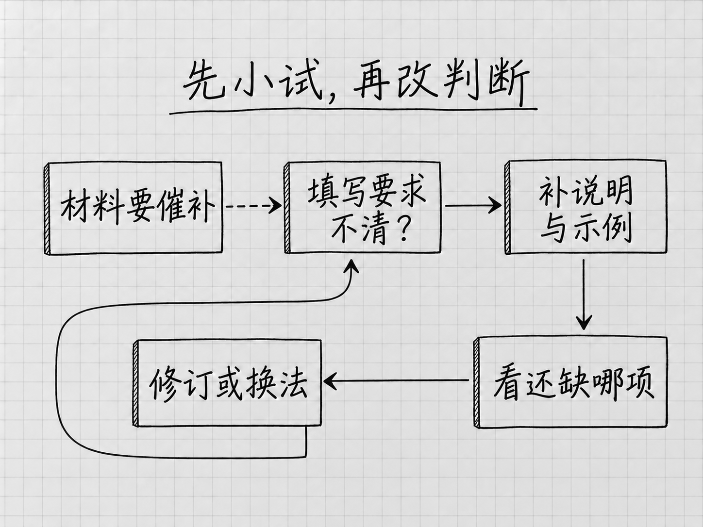

*图：先把原因写成待检验的解释，用小范围改动观察还缺什么，再决定修订或换法。两次反馈不能证明全组效果。*
<!-- /diagram: FIG-030 -->

最后加入“两次小试反馈”。两份材料都有成果位置和待确认人，但其中一份仍被追问了下周日期。提交人没有记具体耗时，也没有比较组。

你可以请它给负责人写两句话：

> 请依据这次反馈，写一个简短试用结论：目前看到哪些变化，什么还不能判断，下周只需补哪一点。不要算节省比例，也不要将两份材料代表全组。

合适的结论应当保留规模和限制。例如：“两份试用材料都能直接找到成果位置和待确认人，这两项没有继续追问；下周日期仍有一次需要补充。建议在示例里补明确日期，再观察一轮。”这已足以支持下一步，不需要把小试包装成“效率大幅提升”的证据。

下一轮只补明确日期，其他条件尽量保持相近，才较容易看出这项修改是否有用。若同时换表格、增加提醒、举办培训，即使情况改善，也难以知道哪项值得保留。

实际使用时，记录收集人追问了哪些信息、双方用了多少处理时间。质量是否保持、同事是否更费力，同样重要。把工作转给别人却让总投入增加，不能算流程更高效。

#### 换成自己的选择，也沿用这条思路

比较供应商、选择活动形式、决定先做哪项改进，都可以这样处理。先把需要满足的条件写清楚，再让 WorkBuddy 读取材料，指出缺项，统一比较的范围。

例如，三份报价一个含配送、一个不含，一个交付日期晚于活动。先补齐费用范围并检查日期，再比较价格。不要让一个暂时缺项的报价看起来更便宜，也不要用“综合评分最高”掩盖它根本赶不上时间。资料没有给出的数字，先问清，不能让 AI 自行估算后混入真实报价。

若问题涉及重要的人事、合同或其他专业判断，可以让 AI 帮你整理事实、列出需请专业人员确认的问题。你不必要求它装成最终决策者。整理工作做得越扎实，真正有责任作决定的人越容易判断。

这一章结束时，保存的不必是一份长报告。一页“问题、依据、先试办法、观察什么”已经足够。下次遇到新情况，把它作为上一轮的判断依据，让 WorkBuddy 说明需要改变哪一部分。你逐渐积累的，是能随着证据修正的方法，而不只是一批看起来周全的方案。

### 第18章 沟通协作与任务推进：理清消息，跟进到结果

你可能从来没有忘记看消息，却仍然漏掉一件事。原因常常不是信息太少，而是一个事项分散在好几次交流里：先有人提出，后来你答应，再后来补条件、改时间，最后一句“我发过去了”又让人误以为事情已经结束。

WorkBuddy 可以帮你把这些材料整理成能执行的安排。你要练习的判断是：自己答应了什么、在等谁、下一步什么时候做，以及到什么程度才算完成。本章先处理八条消息，再处理一次会议的文字记录，不需要管理团队或连接真实聊天工具。

#### 八条消息，不等于八件事

打开[个人工作安排练习](examples/P01/README.md)，把“八条消息”和“可用时间”两份材料交给 WorkBuddy。现在是练习中的星期一上午，你要处理报名名单、例会通知和资料核对。

新建一个任务，发送：

> 这是我周一上午收到的消息和本周已有安排。请按具体事项归并，列出我已经接受的工作、别人提出但我还没答复的工作，以及还需要等待的材料或确认。每项写下一步动作、截止时间和依据消息。不要替我答应新的时间，也不要实际发送消息或修改日历。

第一轮结果应该只有三项主要工作，而不是每条消息一行。名单的截止、去重方式和依赖的原始表，是同一个事项的不同信息；通知的房间、草稿截止和停车说明，属于另一件事。

先检查 WorkBuddy 有没有把“要不要加停车说明”写成必须完成。提出建议的人和决定是否采用的人未必相同。后续消息明确先保持原交通说明，因此当前不能把停车说明列成你的已接受任务。

再检查资料核对。吴提出周四10:00，你没有回复。这应被标为待答复，而不是已经安排好的约定。AI 可以替你整理提议，也可以起草答复，但不能因为日历看起来有空，就把你的同意补出来。

#### 留下最少但够用的信息

对于你自己的三件事，暂时不需要十几列表格。每项只要看得出做什么、做到什么程度、什么时候交，以及当前在等什么，就足够开始行动。

例如，名单可以写成：“周二17:00前交林一份合并名单；按手机号检查重复，缺手机号单独列；等周于周二10:00发来原始名单。”这比“跟进名单”多一些字，却少了日后重新翻聊天的动作。

还要弄清交付标准：是发出名单即可，还是需要对方确认可用？本题已接受的承诺是按时交付一份名单。收到对方确认可用的回复，再更新为“名单已获对方认可”；对方要求修改，则还有下一步。先说清“完成”在这件事里表示什么，工具才能按同一标准维护状态，不能让它从一个勾选框替你推断所有后续都已结束。

可以继续请 WorkBuddy 收紧结果：

> 请把这三项整理成我今天会看的简短清单。每项只保留动作、交付物、时间、当前状态和依赖。已明确的不要再问，只有会改变安排的缺口才放进待确认。例如周四核对尚未答复，需要我决定是否接受。

这种写法的目的，是减少下一次理解成本。你周二再打开文件，不必重新读八条消息，仍然知道自己要做什么。原始材料则保留，遇到争议能回去核对。

#### 让 AI 帮你排顺序，不让它填满每个空档

材料提供了固定会议、日常反馈时段和几项粗略用时。请 WorkBuddy 根据这些信息提出安排：

> 请为我建议周一和周二的处理顺序。尊重固定安排，给等待材料留出位置，也给常规工作留余量。名单在拿到原件后才核对；通知要等房间确认。用时只是我的粗略估计，安排是建议，不是已对外承诺的日程。

检查顺序时，先看依赖。名单周二才到，不能周一就安排完成核对；房间未确认，通知可以先准备正文，但不适合发布正式版本。时间早不一定更优，重要的是所需输入是否已经具备。

接着看容量。上午有会，不等于下午每一分钟都可以分配给这些事情。真实工作会有临时消息和他人的延迟。AI能排出时间表，不表示它知道你每件事实际需要多久。估计越粗、等待越多，越适合先要处理顺序与机动时间；只有时段已经确定，才进一步排到具体时间。

对尚未接受的资料核对，你可以自己决定后，请它写一句答复：“周四10:00—10:30我可以参加，我们先核对目录和失效链接。”若你还不确定，就写需要稍后确认。把草稿复制到真实工具并发送之前，最后看一次时间和范围。本练习无需真的联系任何人。

#### 新消息来了，更新同一件事

<!-- diagram: FIG-031 -->
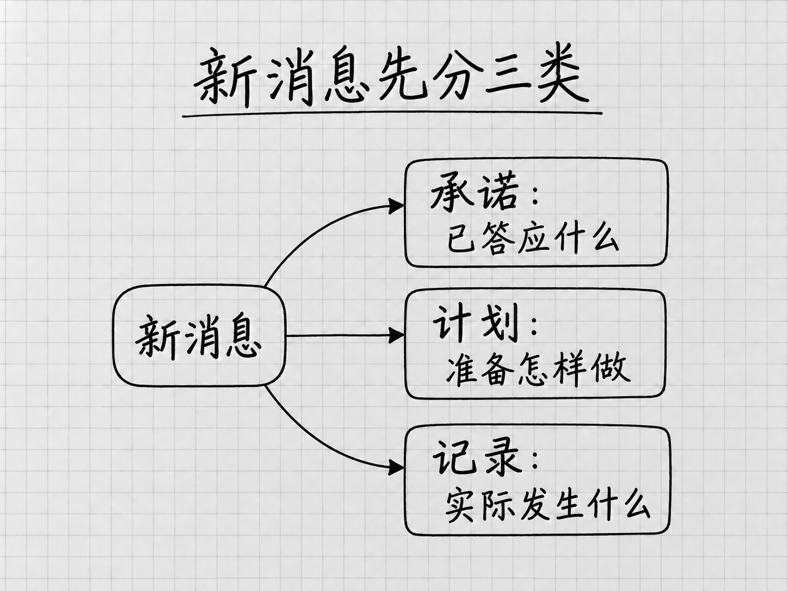

*图：名单原件晚到会改变到达记录和个人安排；没有新的约定，就不能改写原交付承诺。*
<!-- /diagram: FIG-031 -->

现在打开“新增消息”，先只复制第一轮周一的两条消息，不把整个文件交进去。当前时点推进到周一14:10：房间已定，又临时接了一页材料核对。请它先加入这项新接受的工作，检查与通知修改的安排是否冲突。

例如，周一14:10至14:40可以核对一页材料，14:40至15:00先改通知；若需要更多时间，15:30至16:00还可继续，但仍要由你确认是否符合当时情况。这只是基于题内用时范围的一种建议，不能记为实际发生。

这一轮调整完成后，再复制第二轮周二的两条消息，把当前时点推进到周二11:00。原始名单比预计晚一小时，但现在已实际收到。材料尚未提供周一工作的完成回执，需要保留其状态待核，不能因日期已经过去就自动勾选完成。

这时不必再让 WorkBuddy 从零做一张完全不同的清单。继续同一个任务：

> 现在是周二11:00，这是本轮后续消息。请更新已有事项，标出哪些信息替换了旧信息。名单原始材料已经收到，把等待状态改掉。我的对外交付时间没有收到变更，请不要自行顺延。只建议从现在起的安排，不回到周一填计划；周一完成情况尚无回执，保留待核。

名单晚一小时到，并不等于你答应的17:00自动延后一小时。如果剩余时间仍足够，可以调整自己的处理顺序；如果确实会影响交付，就要尽早与对方协商。AI 能帮助你发现冲突，却不能把未经对方同意的延期写成新事实。

这里要分别保留三类信息：对外承诺规定你答应了什么，个人计划说明准备怎样完成，实际记录说明已经发生了什么。收到新消息时，先判断它改变哪一类。本例改变的是材料到达情况和可用时间，尚未改变对外承诺。让工具沿着这个区别更新，才不会为了把日程排顺，顺手改掉你答应的期限。

第一轮新增的一页核对需要单列，因为那是另一项明确接受的工作。回看它在周一给出的安排，如果两个截止实在撞上，输出应说明冲突和可选办法，而不是把两件事安排在同一个半小时。第二轮只处理周二眼前的变化，不把旧建议当成执行记录。

当工作变得更多，可以给事项使用稳定编号，或借助已有任务管理软件。编号的作用是让后续消息找到原来的事项，并不需要一开始就让日常工作变成繁复的项目管理制度。三件事能靠名称对应，就先用名称。

#### 会议记录：把决定、建议和未知拆开

接下来换一个独立任务，使用[会议文字记录](examples/P02/README.md)。本题里的你叫陈，负责资料整理。输入已是文字，不需要录音工具。

先让 WorkBuddy 输出一份够用的纪要：

> 请根据这份会议文字记录整理一页纪要，供参会者核对。分清已经决定、只是建议、尚待确认的内容。行动项写负责人、交付物、截止或跟进条件，并注明相关时间点。没有明确答应的截止不要补齐。最后单独列出属于陈的下一步。

作者整理的关键判断如下：名单和座位需求要在10月15日17:00前交林；它依赖周在10月14日12:00前提供名单。版本清单答应“明天下午”交，但准确时点待确认。收集报名问题尚未定截止。旧文件先保留，没有授权删除。是否走场下次再定，没有决定新增彩排。

逐条检查时，不需要要求 AI 复述整场会议。只需回到影响行动的原话。10:13说“明天下午”，可以换算为10月13日下午，但不能凭习惯补成17:00。日期换算与补造具体时刻，是两件事。

吴答应今天联系场地方确认投影接口，但对方何时回复未定。行动表可以写“今天联系；周三上午仍无回应则提醒林”，不能写“今天完成设备确认”。你能控制自己发出询问，不能单方面保证第三方回应。

纪要的完整，不是每个格子都有值，而是让参会者知道哪些已经确定、哪些仍须答复。填入未经同意的负责人或期限，会把整理记录变成替别人作决定；缺项是否影响行动，比表格是否齐整更值得检查。

#### 把待确认写成对方能回答的一句话

纪要整理后，下一步未必是马上发给所有人。你可以让 WorkBuddy 只起草与你有关的两句确认：

> 关于版本清单，我计划明天15:00前给您，是否可以？报名问题收集希望在哪天前完成？我收到时间后安排。

第一个问题提出你的可行时间供对方接受；第二个问题还缺关键条件，不装成已有答案。比起“请大家确认纪要”，它们让对方知道这次只需要回答什么。等对方真实回复后，再将回复作为新材料更新事项；起草确认消息本身不会消除待确认状态。

如果手头是录音或会议平台的原始结果，可以在已获得适当使用权限的范围内，先取回该平台提供的转写或摘要，再按本章方法处理。转写中姓名、数字、日期听错时，要回到原始记录核对。WorkBuddy 的连接能力可以减少材料搬运，但具体服务是否可用、是否已授权，需要以当前入口为准。没有连接器，导出的文字仍能完成这项练习。

#### 周末回看，不把“发出”统一改成“完成”

回到第一组练习，加入“周末核对”。请它根据新的证据更新三项原工作和一项新增工作：

> 请按实际发生的结果更新状态，并指出还需我跟什么。不要以计划日期当完成日期，不要以发出当作已被接受。保留原承诺与实际结果的区别，只简要说明有影响的变化。

你应看到：一页材料已获认可；合并名单已交并获接受，三条手机号缺失由林继续补；通知草稿已获准发送，但没有正式发送证据；文件夹核对后来改约到周五并完成。周四只是未回复的提议，不能记成你按时完成了一个已确定约定。

尤其看通知。如果清单写“通知完成”，下一位同事可能以为大家都已收到。把状态写成“草稿已确认，正式发送情况待核对”，会让需要做的动作自然浮出来。

#### 从整理消息走向更省力的协作

本章最直接的收益，是不必反复从长对话里重新拼出事情。但你还可以继续减少往返。自己发消息时，就把动作、结果和时间放在一起；交付时说明文件位置、当前版本，以及希望对方确认哪一点。更清楚的输入，会使下一轮 AI 整理也更可靠。

开始使用时，只维护自己的几项工作。有清单或任务管理软件，就优先更新已经在用的那一份，不必为了使用AI再平行建一套。确实需要与多人共用时，先约定查看哪个位置、谁负责纳入新消息；否则聊天、表格、AI摘要各有一个状态，反而多出核对负担。

把今天的清单保存到你能找回的位置。明天有新消息，只让 WorkBuddy 更新受影响的事项；周末依据实际交付再看一次。衡量效果时，观察自己少翻了多少次记录、是否减少漏跟进，以及清单维护会不会反而占用太多精力。能帮助你做下一步的安排，才值得长期保留。

### 第19章 重复工作与流程复用：留下方法，下次接着用

第一次用 WorkBuddy 写周报，你交了材料，解释了要求，又改了几处。结果可以用，但如果下周仍然要从头交代，长期收益就有限。真正值得留下的是：哪些步骤每次都一样，哪些事实每周会变，以及出现缺项时应该怎么办。

这一章把已经做清楚的工作保存成普通说明，用第二期材料再做一次，再用第三期的不完整材料检验。先确认方法可以重复使用，再按需用技能或定时任务减少重复操作。

#### 选一件适合重复的工作

适合先复用的任务，通常有三个特征：你会定期做，输入大致相似，结果是否合格能检查。个人周报、每月费用汇总、会议纪要初稿、几份固定来源的摘要，都比“替我解决所有工作问题”更适合起步。

本章使用[独立周报材料](examples/P08/README.md)。即使没有做过前面的周报练习，也可以直接开始。第一期有六条本期记录与三项旧事项。打开“每周工作说明”，先读一遍，看看用途、输入、写法和输出分别是什么。

在 WorkBuddy 新建任务，给它工作说明与第一期材料：

> 请按这份工作说明，整理9月14日至18日的个人周报。以本期资料为事实依据，旧事项只用于接续。先在对话中给可检查的正文；缺信息时说明具体缺口，不补造完成情况。

检查结果时，T01的24人已核对，但两人联系方式还缺；T02只写完前两节；T03通知草稿在等审核；T04修复了两个失效链接并验证。六条记录不等于六项完成成果，T05上周整理的五份资料也不能再次算进本周。

如果第一轮都需要大量改写，先在这一轮把问题弄清楚。复用不会自动修复错误，它只会把好方法或坏方法一起带到下一次。

#### 把改对的原因写进说明

假设 WorkBuddy 把“已交林审核”写成“文档已完成”。你纠正之后，不必只保留修正后的周报。请它解释这次应该留下什么规则：

> 请根据刚才的修改，更新工作说明。只保留以后同类周报都适用的方法，不要把本期人物、日期和进度写进去。尤其说明已发出、已收到、已接受怎样区分。保持一页左右，避免越补越长。

一条可复用规则可以是：“状态以材料为准；交审核表示已经提交，不自动表示获准使用。”这条规则下周仍然有效。“T03等林确认”则属于本期事实，下周可能过时，不该藏进通用说明。

这时你手里有三种东西。工作说明告诉 AI 怎么做；本期记录告诉它现在发生了什么；一份好周报可以作为语气和篇幅参考。三者作用不同，交入时要说明各自用途。

整理工作说明时，可以逐句问：“换成下一期，这句话还成立吗？”“按事项归并，不把多条消息算成多项成果”属于稳定规则；“本期为9月14日至18日”必须换入当期值；“联系人缺失，列出缺项而不猜”属于异常处理。规则、每期要换的信息和缺项处理都清楚，这份说明才足以独立使用。只留下一篇好周报，无法让工具知道它为什么这样写。

如果你要给它上周周报作为样式参考，明确写“只参考结构和表达，不继承其中事实”。否则最省事的改写方式，可能就是保留大部分旧内容换一个日期。对周期性工作来说，流畅地带入旧事实，比文字不好看更值得检查。

#### 第二次换材料，不把上次对话当作唯一记忆

<!-- diagram: FIG-032 -->
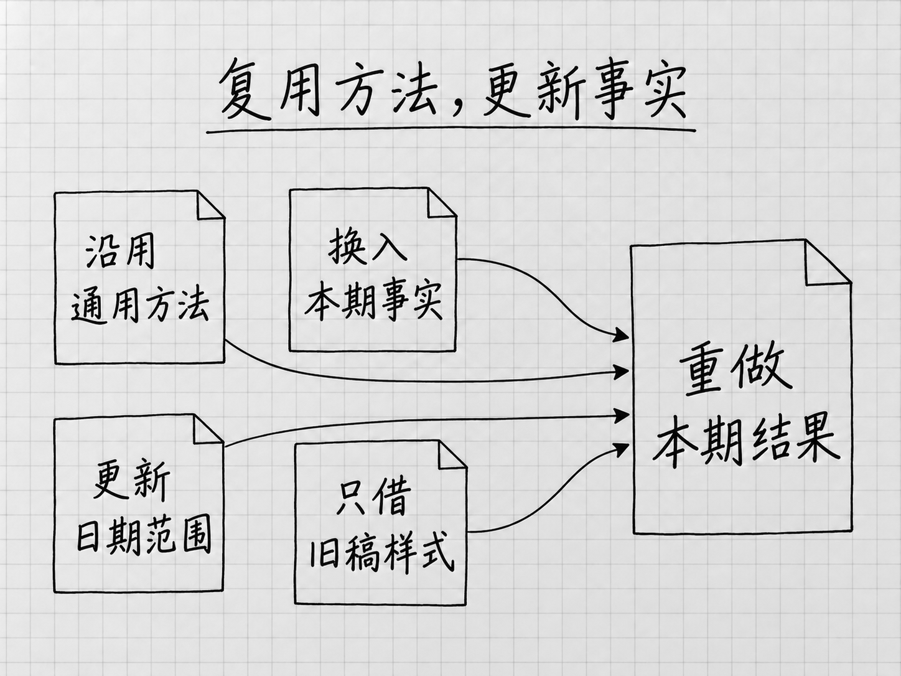

*图：沿用通用方法，换入本期事实和日期范围；旧稿只借样式。下一期结果仍要按新材料重新判断。*
<!-- /diagram: FIG-032 -->

现在新建另一个任务，交同一份工作说明和第二期材料。这样做不是要求每周必须新建，而是检验方法是否离开原对话也能使用。

发送：

> 这是9月21日至25日的材料，请按附带工作说明做本期周报。报告范围仅为本期，材料末尾的遗留事项用于接续。不要沿用第一期成果。如果发现说明不足以完成，请具体指出，不要求我把上一次聊天重新复制一遍。

第二期的T01补齐资料并获接受；T02修改稿已经交出，但最终确认未到；T03已经发送，仍有两人未确认；T06收到八条反馈，整理了五条。好的复用应当保留这些变化，而不是每次生成数量一样的“完成、进行中、下周计划”。

第二次能否少解释，是检验说明是否有效的机会。若仍要反复纠正“提交审核不等于获准使用”，检查这条规则是否清楚、是否与样文冲突；若只是补本期联系人，那是输入缺项，不应再给通用说明追加一条人名规则。先分清重复错误与每次必需的新信息，才能避免说明越补越长，却越来越难用。

相同用途的连续工作也可以在原任务中接着做，特别是需要追踪历史变化时。不过材料和日期仍要明确。需要工具采用的关键规则应写入工作说明、在本次提供，不能只依赖“我们上次聊过”。这样换任务或交接时，也能看清本次采用的做法。

#### 第三次故意遇到不齐全的输入

加入第三期材料前，先看它与前两期的区别。这里有一个“通知事项完成”的便笺，却没有两位同事确认的证据；有一份内容相同的复制文件；有一个数字12，却没有单位。这些都可能在真实工作中出现。

用新的任务，给同一说明和第三期材料：

> 请按固定说明做9月28日至10月2日周报。遇到缺少完成依据或含义不清的数据，把它放到待核对处，其余内容继续写。不用为一个缺项暂停所有工作，也不要推测它最可能是什么意思后当成事实。

看结果时，重点不在它是否愿意回答，而在不完整输入有没有被正确保留下来。T03不能仅凭便笺就抹去上期尚有两人未确认的遗留；T07复制件不是第二项成果，新增字段还未获认可；T08的12不能直接写成12人或12份。

一个可靠的草稿可以正常汇报T02正式确认与T06反馈整理进展，同时指出需要补充T03的确认情况、T08的统计含义。它没有因为材料不全而什么都不做，也没有为了完成漂亮周报而伪造完整性。

随后再提供“第三期补充”，让它定点修订。T03现在有具体确认记录，T08确定为报名12人，T07仍未获确认。补充只改变本期相关部分，不该反过来改写之前保存的第一、第二期结果。

#### 重跑一次，处理好文件和版本

重复运行时，另一个常见问题是结果覆盖。昨天确认好的报告，今天因为随手重做被替换，后来不知道哪份才是交出去的版本。你不需要先学复杂的版本管理，可以用日期与状态清楚的文件名。

例如第一次保存“周报-0928至1002-草稿”，检查后另存“周报-0928至1002-确认版”。同一期补充材料后，先生成新草稿，再比较涉及的变化。确认完成后再决定如何保留或替换正式文件。

给 WorkBuddy 的要求应当具体：

> 根据补充材料生成本期的新草稿，保留已有确认版。只调整通知确认情况和报名数字，列出这次改了哪两处。不要重命名或移动原始材料。

同一期重跑，还要检查是否产生重复条目。这里的目标是得到更新后的本期周报，不是把原有记录再追加一遍。给工具说明本次是替换某段、更新同一事项，还是增加一个新事项，比笼统地说“继续处理”更清楚。

处理十几份或几百份文件时，先在少量副本上确认命名、分类或汇总规则，再扩大到剩余文件。前面的数据章用小样检验计算；这里还要检验文件去向和重跑方式，避免内容正确却覆盖了已交付版本。

“没有材料”也不等于“本期没有进展”。如果本周该收到三个人的记录却只收到两份，应当标明范围缺了一人；不能写第三人完成零项。只有明确确认其本期没有需要报告的事项，才可以如实表达无更新。

#### 什么时候值得做成技能

普通文件已经能保存这套方法。只有你经常使用、总要重复提供说明，或者希望在更多同类任务里更方便地调用，才有必要考虑 WorkBuddy 的技能。

技能可以承载这套可复用方法；基本概念见[第11章“按需扩展”](#capability-system)。这一节讨论怎样把已经验证的工作说明用于技能。

若当前版本提供创建技能的入口，可以以这份经过两期正常材料与一期异常材料检验的说明为基础，通过创建引导交代用途、需要什么输入、输出什么，以及缺少依据时如何处理。不要把第三期的12人、某人的名字和本周日期固化进去。

创建之后，用新任务和一份已经熟悉的材料再试。列表里出现技能名字，只说明已经创建；还要看任务是否使用了它的规则，结果是否保持原有事实区别。用熟悉的材料检查，是为了只改变调用方法，减少“材料变了还是技能变了”的混淆。若结果变差，先回到具体差异修改，再试新一期。

当前界面没有相应入口，或你暂时不想维护扩展，就继续附上工作说明。普通文件路线已经可以复用，并不是半成品。工具设置只有在减少实际重复操作时才值得增加。

#### 定时之前，先确定到点时能拿到什么

每周五固定做周报，很容易让人想到定时任务。这里要多问一句：周五到点时，本周资料已经在哪里？如果材料还留在你的便笺里，或同事还没交齐，定时启动也不会自动知道新事实。

WorkBuddy 官方的定时相关说明使用过“自动化”这一名称，配置涉及任务内容、工作空间、执行设置和时间规则。实际入口与名称按你当前版本显示为准。开始设置时，把已经手动做成的任务搬过去，不要同时换材料位置、增加外部连接，又改变输出用途。这样出现问题才容易定位。

任务说明可以写清：读取哪个本期目录、报告哪一段时间、输出到哪里、缺件时怎么处理。例如“按本期目录内的日期说明确定报告范围；缺少输入时生成缺件提示，不用旧材料代替”。如果你每周要自己改日期，也应把这一步算作维护成本，不能叫它完全无需干预。

第一次选一个方便自己观察的时间，小范围试跑。检查任务历史、实际读取的文件、输出时间和文件内容。计划列表里出现一条任务，只能证明设置已经保存；需要运行结果才能知道它是否完成了工作。

执行成功与通知成功也要分开看。没有收到通知时，先查任务记录和结果文件，不能立刻断定没执行，再重复启动造成多份结果。反过来，收到一条提示，也不代表报告数字已经正确。通知渠道若需要额外连接，可以后加，不是学会复用的前置。

不要自行假定关闭电脑、退出登录或失去网络后仍会照常运行。应按当前客户端与官方说明确认运行条件，并在自己的环境中检查。定时适合接手稳定重复动作，不适合掩盖尚不确定的材料来源和交付标准。

#### 不急着让流程自动对外发送

自动生成与自动发布是两步。个人周报即使能按时生成，也可能包含未确认事实、需要你解释的延误或不宜发送的备注。先让流程停在草稿，自己检查后交付，就能减少大部分整理工作。

将来确实需要自动发送时，再明确收件对象、允许发送的范围和失败处理。不要为了省掉最后一次检查，把错误信息扩散给更多人。决定是否去掉人工环节，应看任务性质、持续稳定的结果和可补救程度，而不只是功能列表里有没有这个选项。

规则也会变化。负责人希望周报突出风险，可以调整内容取舍；统计字段更改，则要重新检查受影响的计算。更新说明时，替换失效规则，不要只在末尾不断追加补丁。否则开头说“按事项归并”、结尾又保留“每条记录一行”，工具就面对两套冲突要求。用一份熟悉的材料检查变化后，再继续用于新材料。

本章结束时，你应有一份能独立解释方法的工作说明、几期可对照结果，以及对缺项与变化的处理方式。技能和定时只是后续的便捷入口。让下一次工作少交代、少搬运、少重做，并且仍能检查，这才是流程复用带来的持续提效。

### 第20章 综合实践：用 WorkBuddy 完成一项真实工作

现在选一项需要交付的工作，把前面学过的几种方法连起来使用。例如，做月度小结通常要先看材料、核对数字，再组织汇报，最后确定下一步安排。你要决定采用哪些方法，以及前一步的结果能否支持后一步。只学过其中几类实战，也可以开始，不必把七种能力全部塞进一次任务。

本章用“月度资料交付小结”示范。练习材料为原创虚构；换到自己的工作时，保留处理方法，替换材料、范围和交付要求。

#### 从最后要交的成果，倒推需要做的事

打开[综合实践材料](examples/C02/README.md)。你负责整理办公资料，月底需要让接收人林看清三件事：约定交付的资料完成到哪里，哪些没有按期确认，接下来要处理什么。最终交三份相互一致的成果：核对与统计表、一页月度小结、简短的后续安排。

这三份成果有先后关系。小结中的数字来自统计表；后续安排来自尚未完成的事项和已发现的问题。如果先让 AI 分别写三份“漂亮成稿”，可能一份说完成六项，另一份列出三项未完成，或者把已经确认的事项再次安排返工。开始时说明它们共用哪一批事实，可以减少后面的核对与来回解释。

第一轮将“交付要求”“九月交付台账”和“九月工作记录”复制到一个练习文件夹，选它作为本次工作空间。更正、十月材料与作者参考暂不放入。新建任务，添加这三份文件，提出请求：

> 请根据这三份材料，帮我完成九月资料交付小结。最终需要一张核对与统计表、一页小结和简短的后续安排，三者采用同一范围和完成标准。先给核对明细与统计草稿，说明哪些事实待核，不急着排版，也不对外发送。缺口不影响的部分继续处理。

你没有要求它先写一份很长的工作计划。当前需要先检查的是会影响全部成果的统计依据。等这些依据明确，再写小结，能避免把同一个错误修三遍。换成一条事实已经清楚的短通知，就可以直接要求成稿，无须照搬这个中间环节。

#### 先把记录变成可以核对的判断

本例约定截止在九月的资料共有八项，每个编号是一项。完成以林“确认可用”的日期为准；发了草稿、文件送到了，都还没有达到这个完成标准。确认日期不晚于约定截止，才算按期完成。两个比例的分母都是本月计划的八项，未完成的也在其中。

这些要求已经在材料里写明。你要检查 WorkBuddy 是否采用了它们，而不是重新发明一套看起来合理的算法。可以要求明细保留编号、约定截止、确认日期、是否完成、是否按期以及依据。每个汇总数字都应能从这些行中找到来处。

有两行尤其值得看。M02在9月12日确认，晚于9月10日截止，所以属于“本月已完成、未按期”。M05虽然9月22日已经发出草稿，仍未获确认，不能因为发稿日期早于截止就算完成。先检查这两种容易混淆的记录，比只盯着最后一个百分比更能发现规则错误。

M04则是一个尚未完全解决的事实：台账暂记9月18日确认，工作记录提醒还要核对原消息。按台账暂算，八项中六项完成，五项按期，完成比例75%，按期完成比例62.5%；但按期结果应标为暂算，说明M04日期会影响它。

这里不需要暂停全部工作。其余七项可以继续核对，六项已完成的状态也没有被否定；待确认的是M04的确切日期及按期判断。把缺口落到具体字段，既能继续推进，又不会把不确定性藏进最终结论。

如果它算出“已发稿七项，所以完成七项”，不要只说“数字不对”。指出规则和受影响对象：

> M05只有交稿记录，没有确认可用的记录，请按任务要求保留为未完成。检查是否还有同类混淆，再更新汇总。M04的确认日期暂待核对，不要自行选一个日期，也不要把它改成未完成。

这种反馈能让 AI 修正规则在多行中的应用。只给一个正确总数，它可能改了结果，却仍保留错误明细，下次换材料就再次算错。

#### 用同一份明细生成小结和安排

核对表没有明显规则错误后，继续同一个任务：

> 请依据刚才核对的明细写一页小结，回答完成到哪里、哪些事项需要解释、下一步做什么。M04日期尚待核，相关按期数字明确为暂算。再列简短后续安排，区分我能采取的动作与等待他人的条件。不增加材料没有给出的成果、原因或承诺。

六项完成并不需要逐项写成六段。林已经能从表里查到内容，小结应帮助他理解当前状态：两项遗留分别卡在哪里，哪些偏离约定，接下来需要谁提供什么。文字的取舍由读者要作的判断决定。

M02的原始明细晚到，是材料中可见的影响因素，但它不能证明所有延期都由别人造成，也不能据此写“通过加强沟通即可彻底解决”。M07缺一份原始记录，可以安排你向周确认预计时间；周尚未答复，就不能在安排表中给他写一个已经接受的新截止。

检查时把三份成果放在一起看。表中的未完成是M05、M07，小结和后续安排就应与此对应；小结提到的数字应能回到统计表；没有确切时间的外部反馈，不应在安排表里变成确定承诺。这样查的是成果之间的关系，不需要把每个字都重新读三遍。

暂时只有聊天文字也可以先核对。内容达到当前阶段要求后，再让 WorkBuddy 保存为实际需要的表格和文档，并按[第10章](#results)检查产物。本章没有投屏需求，不必额外做幻灯片；多生成一种格式，就多一份需要保持一致的成果。

#### 一个状态更正，要沿着它的影响修改

<!-- diagram: FIG-033 -->
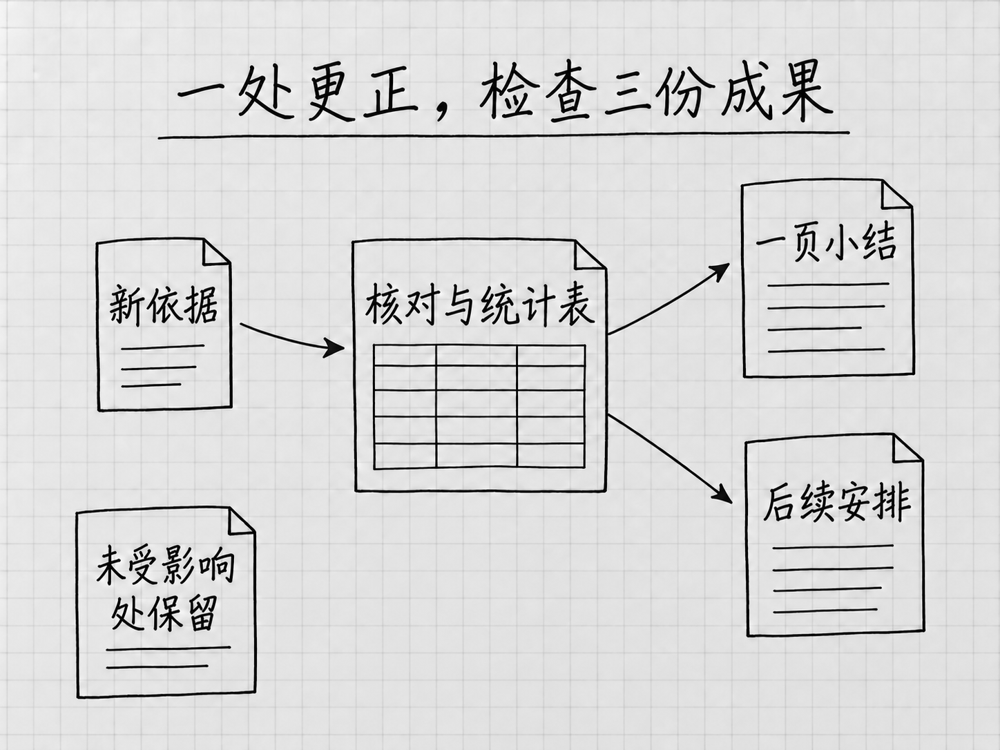

*图：先更正核对表，再沿引用关系检查小结与后续安排；保留未受影响内容，也不额外生成新的交付物。*
<!-- /diagram: FIG-033 -->

现在加入“九月更正”。原消息表明，9月18日只是收到M04，9月21日才确认可用。截止仍是9月18日，其他事项没有变化。

先想清楚它会影响什么。M04依然在九月完成，因此完成总数仍为六项，完成比例仍75%。它从按期变为逾期确认，按期数从五项降为四项，按期比例变为50%。变化发生在确认日期及其派生判断，不能把所有统计都推倒重做。

让 WorkBuddy 处理这次变化：

> 请根据这份更正，更新九月核对表、小结和后续安排。先说明哪些字段、数字或判断受影响，再作对应修改；其余已确认内容保留。M04已在九月完成，不重新列为待交付。保存更正后的草稿，原稿保留用于比较。

检查四处：M04的确认日期；按期与逾期确认数量；小结中的比例和解释；后续安排是否吸收了这次发现的问题。后续可以增加“收到与确认可用分开记录”的改进，却不该要求M04再交一遍。修改范围由事实之间的关系决定，不能机械地“把全文所有5改成4”。

如果它只改了表格，小结仍保留62.5%，继续指出遗漏的成果，并要求检查同一指标还有哪些引用。向 AI 交代一项修改时，既要限制无关改动，也要让它找出真正受影响的部分。“只改这一句”适合纯措辞修改，未必适合会改变后续结论的事实更正。

#### 用新月份检验留下的是方法还是旧答案

九月更正完成后，请它提炼一页工作说明，供下次同类任务使用：

> 请把本次做对的方法整理为下次可复用的工作说明：需要哪些材料，怎样确定月份与清单，完成和按期怎样判断，哪些中间结果要先检查，三份成果如何保持一致，缺依据或收到更正时怎样处理。不要写入九月的编号、日期、项数和比例，也不要把本次发现的M04问题固化为每期必有的问题。

一条值得留下的规则是“以确认可用作为完成依据”。“本月完成六项”属于九月结果，下次必须重算。若保留下来的说明仍写“计划八项”，就会把一次成功变成下一次错误的来源。

另用一个练习文件夹，新建任务，只提供这份通用说明和“十月材料”。这一步用来检查方法能否离开原对话独立使用，不表示以后每个月都必须新建任务。请求：

> 请按这份说明处理十月材料，生成相同用途的三份成果。本期统计范围按十月清单确定。材料未提供的九月遗留结果不要补成已完成；发现说明不足以支持判断时，指出具体缺口。

十月计划四项，三项确认完成，两项按期。完成比例75%，按期比例50%。它们与九月更正后的比例相同，但项目数量与内容不同，不能说两个月效率相同。这里练的是按新材料重新判断，不是模仿上个月数字。

N01延续了九月M05的反馈处理，已经作为十月的一项新交付登记，不能再多加一条“M05完成”。九月M07没有后续材料，就不能擅自销项。需要整体跟进旧事项，可以单列待补资料，但不改变十月四项的统计范围。

发现旧数字混进十月时，先看工作说明有没有写死九月事实，输入是否夹带旧成稿，再核对本次取用的文件。反复要求“认真一点”无法纠正材料角色的混淆。分开固定规则、当前事实和样式参考，才能把复用变成少交代、少搬运、少修改。

#### 换成自己的工作，观察整项任务省了什么

现在可以选自己的月报、阶段汇报或一组资料交付来试。不需要保持八项、三个文件或相同表头。先写清交付对象和用途，再挑需要的能力：没有数字，就不强加统计；只有一份短说明，就不拆成三份成果；需要解释变化，才保留前后对照。

对第一次尝试，观察自己花在准备、交代、检查和修改上的投入。第二次再看哪些说明能够复用、哪些步骤可以批量完成、哪些错误仍反复发生。AI等待时间与自己实际投入分开记；只有结果达到同样要求，省下的时间才有意义。

本例的百分比描述交付状态，没有测量时间，不能拿来证明工具提升了多少效率。真实工作量较大时，可以先用几条覆盖正常、逾期、待确认等情况的记录验证规则，再扩到本月其余材料。检查也要保留明细和来源，否则批量执行越快，出错后追查越费力。

如果反复修改都发生在统计口径，就把定义说清；如果发生在汇报重点，就重新说明给谁看、要支持什么判断；如果是多份成果互相矛盾，就明确共同依据和变化影响范围。每次修订尽量解决一个可以识别的原因，并把稳定的判断留下。

完成这次练习后，你应能拿出一组相互一致的成果、一份简短工作说明，并指出下一次具体能少做哪些事。把这套方法用于下一项相似工作，再根据真实投入决定是否继续扩大范围。

## 附录

### 附录A 常见问题排查：任务卡住、结果不对、文件打不开

<!-- diagram: FIG-024 -->
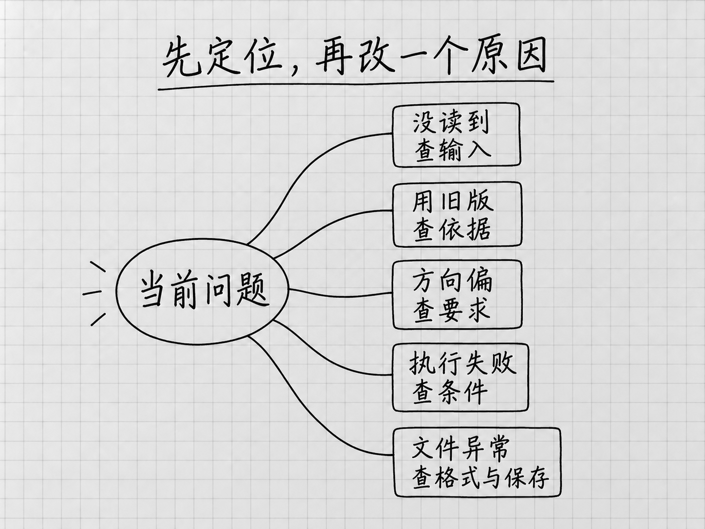

*图：选最接近的症状，检查一个可能原因，再看结果是否恢复；如果依据错了，还要回查受它影响的结论。其他问题按附录相应小节处理。*
<!-- /diagram: FIG-024 -->

本附录按你看到的现象排查。先选最接近的一项，只改一个可能的原因，再看结果是否恢复。这样能保留已完成的工作，也能知道问题究竟出在哪里。

#### 进不去，或登录后没有回到应用

先确认自己使用的是官方提供的客户端与下载入口，安装包与操作系统相符。网页登录完成后，查看 WorkBuddy 应用是否已显示账户状态；浏览器里的成功提示不总等于客户端已完成回跳。如果页面提供返回应用的操作，按当前提示完成；再不行，保存错误提示，按官方帮助处理。

网络、单位设备管理和账户状态都可能影响登录。记录操作系统、客户端版本、发生步骤和原始错误，按[安装与登录章](#setup)定位，组织管理造成的限制交给单位技术支持。

#### 文件已添加，它却答非所问

先问它实际读到哪些文件，指出相关内容出现在哪里。文件名出现在输入区，只表示你已提供这个入口，不代表每一页都已经成功读取。

例如：“请先告诉我你是否读到了附件中‘提交时间’那一段，并引用对应小标题；现在不要写总结。”如果它无法找到，检查附件是否发进了本次任务、文件是否仍可访问、扫描内容是否需要转成可读取文本。可以先给一小段必要原文，确认理解后再扩大范围。

电脑里有文件，不代表本次任务已经取得它。多个附件同名时，明确文件位置、日期和用途，不只说“按刚才那份”。具体方法见[提供材料](#materials)。

#### 它读到了材料，却用了旧版本

给出应采用的具体文件，以及旧版仍能用于什么。如果新版只改了会议室，就说明其他安排仍沿用哪份已确认通知；如果新版全文替代旧版，也要明确。

可以这样说：“10月13日确认消息只更改会议室；请按这条更正地点，时间与材料截止继续采用10月12日通知。未确认备忘不作为正式安排。”这比“以最新为准”更可靠，因为时间最新的一份也可能只是草稿或建议。

#### 它一直追问，任务迟迟不开始

先看缺少的信息会不会改变结果。正式活动日期未知，确实应该先问；周报里某个不影响本周状态的具体联系时刻缺失，则未必值得阻塞整份草稿。

你可以明确：“先根据已有材料完成可确定部分，把确实影响交付的缺口集中列出来，其他细节不要推测。”如果需求已经很清楚，却仍只给建议，检查是否选择了适合执行的任务模式，并在当前任务中说明现在需要它实际处理什么文件。

#### 它开始做了，但方向已经偏了

不必等整个任务完成才纠正。若仍在运行，可以使用当前任务的停止操作；停止后先检查已经产生的结果，再缩小任务继续。停止不是撤销，之前写入的文件可能仍然存在。

指出偏差的对象与期望：“我只需要一页给同事看的通知，不需要活动策划书。保留已确认的事实，删除背景分析，先给正文。”如果只是某个日期错误，定点修改比要求全部重写更容易保持其他正确内容。

#### 数字看起来合理，但总对不上

先问统计范围和一个单位是什么，再看计算。截止到哪天，取消项目是否计入，重复记录按哪个编号归并，未知值如何处理，都可能改变结果。

请它用少量明细解释一个汇总数。若解释中的明细与原表不同，先修数据读取或筛选；若明细正确，计算不对，再核对公式或计算过程。未知不等于零，没有收到某组材料不等于该组没有业务。

不要仅靠再问一次“你确定吗”。更有效的是给出一个手工核对的小样，要求它指出差异从哪条记录开始。详细方法见数据分析章。

#### 文件生成了，却找不到或打不开

先区分对话文字、预览与实际文件。让 WorkBuddy 明确最终文件名和位置，再用结果入口或电脑的文件管理器打开。名字后面写了“.docx”，不自动证明它就是能编辑的文档。

用你实际要交付的软件检查。若不能打开，保留报错内容，请它重新生成相应格式；文字任务可以先输出正文，自己放入编辑器继续工作，避免整项任务被文件转换卡住。表格则还要核对是否保留公式、数值类型和工作表结构，不能把能看见预览当作全部通过。

能打开以后，修改一处、保存、关闭再打开。若版式或字体变化影响交付，再说明你使用的软件和需要保留的布局。文件兼容问题要在最终使用环境里判断。

#### 修改一次，其他地方却跟着变了

说明修改边界，提供已经确认的版本，并要求只改变指定内容。让它列出变化，检查相关数字、日期是否一起更新。

如果原版本已被覆盖，先查看保留副本或软件可用的历史记录。重新生成一遍与恢复原文件是两件事，不能假定“重做”会找回原来的每处内容。局部修改和检查方法见[检查结果](#results)。

#### 定时任务没有按预期出现结果

先查看任务是否启用、规则指向哪个时间与工作空间，再看运行记录。确认当时材料是否已经到位，客户端、登录和网络是否满足当前运行条件。

没有通知不一定没有执行；有运行记录也不意味着内容正确。找到实际输出，再决定是否重试。若需要重跑，避免覆盖确认版，或在相同时间范围内重复发送结果。刚建立流程时，先只生成草稿，能让问题更容易补救。

#### 请别人帮忙时，给一份最小问题说明

保留四项就够用：想完成什么；给了哪些必要材料；哪一步的实际结果与预期不同；当前版本和具体错误。可以附一份删去无关个人资料、商业内容和账户信息的小样，只保留能表现问题的部分。

例如，三张表合并出错，先用几行虚构数据保留相同列名和同一种错误，让对方能看到“本应得到什么、实际得到什么”。这类小样便于判断读取、筛选还是计算出了问题；完整内部台账和账号信息通常无助于定位。

### 附录B 日常使用速查：术语、版本与任务入口

WorkBuddy 会继续增加功能、调整入口。书中的任务方法应尽量经得起这些变化，某个按钮的位置却可能不同。遇到不一致时，先确认版本和功能含义，不必认为整章已经失效，也不要强行照着旧界面操作。

#### 给自己的使用环境留一张简短记录

遇到界面或结果差异时，记录四项信息：查看日期、Windows或Mac及系统版本、WorkBuddy客户端版本、实际打开交付文件的软件。安装与登录问题主要查系统和客户端版本；文件兼容问题还要看最终使用的是哪种Office、WPS或编辑器。

WorkBuddy版本以自己客户端显示的号码为准。官网更新日志说明某一版发布了什么，不代表电脑已经装上那一版。记录这些信息，是为了定位差异，无需另外建立复杂设备档案。

当某个功能没有出现时，再补一行它的具体情况：入口完全没有、能看到但无法启用，还是已经启用而本次没有调用。把情况分清，查资料或求助都更容易。

#### 用官方资料核对正在做的动作

需要核对时，从[WorkBuddy 官方网站](https://www.workbuddy.cn/)进入当前帮助与下载入口，并参考[官方文档](https://www.codebuddy.cn/docs/workbuddy/)。若旧页面打不开，回到官方文档导航查同名功能，避免把第三方转载的旧截图当成当前界面。

本书的[资料与版本说明](%E8%B5%84%E6%96%99%E4%B8%8E%E7%89%88%E6%9C%AC%E8%AF%B4%E6%98%8E.md)列出写作采用的主要入口及核实范围。你查资料时，也应先看页面讲的是 WorkBuddy 的哪个产品端、什么平台和什么功能。相邻产品的相似名字，不代表操作相同。

核对功能时，看它解决什么问题、需要哪些条件、会执行什么动作。名为“自动化”的内容，若讲按时间启动任务，可能对应你看到的“定时任务”；仍要逐项确认运行条件。“任务”“项目”“记忆”则承担不同作用，名称相近不能相互替代。

#### 把界面变化与工作方法变化分开

如果只是附件入口换了位置，你仍然需要把正确材料交入任务，并检查实际采用的文件。如果增加了更便利的文档输出入口，你仍要打开交付文件核对内容和编辑能力。如果模型选择变化，仍可以先用当前默认选择完成熟悉小任务，再按需要比较结果。

影响处理范围的变化，则值得用小样复验。例如资料读取范围、权限行为或定时运行条件改变，就重新处理一份自己已经知道答案的材料，比较关键事实、输出位置与缺项处理。结果不必字句相同，但应满足原来的交付要求；先找出变化影响了哪一步，再扩大到正常工作量。

#### 术语和日常任务怎样快速找到

遇到模式、技能、连接器、记忆等词，查看[术语表](%E6%9C%AF%E8%AF%AD%E7%BF%BB%E8%AF%91%E8%A1%A8.md)，再回到链接的首次解释处。想做一项眼前工作，查看[任务选择页](#choose)：写通知去第14章，合并台账去第15章，做月报去第16章，整理碎片消息去第18章。术语用于找到需要的帮助，不是开始工作的考试。

#### 功能暂时没有，先走可完成的路线

本书的七类实战都保留普通文件输入的做法。没有连接器时，使用自己获准导出的文件；不想配置记忆时，附上工作说明；没有稳定定时条件时，手动启动同一任务方法。这样可以继续学会处理工作，而不把所有时间花在配置功能上。

如果核心步骤确实受当前平台或账号限制，记录限制并选另一项可完成任务。不要将暂时不可用的功能写成自己操作失误，也不要照着来源不明的方法绕过账户或系统限制。

功能更新后，优先复验受影响的一步。把稳定的工作方法留下，把确实变化的操作换掉，便能逐步使用新能力，而无需把整套流程重新学一遍。
